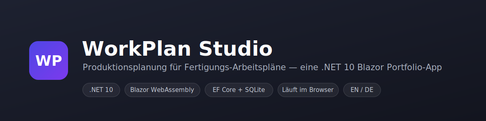

# WorkPlan Studio

[English](README.md) · **Deutsch**

[](https://dotnet.microsoft.com/)
[](https://learn.microsoft.com/aspnet/core/blazor/)
[](https://learn.microsoft.com/ef/core/)
[](.github/workflows/ci.yml)
[](docs/TESTING.de.md)
[](docs/TESTING.de.md)
[](LICENSE)

**WorkPlan Studio** ist eine kompakte, eigenständige Portfolio-Anwendung zur Verwaltung von **Fertigungs-Arbeitsplänen** (Routings): die geordnete Folge der Arbeitsgänge zur Herstellung eines Teils, die Arbeitsplätze, auf denen diese laufen, sowie die daraus resultierende **Zeit und Kosten** für eine gegebene Losgröße.

Das Ganze — inklusive einer **echten relationalen Datenbank** — läuft vollständig im Browser als statische WebAssembly-App. Es gibt kein Backend, keine API und keine serverseitige Speicherung: die App lässt sich kostenlos über GitHub Pages hosten und verhält sich dennoch wie eine vollwertige datengetriebene Anwendung.

> 🌐 **Live-Demo:** `https://<your-username>.github.io/WorkPlanStudio/`
> _(verfügbar, sobald GitHub Pages aktiviert ist — siehe [Deployment](#deployment))_

Die Oberfläche ist in **Englisch und Deutsch** verfügbar und zur Laufzeit umschaltbar.

---

## Höhepunkte

- 📋 **Arbeitspläne / Routings** — anlegen, bearbeiten, durchsuchen und nach Status (Entwurf / Freigegeben / Archiviert) filtern.
- 🔧 **Arbeitsgang-Editor** — eine editierbare Tabelle der Arbeitsgänge (Rüstzeit, Stückzeit, Arbeitsplatz, Bemerkungen) mit einer **Live-Zusammenfassung** von Gesamtzeit und geschätzten Kosten, die sich beim Tippen neu berechnet.
- 🏭 **Arbeitsplätze** — Stammdaten mit Stundensätzen und Kostenstellen, samt Schutz gegen das Löschen eines Arbeitsplatzes, der noch von Arbeitsgängen verwendet wird.
- 📊 **Dashboard** — Kennzahlen, ein Statusverteilungs-Balken und die zuletzt geänderten Pläne.
- 🗓️ **Produktionsplanung** — ein kapazitätsbeschränkter Planer, der jedem freigegebenen Plan einen Zieltermin zuweist und seine Arbeitsgänge über die Arbeitsplätze einplant: sechs Prioritätsregeln, konfigurierbare Zieltermin-Vergabe, Multi-Start- und Lokalsuche-Optimierung, ein Gantt-Diagramm und Termintreue-/Verspätungs-Kennzahlen. Deterministisch und durch Tests abgedeckt.
- 🌍 **Zweisprachige Oberfläche (EN / DE)** — vollständige Lokalisierung über `IStringLocalizer` und `.resx`-Ressourcen, inklusive kulturkorrekter Zahlen-, Datums- und Währungsformatierung.
- 💾 **Echte Datenbank im Browser** — EF Core spricht mit einer SQLite-Datenbank, die nach WebAssembly kompiliert und im `localStorage` persistiert wird, sodass die Daten Seiten-Neuladungen überstehen.
- 📱 **Responsiv** — funktioniert vom breiten Desktop bis zum mobilen Drawer-Layout.

## Was technisch interessant ist

Das Kernstück: **EF Core + SQLite laufen clientseitig in WebAssembly**:

- Die native SQLite-Engine wird zur Buildzeit in die `dotnet.native.wasm` der App relinkt (über die `wasm-tools`-Workload).
- Beim Start liest die App eine Base64-kodierte SQLite-Datei aus dem `localStorage` in das In-Memory-Dateisystem des Browsers; beim ersten Lauf wird das Schema angelegt und mit Beispieldaten befüllt.
- Nach jeder Änderung wird die SQLite-Datei zurück in den `localStorage` geschrieben.
- Ein Schema-Versionsschlüssel verhindert das Laden einer inkompatiblen Datenbank nach einer Modelländerung.

Damit demonstriert die App eine vollständige Datenschicht — `DbContext`, Beziehungen, LINQ-Abfragen, eine `IDbContextFactory`, eine Service-Schicht — **ganz ohne Server**.

## Produktionsplanung

Die Seite **Planung** verwandelt die freigegebenen Arbeitspläne in einen kapazitätsbeschränkten Produktionsplan — der algorithmisch anspruchsvollste Teil des Projekts. Er liegt in einer eigenen, abhängigkeitsfreien Bibliothek (`src/WorkPlanStudio.Scheduling`), sodass die gesamte Engine auf einem normalen .NET-Runner unit-getestet werden kann — ohne Blazor oder die WebAssembly-Toolchain.

1. **Zieltermine („Meta").** Jeder Auftrag erhält einen Termin nach einer konfigurierbaren Regel — Total Work Content (TWK), Number of Operations (NOP), Equal Slack (SLK), Constant Allowance (CON) oder einen expliziten Wert.
2. **Dispatch-Planung.** Ein kapazitätsbeschränkter List-Scheduler platziert die Arbeitsgänge jedes Auftrags auf dem frühesten freien Slot ihres Arbeitsplatzes, unter Beachtung von Arbeitsgang-Reihenfolge und Maschinenkapazität. Sechs Prioritätsregeln entscheiden, wer auf einer umkämpften Maschine zuerst drankommt: FIFO, SPT, LPT, EDD, Critical Ratio und WSPT.
3. **Optimierung.** Eine seed-basierte Multi-Start-Suche plus eine First-Improvement-Lokalsuche verfeinern die Reihenfolge; das Ergebnis ist nie schlechter als der reine Regel-Plan.
4. **Bewertung.** Durchlaufzeit (Makespan), Gesamt-/Maximalverspätung, Termintreue und Arbeitsplatz-Auslastung werden zu einem einzigen Strafwert zusammengefasst, den die Suche minimiert.

Einige Entscheidungen heben es vom Spielzeug zur Referenz:

- **Deterministisch.** Alle Zeiten sind ganzzahlige Sekunden und der Zufall stammt aus einem kleinen PRNG mit festem Algorithmus, sodass derselbe Seed auf dem Desktop, in der CI und im Browser einen bit-identischen Plan liefert.
- **Per Konstruktion zulässig.** Die Lokalsuche permutiert die *Prioritätsreihenfolge* der Aufträge und plant neu ein, sodass jeder bewertete Kandidat ein gültiger Plan ist.
- **Auf jeder Ebene getestet.** ~90 Tests über vier Schichten — Engine-Unit-Tests, ein Architektur-Test, der die Pure-Library-Grenze *erzwingt*, EF→Domain-Mapping-Tests, bUnit-Komponententests der Seite und Playwright-End-to-End-Tests in einem echten Browser.

Siehe [`docs/SCHEDULING.de.md`](docs/SCHEDULING.de.md) für die Algorithmus-Beschreibung und [`docs/TESTING.de.md`](docs/TESTING.de.md) für die Teststrategie.

## Screenshots

Die Planungsseite reagiert auf eine **einzige Parameter-Änderung** — lockere vs. enge Zieltermine. Das Anziehen macht die Aufträge verspätet: rot umrandete Gantt-Balken, eine „Late"-Legende und rote Status-Pillen. _(Beide Bilder erzeugt der End-to-End-Testlauf automatisch.)_

| Termintreu — Faktor `3.0` | Verspätet — Faktor `0.5` |
| --- | --- |
|  |  |

Die Beispieldaten liefern **sieben freigegebene Pläne**, die um dieselben Maschinen konkurrieren — daher verändern auch Prioritätsregel und Seed das Ergebnis sichtbar, nicht nur die Zieltermine.

## Technologie-Stack

| Bereich | Wahl |
| --- | --- |
| Framework | .NET 10, Blazor WebAssembly (eigenständig) |
| Daten | Entity Framework Core 10 + SQLite (nach WebAssembly kompiliert) |
| Persistenz | Browser-`localStorage` via JS-Interop |
| Lokalisierung | `Microsoft.Extensions.Localization`, `IStringLocalizer`, `.resx` |
| Styling | Handgeschriebenes CSS-Designsystem (CSS Custom Properties) |
| Planung | Reine C#-Domänenbibliothek — kapazitätsbeschränktes Dispatching + Zieltermin-Vergabe |
| Tests | xUnit v3 (Microsoft Testing Platform), bUnit-Komponenten, Playwright-E2E |
| CI / Hosting | GitHub Actions — geschichtete Test-Workflows + test-gesichertes GitHub-Pages-Deploy |

## Dokumentation

| Thema | English | Deutsch |
| --- | --- | --- |
| Projektübersicht | [README.md](README.md) | dieses README |
| Planungs-Algorithmus | [docs/SCHEDULING.md](docs/SCHEDULING.md) | [docs/SCHEDULING.de.md](docs/SCHEDULING.de.md) |
| Teststrategie | [docs/TESTING.md](docs/TESTING.md) | [docs/TESTING.de.md](docs/TESTING.de.md) |
| Entscheidungsprotokolle (ADR) | [docs/adr](docs/adr) | — |
| Mitwirken | [CONTRIBUTING.md](CONTRIBUTING.md) | — |
| KI-Agent-Kontext | [AGENTS.md](AGENTS.md) | — |
| Mit einem KI-Agenten prüfen | [docs/CODEX.md](docs/CODEX.md) | — |
| Auf GitHub veröffentlichen | [docs/PUBLISHING.md](docs/PUBLISHING.md) | — |

## Entwicklungspraktiken

Über die Funktion hinaus ist das Repository so aufgesetzt, wie es eine produktive Codebasis wäre:

- **Strikte Builds** — Nullable Reference Types, .NET-Analyzer und **Warnungen als Fehler** (`Directory.Build.props`).
- **Central Package Management** — jede NuGet-Version in einer [`Directory.Packages.props`](Directory.Packages.props).
- **Einheitlicher Stil** — eine umfassende [`.editorconfig`](.editorconfig) und Zeilenende-Normalisierung über [`.gitattributes`](.gitattributes).
- **Geschichtete Tests + Abdeckung** — 91 Tests über vier Schichten, ~98 % Zeilenabdeckung der Engine, alle in der CI.
- **Architektur per Test erzwungen** — die Engine kann keine Blazor-/EF-/JS-Abhängigkeit ansammeln.
- **Entscheidungen dokumentiert** — siehe die [Architecture Decision Records](docs/adr).
- **Abhängigkeits-Hygiene** — [Dependabot](.github/dependabot.yml) hält NuGet und GitHub Actions aktuell.
- **CI/CD** — Test-Workflows je Schicht bei jedem PR plus ein test-gesichertes GitHub-Pages-Deploy.

## Projektstruktur

```
WorkPlanStudio/
├─ .github/workflows/
│  ├─ ci.yml                        # Engine- + Mapper-/Komponententests (PRs)
│  ├─ e2e.yml                       # Playwright-End-to-End-Tests (PRs)
│  └─ deploy.yml                    # test-gesichertes Veröffentlichen + Deploy zu GitHub Pages
├─ docs/                            # Banner, Screenshots, SCHEDULING(.de).md, TESTING(.de).md
├─ global.json                      # SDK-Pin + Microsoft-Testing-Platform-Runner
├─ src/
│  ├─ WorkPlanStudio/               # die Blazor-WebAssembly-App
│  │  ├─ Models/                    # WorkPlan, Operation, WorkCenter, WorkPlanStatus
│  │  ├─ Data/                      # AppDbContext, SeedData, BrowserDatabase
│  │  ├─ Services/                  # WorkPlan-/WorkCenter-Services, IProductionScheduleService, ScheduleMapper, View-Models, Format
│  │  ├─ Resources/                 # SharedResource(.de).resx — UI-Übersetzungen
│  │  ├─ Components/                # Modal, StatusBadge, CultureSelector
│  │  ├─ Layout/                    # MainLayout, NavMenu
│  │  ├─ Pages/                     # Home, WorkPlans, WorkPlanEditor, WorkCenters, Schedule, About
│  │  ├─ wwwroot/                   # index.html, css/app.css, js/app.js
│  │  └─ Program.cs                 # DI-Registrierung + Kultur-Bootstrap
│  └─ WorkPlanStudio.Scheduling/    # reine Planungs-Engine (kein Blazor / EF / WASM)
│     ├─ Inputs/                    # ProductionJob, JobStep, MachineCapacity
│     ├─ Parameters/                # SchedulingParameters, DispatchRule, DueDateRule
│     ├─ Core/                      # DispatchScheduler, DueDateAssigner, LocalSearch, PriorityOrdering, DeterministicRandom
│     ├─ Evaluation/                # ScheduleEvaluator, ScheduleEvaluation
│     ├─ Outputs/                   # Schedule, ScheduledOperation, JobSchedule
│     └─ SchedulingEngine.cs        # Orchestrierung: Zieltermine → Multi-Start → Lokalsuche
└─ tests/
   ├─ WorkPlanStudio.Scheduling.Tests/   # Engine: Determinismus, Zulässigkeit, Regeln, Suche, Architektur
   ├─ WorkPlanStudio.Web.Tests/          # EF→Domain-Mapping + bUnit-Komponententests
   └─ WorkPlanStudio.E2E/                # Playwright-End-to-End (Page-Object + Szenarien)
```

## Erste Schritte

### Voraussetzungen

- [.NET 10 SDK](https://dotnet.microsoft.com/download)
- Die WebAssembly-Tools-Workload (nötig zum Relinken von nativem SQLite):

  ```bash
  dotnet workload install wasm-tools
  ```

### Lokal ausführen

```bash
dotnet run --project src/WorkPlanStudio/WorkPlanStudio.csproj
```

Öffnen Sie dann die in der Konsole ausgegebene URL (z. B. `http://localhost:5235`).
Der erste Build dauert länger, weil die native SQLite-Engine nach WebAssembly kompiliert wird; nachfolgende Builds werden gecacht.

### Tests ausführen

Die Engine ist eine reine .NET-Bibliothek, daher braucht der Großteil der Suite **keine** WebAssembly-Workload und läuft in Sekunden:

```bash
dotnet test tests/WorkPlanStudio.Scheduling.Tests/WorkPlanStudio.Scheduling.Tests.csproj   # Engine + Architektur
dotnet test tests/WorkPlanStudio.Web.Tests/WorkPlanStudio.Web.Tests.csproj                 # Mapping + bUnit-Komponenten
```

Die Playwright-End-to-End-Tests steuern einen echten Browser gegen die laufende App — siehe [`docs/TESTING.de.md`](docs/TESTING.de.md) für die vollständige Strategie und Ausführung.

### Statischen Build veröffentlichen

```bash
dotnet publish src/WorkPlanStudio/WorkPlanStudio.csproj -c Release -o publish
```

Die deploybare Seite liegt in `publish/wwwroot/` und kann von jedem statischen Datei-Host ausgeliefert werden.

## Deployment

> 🚀 Neu beim Veröffentlichen? [`docs/PUBLISHING.md`](docs/PUBLISHING.md) führt Schritt für Schritt (erster Commit → Repo anlegen → Live-Demo aktivieren).

Das Repository bringt einen GitHub-Actions-Workflow mit ([`.github/workflows/deploy.yml`](.github/workflows/deploy.yml)), der die App bei jedem Push auf `main` zu **GitHub Pages** veröffentlicht. Er:

1. installiert die `wasm-tools`-Workload und veröffentlicht die App,
2. schreibt `<base href="/" />` auf `/<repository-name>/` um, damit Assets unter dem Projektseiten-Unterpfad aufgelöst werden,
3. fügt einen `404.html`-SPA-Fallback und eine `.nojekyll`-Markierung hinzu,
4. lädt das Artefakt hoch und deployt es.

Zum Aktivieren: dieses Repo zu GitHub pushen, dann unter **Settings → Pages** **Source = GitHub Actions** setzen.

## Hinweise

- Alle Daten werden lokal in Ihrem Browser gespeichert und verlassen Ihr Gerät nie. Über **Über → Auf Beispieldaten zurücksetzen** stellen Sie den ursprünglichen Demo-Inhalt wieder her.
- Beispiel-Teilenummern, -Maschinen und -Zeiten sind fiktiv und dienen nur der Illustration.

## Lizenz

[MIT](LICENSE)
