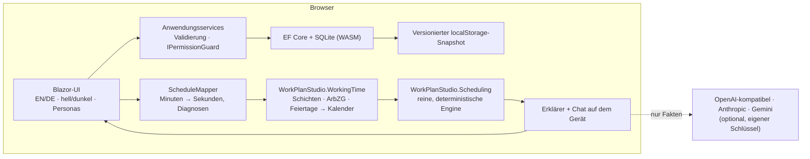

# WorkPlan Studio

[English](README.md) · **Deutsch**

[](https://github.com/aco993/WorkPlanStudio/actions/workflows/ci.yml)
[](https://github.com/aco993/WorkPlanStudio/actions/workflows/e2e.yml)
[](https://github.com/aco993/WorkPlanStudio/actions/workflows/quality.yml)
[](https://github.com/aco993/WorkPlanStudio/actions/workflows/codeql.yml)
[](https://github.com/aco993/WorkPlanStudio/actions/workflows/performance.yml)
[](https://aco993.github.io/WorkPlanStudio/)
[](docs/TESTING.de.md#abdeckung)
[](docs/TESTING.de.md#abdeckung)
[](docs/TESTING.de.md#abdeckung)
[](LICENSE)

**WorkPlan Studio** ist eine eigenständige Anwendung für die Produktionsplanung: **Arbeitspläne** (Routings), die **Arbeitsplätze**, auf denen sie laufen, **Fertigungsaufträge** mit eingefrorenem Arbeitsplan und ein **kapazitätsbeschränkter Planer**, der Schichtkalender und das Arbeitszeitgesetz (ArbZG) einhält — mit einem Chat, der das Ergebnis erklärt. Die gesamte Anwendung einschließlich ihrer relationalen Datenbank läuft im Browser als statische WebAssembly-Site. Kein Backend, keine API, keine serverseitige Speicherung.

> **Live-Demo:** <https://aco993.github.io/WorkPlanStudio/> — Englisch und Deutsch, hell und dunkel, Desktop und Mobil. Nichts zu installieren, keine Anmeldung.


---

## Höhepunkte

- 📋 **Arbeitspläne / Routings** — anlegen, bearbeiten, durchsuchen und nach Status (Entwurf / Freigegeben / Archiviert) filtern, mit einem Arbeitsgang-Editor, dessen Gesamtzeit und Kosten beim Tippen neu berechnet werden.
- 🏭 **Arbeitsplätze** — Stundensätze, Kostenstellen, validierte Parallelkapazität, ein **Schichtmodell** (durchgehend, Ein-, Zwei- oder Dreischicht) und **Abwesenheiten** (Wartung, Urlaub, ungeplant), mit Schutz gegen das Löschen oder Deaktivieren eines noch genutzten Arbeitsplatzes.
- 🧾 **Fertigungsaufträge** — eine Menge eines Teils zu einem Termin. Die Freigabe **friert den Arbeitsplan ein**, nach dem gefertigt wird; eine spätere Änderung des Arbeitsplans kann Arbeit auf dem Shopfloor nicht mehr verändern.
- 🗓️ **Kapazitätsbeschränkte Planung** — sechs Prioritätsregeln, vier Terminregeln, seed-basierte Multi-Start- plus Insertion-Lokalsuche, exakte Enumeration bei kleinen Instanzen, ein Gantt-Diagramm mit echten Daten, Kennzahlen für Durchlaufzeit, Verspätung, Termintreue und Auslastung *der offenen Zeit*.
- ⚖️ **Arbeitszeit als Randbedingung** — Schichten, Pausen, Ruhezeiten, Sonntage, Feiertage je Bundesland und Abwesenheiten werden zu Maschinenkalendern. Jede Regel des ArbZG, die die App anwendet, ist ein **Parameter mit Gesetzesverweis**, auf der Arbeitszeitseite erklärt und mit einer Live-Vorschau der Woche versehen; jede geschlossene Strecke im Gantt nennt die Regel dahinter.
- 💬 **Ein Chat über den Plan** — „Welcher Arbeitsplatz ist der Engpass?", „Warum ist PO-1003 verspätet?", „Was wäre mit SPT?" (das lässt den Planer erneut laufen). Die Antworten werden **auf Ihrem Gerät** berechnet, auf Deutsch oder Englisch, ohne Schlüssel. Mit eigenem API-Schlüssel gehen dieselben Fakten an **OpenAI-kompatible, Anthropic- oder Gemini-Modelle** für eine Antwort im Gespräch, mit Rückfall auf die Antwort vom Gerät bei jedem Fehler.
- 👥 **Personas mit echten Folgen** — Planer, Meister und Gast laufen durch die echte ASP.NET-Core-Autorisierungspipeline: Richtlinien blenden aus, was eine Persona nicht darf, und jeder schreibende Service lehnt es ebenfalls ab.
- 🌗 **Helles, dunkles und System-Theme**, WCAG 2.2 AA per axe auf jeder Seite geprüft, Tastaturpfade mit Sprunglink und Fokusfalle, `prefers-reduced-motion`, und ein mobiles Layout mit Drawer.
- 🌍 **Zweisprachige Oberfläche (EN / DE)** mit kulturkorrekten Zahlen, Daten und Währungen.
- 💾 **Eine echte Datenbank im Browser** — EF Core über SQLite in WebAssembly; WAL-sichere Snapshots überstehen Reloads, inkompatible Daten landen in einem expliziten Export/Reset-Ablauf statt verloren zu gehen.

## Screenshots

| Übersicht, hell | Übersicht, dunkel |
| --- | --- |
|  |  |

| Plan mit schattierter geschlossener Zeit, dunkel | Arbeitszeit: die Regeln, die Woche, die Feiertage |
| --- | --- |
|  |  |

| Der Chat auf Englisch | Auf Deutsch | Mobil |
| --- | --- | --- |
|  |  |  |

Die Planungsseite reagiert auf eine **einzige Parameteränderung** — lockere gegen enge Zieltermine machen die Aufträge verspätet: rot umrandete Gantt-Balken und rote Status-Pillen. _(Beide Bilder erzeugt der End-to-End-Testlauf.)_

| Termintreu — Faktor `3.0` | Verspätet — Faktor `0.5` |
| --- | --- |
|  |  |

## Wie die Teile zusammenpassen


```mermaid
flowchart LR
    subgraph Browser
        UI["Blazor-UI<br/>EN/DE · hell/dunkel · Personas"]
        SVC["Anwendungsservices<br/>Validierung · IPermissionGuard"]
        DB["EF Core + SQLite (WASM)"]
        LS["Versionierter localStorage-Snapshot"]
        MAP["ScheduleMapper<br/>Minuten → Sekunden, Diagnosen"]
        WT["WorkPlanStudio.WorkingTime<br/>Schichten · ArbZG · Feiertage → Kalender"]
        ENG["WorkPlanStudio.Scheduling<br/>reine, deterministische Engine"]
        EXP["Erklärer + Chat auf dem Gerät"]
    end
    AI["OpenAI-kompatibel · Anthropic · Gemini<br/>(optional, eigener Schlüssel)"]

    UI --> SVC --> DB --> LS
    UI --> MAP --> WT --> ENG --> EXP --> UI
    EXP -. nur Fakten .-> AI
```

Zwei **reine Bibliotheken** tragen die Logik — der Planer und die Arbeitszeitregeln haben keine Blazor-, EF-, JavaScript- oder Netzwerkabhängigkeit, und ein Architekturtest lässt den Build scheitern, wenn sich das ändert. Die App ist die Hülle darum: Stammdaten, Persistenz, Berechtigungen, die Seiten und der Assistent. Siehe [docs/ARCHITECTURE.md](docs/ARCHITECTURE.md).

## Produktionsplanung

Die Seite **Planung** macht aus den freigegebenen Fertigungsaufträgen einen kapazitätsbeschränkten Plan — der algorithmisch anspruchsvollste Teil des Projekts, in `src/WorkPlanStudio.Scheduling`.

1. **Zieltermine.** Ein freigegebener Auftrag bringt seinen Kundentermin mit, daher ist der Standard, ihn zu verwenden. Wo keiner gilt, kann ein Ziel nach Total Work Content (TWK), Number of Operations (NOP), Equal Slack (SLK) oder Constant Allowance (CON) abgeleitet werden.
2. **Werkstatt-Restriktionen.** Jeder Arbeitsplatz bringt seinen Kalender aus der Arbeitszeit-Bibliothek mit (Fenster, Pausen, über die ein Arbeitsgang unterbrochen werden darf, und Sperrzeiten, über die er es nie darf), plus optional eine reihenfolgeabhängige Rüstmatrix zwischen Arbeitsgang-Familien.
3. **Dispatch-Planung.** Ein List-Scheduler setzt jeden Arbeitsgang auf den frühesten zulässigen Platz seines Arbeitsplatzes, unter Beachtung von Reihenfolge, Kapazität und Kalender. Sechs Prioritätsregeln bestimmen die Ausgangsreihenfolge: FIFO, SPT, LPT, EDD, Critical Ratio und WSPT.
4. **Optimierung.** Ein seed-basierter Multi-Start, jeder Neustart gefolgt von einem Insertion-Nachbarschafts-Abstieg über die Auftragsreihenfolge; das Ergebnis ist nie schlechter als der reine Regelplan. Bei Instanzen, die klein genug sind, um alle `n!` Reihenfolgen aufzuzählen, wird das Optimum exakt berechnet und verglichen: die Suche liegt im Mittel 0,2 % vom Optimum entfernt und löst 19 von 20 Zufallsinstanzen exakt — eine getestete Eigenschaft, keine Behauptung.
5. **Bewertung.** Durchlaufzeit, Gesamt- und Maximalverspätung, Termintreue und Auslastung der offenen Zeit werden zu einem Strafwert, den die Suche minimiert.

Die Engine ist **deterministisch** (ganzzahlige Sekunden, ein PRNG mit festem Algorithmus, bit-identische Ergebnisse auf Desktop, CI und im Browser), **per Konstruktion zulässig** (Kandidaten permutieren die Prioritätsreihenfolge und planen neu) und **ehrlich über ihre Parameter** (die Seite meldet, welche anderen Regeln dieselbe Reihenfolge ergäben, statt stumm denselben Plan zurückzugeben). Details: [docs/SCHEDULING.de.md](docs/SCHEDULING.de.md).

## Arbeitszeit und das Arbeitszeitgesetz

Der Betrieb, nicht der Planer, entscheidet, wann eine Maschine laufen darf. `src/WorkPlanStudio.WorkingTime` macht aus einem Schichtmodell und den Betriebseinstellungen eine Woche offener Fenster und eine Liste geschlossener Strecken, jede mit der Regel, die sie geschlossen hat:

| Regel | Parameter | Standard |
| --- | --- | --- |
| §3 werktägliche Arbeitszeit | 8 h, oder 10 h mit Ausgleich | 10 h |
| §4 Ruhepausen | 30 min ab 6 h, 45 min ab 9 h, in Abschnitten von mindestens 15 min | gesetzlich |
| §5 Ruhezeit | 11 h (10 h in manchen Branchen), je Besetzung, über den Wochenumbruch | 11 h |
| §6 Nachtarbeit | 8 h, oder 10 h mit Ausgleich | 8 h |
| §9 Sonn- und Feiertage | geschlossen, sofern keine §10-Ausnahme gilt; das Ruhefenster darf bei Mehrschichtbetrieb um bis zu 6 h verschoben werden | geschlossen |
| §11 freie Sonntage | mindestens 15 im Jahr | berichtet |
| Feiertage | aus dem Osterdatum für alle 16 Länder berechnet, Teilfeiertage optional | Nordrhein-Westfalen |

Die Arbeitszeitseite zeigt die geltenden Regeln, eine Live-Vorschau der Woche je Arbeitsplatz, die Feiertage des Jahres für das gewählte Land und die Abwesenheiten. Die Entscheidungen liegen beim Betrieb: eine §10-Ausnahme ist ein Häkchen, eine kürzere Ruhezeit eine Zahl, und das Gantt sagt beim Zeigen auf eine schattierte Strecke, welche Regel die Maschine geschlossen hat. Siehe [ADR 0012](docs/adr/0012-working-time-as-capacity.md).

## Der Planungs-Assistent

Jeder Lauf wird zweimal erklärt. Ein deterministischer **Erklärer** in der Engine findet den Engpass, die verspäteten Aufträge und die Ressource, auf die jeder gewartet hat, und eine *berechnete* Empfehlung (er lässt die anderen Regeln laufen und schlägt nur einen Wechsel vor, der messbar hilft). Unter dieser Erzählung beantwortet ein **Chat** Fragen zum Lauf — Engpass, verspätete Aufträge und warum, der Stand eines Auftrags oder Arbeitsplatzes, warum Maschinen stillstehen, welche Regeln gelten und Was-wäre-wenn-Fragen, die den Planer tatsächlich erneut laufen lassen — aus denselben Fakten, die die Seite rendert, auf Ihrem Gerät, auf Deutsch oder Englisch.

Mit eigenem Schlüssel gehen dieselben Fakten und die Antwort vom Gerät an ein Modell Ihrer Wahl (jeder OpenAI-kompatible Endpunkt, Anthropics Messages API oder Google Gemini) für eine Antwort im Gespräch; bei jedem Fehler wird die Antwort vom Gerät mit einem Hinweis gezeigt. Der Schlüssel liegt im `localStorage` Ihres Browsers und geht nur an den konfigurierten Endpunkt. Siehe [docs/AI-ASSISTANT.md](docs/AI-ASSISTANT.md) und [ADR 0014](docs/adr/0014-schedule-chat-on-device-first-with-pluggable-models.md).

## Personas

Die Kopfleiste lässt Sie **Planer** (alles), **Meister** (Aufträge freigeben und Abwesenheiten erfassen, aber weder Arbeitspläne noch Betriebsregeln ändern) oder **Gast** (schauen, nichts anfassen) sein. Das ist kein UI-Schalter: die Persona ist ein `ClaimsPrincipal` in der echten ASP.NET-Core-Autorisierungspipeline, die Seiten nutzen `AuthorizeView`-Richtlinien, und jeder schreibende Service prüft dieselbe Richtlinie über einen `IPermissionGuard` und gibt `Forbidden` zurück. Die Demo-Identität gegen eine echte zu tauschen ist eine Klasse. Es ist Autorisierungs-Verdrahtung, keine Sicherheit — der Code läuft in Ihrem Browser, und [docs/SECURITY.md](docs/SECURITY.md) sagt das deutlich. Siehe [ADR 0013](docs/adr/0013-personas-through-the-real-authorization-pipeline.md).

## Technologie-Stack

| Bereich | Wahl |
| --- | --- |
| Framework | .NET 10, Blazor WebAssembly (eigenständig) |
| Daten | Entity Framework Core 10 + SQLite in WebAssembly, persistiert im `localStorage` |
| Domänenbibliotheken | `WorkPlanStudio.Scheduling` (kapazitätsbeschränkte Engine), `WorkPlanStudio.WorkingTime` (ArbZG-Regeln, Feiertage, Kalender) — beide reines C#, ohne Abhängigkeiten |
| Berechtigungen | `Microsoft.AspNetCore.Components.Authorization`, Richtlinien, `IAuthorizationService` mit Demo-Identität |
| Lokalisierung | `Microsoft.Extensions.Localization`, `IStringLocalizer`, `.resx` (EN / DE) |
| Styling | Handgeschriebenes CSS-Designsystem auf Custom-Property-Tokens; helles, dunkles und System-Theme |
| KI | Anbieter-Schnittstelle mit OpenAI-kompatiblem, Anthropic- und Gemini-Client; quellgenerierte JSON-Serialisierung; Rückfall aufs Gerät |
| Tests | xUnit v3 auf der Microsoft Testing Platform, CsCheck-Property-Tests, bUnit, Playwright, axe-core, BenchmarkDotNet, Lighthouse CI |
| CI / Hosting | GitHub Actions — abdeckungsgesicherte Tests, Browser-Suite, CodeQL, Format- und Link-Prüfung, Dependabot; Deploy zu GitHub Pages nur nach jeder Suite |

## Dokumentation

| Thema | English | Deutsch |
| --- | --- | --- |
| Projektübersicht | [README.md](README.md) | dieses README |
| Architektur | [docs/ARCHITECTURE.md](docs/ARCHITECTURE.md) | — |
| Planungs-Algorithmus | [docs/SCHEDULING.md](docs/SCHEDULING.md) | [docs/SCHEDULING.de.md](docs/SCHEDULING.de.md) |
| Planungs-Assistent und Chat | [docs/AI-ASSISTANT.md](docs/AI-ASSISTANT.md) | — |
| Teststrategie | [docs/TESTING.md](docs/TESTING.md) | [docs/TESTING.de.md](docs/TESTING.de.md) |
| Leistung | [docs/PERFORMANCE.md](docs/PERFORMANCE.md) | — |
| Sicherheit | [docs/SECURITY.md](docs/SECURITY.md) | — |
| Entscheidungsprotokolle (14 ADRs) | [docs/adr](docs/adr) | — |
| Interview-Notizen | [docs/INTERVIEW.md](docs/INTERVIEW.md) | — |
| Änderungsprotokoll | [CHANGELOG.md](CHANGELOG.md) | — |
| Mitwirken | [CONTRIBUTING.md](CONTRIBUTING.md) | — |
| KI-Agent-Kontext | [AGENTS.md](AGENTS.md) | — |

## Entwicklungspraktiken — gemessen, nicht behauptet

- **452 Tests in vier Projekten**, jede Art, die die App braucht: Unit, eigenschaftsbasiert (CsCheck), Brute-Force-Optimalität, Architektur, Leistungsbudgets, Datentests mit echtem SQLite, Berechtigungen, bUnit-Komponenten, Anbieter-Clients über gestubbten Transport, Playwright-Abläufe in beiden Sprachen, **axe WCAG 2.2 AA auf jeder Seite in beiden Themes** und **Bildvergleich** gegen Pixel-Baselines. [docs/TESTING.de.md](docs/TESTING.de.md).
- **Abdeckung je Assembly in der CI gegated** — der Build scheitert unter 90 % Zeilen für die Engine (gemessen 96,0 %), 90 % für die Arbeitszeit-Bibliothek (94,0 %) und 65 % für die App (69,3 %). Die Badges oben entstehen bei jedem Deployment aus derselben Messung.
- **Deploy nur nach allem** — die drei Testprojekte mit ihren Abdeckungs-Gates *und* die Browser-Suite müssen bestehen, bevor GitHub Pages aktualisiert wird.
- **Leistung gemessen** — BenchmarkDotNet über beide Bibliotheken, Budget-Tests bei jedem Pull Request, Lighthouse CI auf der veröffentlichten Site. Die Zahlen, auch die unschmeichelhaften, stehen in [docs/PERFORMANCE.md](docs/PERFORMANCE.md).
- **Strikte Builds** — Nullable Reference Types, .NET-Analyzer, Warnungen als Fehler, `dotnet format` in der CI geprüft, Central Package Management, Dependabot für NuGet und Actions, CodeQL security-extended.
- **Entscheidungen dokumentiert** — vierzehn [Architecture Decision Records](docs/adr), jeder mit den Optionen, die verloren haben.
- **Jeder relative Link in der Doku wird geprüft** — vom Quality-Workflow, damit nichts hier auf eine verschobene Datei zeigt.

## Was dieses Projekt zeigt

Dies ist ein öffentliches **Portfolio-Projekt**. Es nutzt eine generische Fertigungsdomäne und fiktive Daten und teilt keinen Code mit einem proprietären System. Es soll zeigen, *wie* ich baue, nicht nur, dass ein Feature funktioniert:

| Bereich | Wo zu finden | Was es zeigt |
| --- | --- | --- |
| **Architekturgrenze** | `src/WorkPlanStudio.Scheduling`, `src/WorkPlanStudio.WorkingTime` | zwei reine Domänenkerne hinter einer *erzwungenen* Abhängigkeitsgrenze |
| **Algorithmen** | `SchedulingEngine`, `DispatchScheduler`, `LocalSearch`, `ExactDispatchOrderOptimizer` | kapazitätsbeschränkte Planung mit Kalendern, Prioritätsregeln, lokale Suche, exakte Enumeration |
| **Domänenmodellierung** | `WorkingTimeRules`, `WorkingTimelineBuilder`, `GermanHolidays` | Gesetz als Parameter, berechnete Feiertage, Regeln, die sich selbst erklären |
| **Determinismus & Korrektheit** | `DeterministicRandom`, `DeterminismTests`, `OptimalityTests` | reproduzierbare Ergebnisse, durch Golden Values fixiert und mit dem echten Optimum verglichen |
| **KI-Integration** | `Services/Assistant/` | erst das Gerät, dann eine Anbieter-Schnittstelle mit drei Clients, sauberer Rückfall, ohne Netz getestet |
| **Berechtigungen** | `Services/Auth/`, `Permissions` | die echte Pipeline mit Demo-Identität, an der Servicegrenze geprüft |
| **Front-End** | `Pages/`, `wwwroot/css/app.css` | Blazor WebAssembly, ein Token-Designsystem mit Themes, ein Gantt mit echten Daten, WCAG AA |
| **Data Engineering** | `Data/BrowserDatabase.cs` | eine relationale Datenbank (EF Core + SQLite) clientseitig, mit expliziter Wiederherstellung |
| **Teststrategie** | `tests/`, [docs/TESTING.de.md](docs/TESTING.de.md) | jede Schicht von Property-Tests bis axe und Pixel-Baselines, Abdeckung gegated |
| **DevOps** | `.github/workflows` | CI je Schicht, Browser-Suite, CodeQL, Leistung, Abdeckungs-Badges, gesichertes Deploy |
| **Dokumentation** | `docs/`, ADRs, `AGENTS.md` | Entscheidungen dokumentiert, Zahlen gemessen, Grenzen benannt |

Wenig Zeit? Der schnellste Rundgang ist `AGENTS.md` → `SchedulingEngine.cs` → `WorkingTimelineBuilder.cs` → `ScheduleMapper.cs` → `Pages/Schedule.razor` → `Services/Assistant/Chat/ScheduleChat.cs`.

## Projektstruktur

```
WorkPlanStudio/
├─ .github/
│  ├─ workflows/                    # ci, e2e, quality, codeql, performance, deploy
│  └─ scripts/coverage_gate.py      # Abdeckungsschwellen je Assembly + Badge-JSON
├─ docs/                            # ARCHITECTURE, SCHEDULING(.de), TESTING(.de), AI-ASSISTANT, PERFORMANCE, SECURITY, adr/, images/
├─ src/
│  ├─ WorkPlanStudio/               # die Blazor-WebAssembly-App
│  │  ├─ Models/                    # WorkPlan, Operation, WorkCenter, ProductionOrder, PlantSettings, WorkCenterAbsence
│  │  ├─ Data/                      # AppDbContext, SeedData, BrowserDatabase
│  │  ├─ Services/                  # Services, ScheduleMapper, ShopCalendar, Auth/, Assistant/ (Erzähler, Chat/)
│  │  ├─ Resources/                 # SharedResource(.de).resx
│  │  ├─ Components/                # Modal, PersonaMenu, ThemeToggle, WeekStrip, ReadOnlyNotice, …
│  │  ├─ Pages/                     # Home, WorkPlans, WorkPlanEditor, WorkCenters, ProductionOrders, Schedule, WorkingTimePage, About
│  │  └─ wwwroot/                   # index.html, css/app.css, js/app.js
│  ├─ WorkPlanStudio.Scheduling/    # reine Engine: Inputs, Parameters, Core, Evaluation, Explain, Outputs
│  └─ WorkPlanStudio.WorkingTime/   # reine Regeln: GermanHolidays, ShiftPattern, WorkingTimeRules, WorkingTimelineBuilder
├─ tests/
│  ├─ WorkPlanStudio.Scheduling.Tests/   # Unit, Property, Optimalität, Architektur, Budgets
│  ├─ WorkPlanStudio.WorkingTime.Tests/  # Feiertage, Regeln, Zeitleisten-Invarianten, Budgets
│  ├─ WorkPlanStudio.Web.Tests/          # SQLite, Mapping, Berechtigungen, bUnit, Assistent + Chat
│  ├─ WorkPlanStudio.E2E/                # Playwright-Abläufe, axe, Bild-Baselines
│  └─ WorkPlanStudio.Benchmarks/         # BenchmarkDotNet
└─ tools/WorkPlanStudio.Scheduling.Scenarios/   # reproduzierbare Leistungsszenarien
```

## Erste Schritte

### Voraussetzungen

- [.NET 10 SDK](https://dotnet.microsoft.com/download) (das Repository pinnt das SDK-Band in `global.json`)
- Die WebAssembly-Tools-Workload, einmalig zum Relinken von nativem SQLite:

  ```bash
  dotnet workload install wasm-tools
  ```

### Lokal ausführen

```bash
dotnet run --project src/WorkPlanStudio/WorkPlanStudio.csproj
```

Öffnen Sie <http://localhost:5235>. Der erste Build dauert einige Minuten, weil SQLite nach WebAssembly kompiliert wird; spätere Builds sind gecacht. Die App legt beim ersten Start einen Demo-Betrieb an (sieben Arbeitsplätze mit Schichtmodellen, sieben freigegebene Aufträge, eine Abwesenheit); **Über → Zurücksetzen** stellt ihn jederzeit wieder her.

### Tests ausführen

```bash
dotnet test tests/WorkPlanStudio.Scheduling.Tests/WorkPlanStudio.Scheduling.Tests.csproj    # Engine — kein WASM nötig
dotnet test tests/WorkPlanStudio.WorkingTime.Tests/WorkPlanStudio.WorkingTime.Tests.csproj  # Arbeitszeit — kein WASM nötig
dotnet test tests/WorkPlanStudio.Web.Tests/WorkPlanStudio.Web.Tests.csproj                  # Daten, Mapping, Komponenten, Assistent
```

Die Browser-Suite (Abläufe, axe, Bildvergleich) braucht die laufende App und einmalig ein Chromium:

```bash
dotnet build tests/WorkPlanStudio.E2E/WorkPlanStudio.E2E.csproj
pwsh tests/WorkPlanStudio.E2E/bin/Debug/net10.0/playwright.ps1 install chromium
dotnet test tests/WorkPlanStudio.E2E/WorkPlanStudio.E2E.csproj
```

[docs/TESTING.de.md](docs/TESTING.de.md) erklärt die Schichten, die Umgebungsvariablen und das Erneuern der Bild-Baselines.

### Statischen Build veröffentlichen

```bash
dotnet publish src/WorkPlanStudio/WorkPlanStudio.csproj -c Release -o publish
```

Die deploybare Site liegt in `publish/wwwroot/` und kann von jedem statischen Host ausgeliefert werden.

## Deployment

[`deploy.yml`](.github/workflows/deploy.yml) veröffentlicht bei jedem Push auf `main` zu **GitHub Pages**, nachdem alle vier Testprojekte bestanden haben. Er veröffentlicht die App, schreibt `<base href>` für den Projekt-Unterpfad um, fügt einen `404.html`-SPA-Fallback und eine `.nojekyll`-Markierung hinzu, kopiert die Badge-Daten der Abdeckung neben die Site und deployt. Zum Aktivieren in einem Fork: **Settings → Pages → Source = GitHub Actions**.

## Grenzen, klar benannt

- **Personas sind keine Zugriffskontrolle.** Jeder kann Planer sein, indem er es wählt; der Code läuft im Browser des Besuchers. Echter Schutz braucht einen Server, dem die Daten gehören.
- **Der Planer ist eine Heuristik.** Auf Instanzen, die klein genug für die Enumeration sind, ist er exakt und daran gemessen; sonst beweist er kein globales Optimum. Der Optimierer belegt etwa 0,5 MB je bewertetem Kandidaten (ein mittlerer Lauf rund 1 GB) — gemessen, dokumentiert und der erste Angriffspunkt, falls der Browser es je spürt.
- **Das Laden von .NET-Laufzeit und SQLite** sind 5,8 MB komprimiert; der Startschirm zeichnet nach 0,4 s, die Übersicht nach rund 7 s auf einer Desktop-Verbindung. Lighthouse berichtet das, statt es zu gaten.
- **Die Erkennung des Chats auf dem Gerät ist stichwortbasiert.** Eine Frage außerhalb ihres Vokabulars bekommt den Hilfetext — es sei denn, ein Modell ist konfiguriert, was genau die beabsichtigte Arbeitsteilung ist.
- **Modellaufrufe gehen vom Browser zum Anbieter**, der Anbieter muss also CORS erlauben; ein Produktivbetrieb würde einen Proxy davorsetzen und den Schlüssel dort halten.
- **Bild-Baselines gelten je Betriebssystem.** Windows-Baselines sind eingecheckt; ein Linux-Runner schreibt seine beim ersten Lauf und lädt sie zum Einchecken hoch.
- Browser-Speicher ist lokale Demo-Persistenz: versionierte Snapshots mit Wiederherstellung, keine Migration und keine Synchronisation. Beispielteile, -maschinen und -zeiten sind fiktiv.

## Hinweis zur KI-gestützten Entwicklung

KI-Werkzeuge wurden intensiv eingesetzt, um Code, Tests und Dokumentation zu erzeugen und zu prüfen. Das Projekt wird nicht als vollständig handgeschrieben dargestellt. Der Autor bleibt verantwortlich für Spezifikation, Prüfung, Debugging, Tests, Integration und die finalen Entscheidungen und kann jeden akzeptierten Teil erklären. Ein Prozentsatz „KI-geschriebener Zeilen" wird nicht behauptet, weil diese Zahl weder bekannt noch aussagekräftig ist; KI-Ausgabe wird nur nach Prüfung und ausführbarem Nachweis übernommen.

## Lizenz

[MIT](LICENSE)
