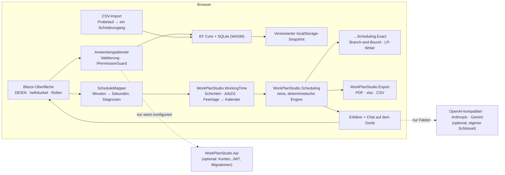

# WorkPlan Studio

[English](README.md) · **Deutsch**

[](https://github.com/aco993/WorkPlanStudio/actions/workflows/ci.yml)
[](https://github.com/aco993/WorkPlanStudio/actions/workflows/e2e.yml)
[](https://github.com/aco993/WorkPlanStudio/actions/workflows/quality.yml)
[](https://github.com/aco993/WorkPlanStudio/actions/workflows/codeql.yml)
[](https://github.com/aco993/WorkPlanStudio/actions/workflows/performance.yml)
[](https://aco993.github.io/WorkPlanStudio/)
[](docs/TESTING.de.md#abdeckung)
[](docs/TESTING.de.md#abdeckung)
[](docs/TESTING.de.md#abdeckung)
[](LICENSE)

**WorkPlan Studio** ist eine eigenständige Anwendung für die Arbeitsvorbereitung und die Feinplanung: **Arbeitspläne** mit ihren Arbeitsgängen, die **Arbeitsplätze** und **Kostenstellen**, auf denen sie laufen, **Fertigungsaufträge** mit eingefrorenem Arbeitsplan und eine **kapazitätsbeschränkte Feinplanung**, die Schichtkalender und das Arbeitszeitgesetz einhält — dazu ein Chat, der das Ergebnis erklärt, und ein Branch-and-Bound-Löser, der sagt, wie weit der Plan vom Optimum entfernt ist. Die gesamte Anwendung einschließlich ihrer relationalen Datenbank läuft im Browser als statische WebAssembly-Seite. Ein optionales ASP.NET-Core-Backend mit echten Benutzerkonten ist vorhanden und bleibt aus, solange es nicht konfiguriert wird.

> **Live-Demo:** <https://aco993.github.io/WorkPlanStudio/> — Englisch und Deutsch, hell und dunkel, Desktop und Mobilgerät. Nichts zu installieren, keine Anmeldung.


---

## Was die Anwendung kann

- 📋 **Arbeitspläne** — anlegen, bearbeiten, durchsuchen und nach Status (Entwurf / Freigegeben / Archiviert) filtern, mit einem Arbeitsgang-Editor, dessen Summe aus Rüstzeit und Stückzeit sowie die Kosten beim Tippen neu berechnet werden.
- 🏭 **Arbeitsplätze und Kostenstellen** — Stundensätze, die **Kostenstelle als echte Stammdaten** (kein Freitextfeld) mit referenzieller Integrität in der Datenbank, geprüfte Parallelkapazität, ein **Schichtmodell** (durchgehend, Ein-, Zwei- oder Dreischicht) und **Abwesenheiten**. Ein Arbeitsplatz, den ein freigegebener Auftrag noch braucht, lässt sich weder löschen noch stilllegen.
- 🧾 **Fertigungsaufträge** — eine Losgröße eines Teils zu einem Termin. Die Freigabe **friert den Arbeitsplan ein**, nach dem gefertigt wird; eine spätere Änderung am Arbeitsplan kann Arbeit, die bereits in der Fertigung ist, nicht mehr verändern.
- 🗓️ **Kapazitätsbeschränkte Feinplanung** — sechs Prioritätsregeln, vier Terminregeln, drei Annahmeregeln für die lokale Suche, Multi-Start mit festem Seed und Insertion-Nachbarschaft, ein Gantt-Diagramm mit echten Terminen, das **vollständig mit der Tastatur bedienbar** und als Tabelle lesbar ist, sowie Kennzahlen für Durchlaufzeit, Verspätung, Termintreue und Auslastung *der offenen Zeit*.
- 🎯 **Eine belastbare Aussage zur Optimalität** — ein disjunktives **Branch-and-Bound**, das keine Zeile Code mit der Heuristik teilt, dazu ein LP-Export für alle, die keinem von beiden trauen. Die Seite kann den Plan auf dem Bildschirm als optimal beweisen, den Abstand nennen oder die bewiesene untere Schranke ausweisen. Auf einer fest eingecheckten Studie über zwanzig Instanzen trifft die Heuristik **18 von 20** gegen die beste Auftragsreihenfolge und **7 von 20** gegen das wahre Optimum — der Unterschied zwischen diesen beiden Zahlen ist der interessante Teil, siehe unten.
- ⚖️ **Arbeitszeit als Randbedingung** — Schichten, Ruhepausen, Ruhezeiten, Sonntage, Feiertage je Bundesland und Abwesenheiten werden zu Maschinenkalendern. Jede Vorschrift des ArbZG, die die Anwendung umsetzt, ist ein **Parameter mit Gesetzesverweis**, und die **Ausgleichszeiträume nach § 3 Satz 2 und § 6 Abs. 2 werden berechnet und angezeigt**: die Schichtbesatzung, der Durchschnitt je Werktag, das Datum der ersten Überschreitung und die noch auszugleichenden Tage.
- 🔄 **CSV-Import mit Probelauf** — Vorschau und Übernahme sind ein und derselbe Codepfad, die Vorschau kann also nicht lügen. Jede abgelehnte Zeile nennt Zeile, Spalte und Grund, und die Datei landet als **ein** atomarer Schreibvorgang oder gar nicht.
- 📄 **Export nach PDF, Excel und CSV** — von Hand geschrieben, im Browser, **ohne Paketabhängigkeit und ohne native Bibliothek**: das PDF bringt seine eigene Objekttabelle und ein Vektor-Gantt mit, die Arbeitsmappe ist OOXML in der richtigen Reihenfolge gezippt, und beide Sprachen bekommen ihre eigene Datumsregel.
- 🧵 **Ein Lauf, der den Browser nicht einfriert** — die Suche wird über Browser-Durchläufe hinweg zerlegt, mit echter Fortschrittsanzeige und einem Abbrechen, das den bisherigen Plan unverändert lässt. Warum es keinen Web Worker gibt, ist gemessen und nicht vermutet.
- 💬 **Ein Chat über den Plan** — „Welcher Arbeitsplatz ist der Engpass?“, „Warum ist PO-1003 verspätet?“, „Was wäre mit SPT?“ (das lässt die Planung erneut laufen). Die Antworten entstehen **auf Ihrem Gerät**, auf Deutsch oder Englisch, ohne Schlüssel. Mit eigenem API-Schlüssel gehen dieselben Fakten — begrenzt, bereinigt und als Daten eingefasst — an **OpenAI-kompatible, Anthropic- oder Gemini-Modelle**, mit Rückfall auf die Antwort vom Gerät bei jedem Fehler.
- 👥 **Rollen, wahlweise mit echten Konten** — Planer, Meister und Gast laufen durch die echte Autorisierungspipeline von ASP.NET Core. Richtet man die App auf das mitgelieferte Backend, setzt *dieselbe Richtlinientabelle* ein Server gegen ein JWT durch, mit Identity, Passwort-Hashing und rotierenden Refresh-Tokens.
- 🌗 **Helles, dunkles und System-Farbschema**, WCAG 2.2 AA per axe auf jeder Route in hell, dunkel **und auf Deutsch** geprüft, Tastaturpfade mit Sprunglink und Fokusverwaltung, `prefers-reduced-motion`, Unterstützung für den Kontrastmodus und ein mobiles Layout mit Navigationsschublade.
- 🌍 **Zweisprachige Oberfläche (DE / EN)** mit kulturkorrekten Zahlen, Datumsangaben und Währungen.
- 💾 **Eine echte Datenbank im Browser** — EF Core über SQLite in WebAssembly, Schemastand 7, mit einer **echten Migration** von 5 und 6, die die Primärschlüssel erhält; WAL-sichere atomare Snapshots, und inkompatible Daten landen in einem ausdrücklichen Export-/Import-/Zurücksetzen-Ablauf, statt verloren zu gehen.

## Bildschirmfotos

| Übersicht, hell | Übersicht, dunkel |
| --- | --- |
|  |  |

| Planung mit schattierter geschlossener Zeit, dunkel | Arbeitszeit: die Vorschriften, der Ausgleichszeitraum, die Feiertage |
| --- | --- |
|  |  |

| Der Chat auf Englisch | Auf Deutsch | Mobilgerät |
| --- | --- | --- |
|  |  |  |

Die Planungsseite reagiert auf die Änderung **eines einzigen Parameters** — dieselben sieben Aufträge unter einem lockeren und einem straffen Durchlauffaktor. Bei `5,0` ist jeder Auftrag pünktlich, bei `0,5` sind alle sieben verspätet: rot umrandete Gantt-Balken und rote Status-Pillen. _(Mit Playwright gegen einen laufenden Build dieses Standes aufgenommen, nicht nachbearbeitet.)_

| Termintreu — Durchlauffaktor `5,0` | Verspätet — Durchlauffaktor `0,5` |
| --- | --- |
|  |  |

## Wie die Teile zusammenspielen


```mermaid
flowchart LR
    subgraph Browser
        UI["Blazor-Oberfläche<br/>DE/EN · hell/dunkel · Rollen"]
        SVC["Anwendungsdienste<br/>Validierung · IPermissionGuard"]
        IMP["CSV-Import<br/>Probelauf → ein Schreibvorgang"]
        DB["EF Core + SQLite (WASM)"]
        LS["Versionierter localStorage-Snapshot"]
        MAP["ScheduleMapper<br/>Minuten → Sekunden, Diagnosen"]
        WT["WorkPlanStudio.WorkingTime<br/>Schichten · ArbZG · Feiertage → Kalender"]
        ENG["WorkPlanStudio.Scheduling<br/>reine, deterministische Engine"]
        EXACT["…Scheduling.Exact<br/>Branch-and-Bound · LP-Writer"]
        EXP["WorkPlanStudio.Export<br/>PDF · xlsx · CSV"]
        CHAT["Erklärer + Chat auf dem Gerät"]
    end
    AI["OpenAI-kompatibel · Anthropic · Gemini<br/>(optional, eigener Schlüssel)"]
    API["WorkPlanStudio.Api<br/>(optional: Konten, JWT, Migrationen)"]

    UI --> SVC --> DB --> LS
    IMP --> DB
    UI --> MAP --> WT --> ENG --> CHAT --> UI
    ENG --> EXP
    ENG --> EXACT
    CHAT -. nur Fakten .-> AI
    SVC -. nur wenn konfiguriert .-> API
```

Vier **reine Bibliotheken** tragen die Logik — Planungsengine, Arbeitszeitregeln und Export-Writer haben keine Blazor-, EF-, JavaScript- oder Netzwerkabhängigkeit, und ein Architekturtest lässt den Build scheitern, wenn sich das ändert. Die App ist die Hülle darum. Siehe [docs/ARCHITECTURE.de.md](docs/ARCHITECTURE.de.md).

## Produktionsfeinplanung

Die Seite **Planung** macht aus den freigegebenen Fertigungsaufträgen einen kapazitätsbeschränkten Plan — der algorithmisch anspruchsvollste Teil des Projekts, in `src/WorkPlanStudio.Scheduling`.

1. **Zieltermine.** Ein freigegebener Auftrag bringt seinen Kundentermin mit, deshalb ist der Standard, ihn zu verwenden. Wo keiner gilt, lässt sich ein Ziel nach Total Work Content (TWK), Number of Operations (NOP), Equal Slack (SLK) oder Constant Allowance (CON) ableiten.
2. **Restriktionen der Fertigung.** Jeder Arbeitsplatz bringt seinen Kalender aus der Arbeitszeit-Bibliothek mit (Zeitfenster, Pausen, über die ein Arbeitsgang unterbrochen werden darf, und Sperrzeiten, über die er es nie darf), dazu optional eine reihenfolgeabhängige Rüstmatrix zwischen Arbeitsgangfamilien.
3. **Belegungsplanung.** Ein List-Scheduler setzt jeden Arbeitsgang auf die Belegung, die *am frühesten fertig wird* — nicht auf den Platz, der als erster frei ist — und beachtet dabei Reihenfolge, Kapazität, Kalender und Rüstzeit. Sechs Prioritätsregeln bestimmen die Ausgangsreihenfolge: FIFO, SPT, LPT, EDD, Critical Ratio und WSPT.
4. **Optimierung.** Ein Multi-Start mit festem Seed, jeder Neustart gefolgt von einem Abstieg über die Insertion-Nachbarschaft der Auftragsreihenfolge; das Ergebnis ist nie schlechter als der reine Regelplan. Welchen verbessernden Nachbarn der Abstieg übernimmt, wurde über 75 Läufe gemessen und hat den Standard geändert ([ADR 0022](docs/adr/0022-local-search-acceptance.md)).
5. **Bewertung.** Durchlaufzeit, Gesamt- und Maximalverspätung, Termintreue und Auslastung der offenen Zeit gehen in einen Strafwert ein, den die Suche minimiert.

### Wie gut ist der Plan wirklich

Auf einem festen, eingecheckten Satz von zwanzig Instanzen werden zwei verschiedene Dinge gemessen.

Gegen die **beste Auftragsreihenfolge, die der Dispatcher bekommen kann** — die Obergrenze der Suche selbst — ist die Suche bei **18 von 20** exakt und im Mittel **0,27 %** entfernt. Gegen das **Optimum des Planungsproblems**, bewiesen vom Branch-and-Bound in `WorkPlanStudio.Scheduling.Exact`, ist sie bei **7 von 20** exakt, mit einem Median-Abstand von **5,3 %**. Der Unterschied zwischen diesen beiden Zahlen ist das Dispatch-Order-Modell — ein ganzer Auftrag nach dem anderen, ohne Lücken nachträglich zu füllen — und nicht die Suche.

Das ist ein interessanteres Ergebnis als das, was hier früher behauptet wurde, und es ist dasjenige, das die Artefakte hergeben. `OptimalityStudyTests` fixiert beide Zahlen; [ADR 0015](docs/adr/0015-exact-solver.md) enthält die Tabelle je Instanz und den einen Befehl, der sie neu erzeugt.

Die Engine ist **deterministisch** (ganzzahlige Belegungsarithmetik, ein PRNG mit festem Algorithmus, bit-identische Ergebnisse auf Arbeitsplatzrechner, CI und im Browser), **zulässig per Konstruktion** (Kandidaten permutieren die Prioritätsreihenfolge und planen neu ein) und **ehrlich gegenüber ihren Parametern**: sie meldet, welche anderen Regeln dieselbe Reihenfolge ergäben, statt stumm denselben Plan zurückzugeben, und sie verweigert eine Parameterkombination, die vom Browser 1 280 000 Kandidatenpläne verlangen würde. Einzelheiten: [docs/SCHEDULING.de.md](docs/SCHEDULING.de.md).

## Arbeitszeit und das Arbeitszeitgesetz

Der Betrieb, nicht die Planung, entscheidet, wann eine Maschine laufen darf. `src/WorkPlanStudio.WorkingTime` macht aus einem Schichtmodell und den Betriebseinstellungen eine Woche offener Zeitfenster und eine Liste geschlossener Strecken, jede mit der Vorschrift, die sie geschlossen hat:

| Vorschrift | Parameter | Vorbelegung |
| --- | --- | --- |
| § 3 ArbZG werktägliche Arbeitszeit | 8 h, oder 10 h, solange der Durchschnitt über 24 Wochen oder sechs Kalendermonate bei 8 h bleibt — **und dieser Durchschnitt wird berechnet**, mit Besatzung, Datum der ersten Überschreitung und noch auszugleichenden Tagen | 10 h |
| § 4 ArbZG Ruhepausen | 30 min ab mehr als 6 h, 45 min ab mehr als 9 h, in Abschnitten von mindestens 15 min | gesetzlich |
| § 5 ArbZG Ruhezeit | 11 h je Besatzung, auch über den Wochenumbruch. Die Verkürzung auf 10 h ist an eine **erklärte Branche nach § 5 Abs. 2** gebunden und weist die Ausgleichspflicht auf 12 h aus | 11 h, keine Branche |
| § 6 Abs. 2 ArbZG Nachtarbeit | 8 h, oder 10 h, solange der Durchschnitt über vier Wochen bei 8 h bleibt — ebenfalls berechnet und angezeigt | 8 h |
| § 9 ArbZG Sonn- und Feiertagsruhe | geschlossen, sofern keine Ausnahme nach § 10 greift; bei mehrschichtigen Betrieben darf das Ruhefenster um bis zu 6 h **vor- oder zurückverlegt** werden, und die Voraussetzung wird geprüft | geschlossen |
| § 11 Abs. 1 ArbZG beschäftigungsfreie Sonntage | mindestens 15 im Jahr, gezählt gegen die tatsächlichen 52 oder 53 Sonntage des Jahres und einen erklärten Turnus | gezählt |
| Feiertage | aus dem Osterdatum für alle 16 Länder berechnet, **jahresgenau über 1990–2200** (Reformationstag nur 2017 bundesweit; Buß- und Bettag bundesweit bis 1994) | Nordrhein-Westfalen |

Die Arbeitszeitseite zeigt die geltenden Vorschriften, eine Vorschau der Woche je Arbeitsplatz, die Karte zum Ausgleichszeitraum, die Feiertage des Jahres für das gewählte Land und die Abwesenheiten. Das Gantt-Diagramm nennt die Vorschrift, die eine Maschine geschlossen hat, sobald man eine schattierte Strecke anfährt. Siehe [ADR 0012](docs/adr/0012-working-time-as-capacity.md) und [ADR 0024](docs/adr/0024-arbzg-in-the-ui.md).

## Der Planungs-Assistent

Jeder Lauf wird zweimal erklärt. Ein deterministischer **Erklärer** in der Engine findet den Engpass, die verspäteten Aufträge und die Ressource, auf die jeder gewartet hat, dazu eine *berechnete* Empfehlung: Er lässt die anderen Prioritätsregeln laufen und schlägt einen Wechsel nur vor, wenn er die Zielfunktion messbar verbessert. Unter dieser Erläuterung beantwortet ein **Chat** Fragen zum Lauf — aus denselben Fakten, die die Seite anzeigt, auf Ihrem Gerät, auf Deutsch oder Englisch.

Mit eigenem Schlüssel gehen dieselben Fakten und die Antwort vom Gerät an ein Modell Ihrer Wahl; bei jedem Fehler erscheint die Antwort vom Gerät mit einem Hinweis. Der Schlüssel wird je Anbieter getrennt abgelegt, gelangt nie zurück in die Seite und lässt sich mit einem Klick vergessen. Siehe [docs/AI-ASSISTANT.de.md](docs/AI-ASSISTANT.de.md) und [ADR 0025](docs/adr/0025-hostile-input-on-the-model-path.md).

## Rollen und das optionale Backend

Die Kopfleiste lässt Sie **Planer** (alles), **Meister** (Aufträge freigeben und Abwesenheiten erfassen, aber weder Arbeitspläne noch Betriebsregeln ändern) oder **Gast** (ansehen, nichts ändern) sein. Das ist kein Schalter in der Oberfläche: Die Rolle ist ein `ClaimsPrincipal` in der echten Autorisierungspipeline von ASP.NET Core, die Seiten nutzen `AuthorizeView`-Richtlinien, und jeder schreibende Dienst prüft dieselbe Richtlinie über einen `IPermissionGuard` — eine Menge, die ein Reflexionstest ermittelt, statt einer Liste, die jemand pflegen muss.

„Die Demo-Identität gegen eine echte zu tauschen ist eine Klasse“ war eine Behauptung; inzwischen ist es ein Projekt. `src/WorkPlanStudio.Api` bindet die Richtlinientabelle des Clients als *verlinkten Quelltext* ein und setzt sie gegen ein JWT für ein Identity-Konto durch, mit rotierenden Refresh-Tokens, Kontosperre, Ratenbegrenzung und einem Start, der einen zu schwachen Signaturschlüssel verweigert. Wird `Api:BaseAddress` konfiguriert, verschwindet der Rollenwechsler. Die veröffentlichte Demo konfiguriert ihn nicht, und [docs/SECURITY.de.md](docs/SECURITY.de.md) sagt deutlich, dass die Demo nichts schützt. Siehe [ADR 0013](docs/adr/0013-personas-through-the-real-authorization-pipeline.md) und [ADR 0020](docs/adr/0020-optional-backend-and-real-auth.md).

## Technologie

| Bereich | Wahl |
| --- | --- |
| Framework | .NET 10, Blazor WebAssembly (eigenständig) |
| Daten | Entity Framework Core 10 + SQLite in WebAssembly, im `localStorage` persistiert, schemaversioniert mit echten Aufwertungsschritten |
| Domänenbibliotheken | `WorkPlanStudio.Scheduling` (kapazitätsbeschränkte Engine und exakter Löser), `WorkPlanStudio.WorkingTime` (ArbZG-Regeln, Feiertage, Kalender), `WorkPlanStudio.Export` (CSV, xlsx, PDF) — alle reines C#, ohne Paketreferenzen |
| Optionales Backend | ASP.NET Core 10 Minimal API, EF-Core-Migrationen, ASP.NET Core Identity, JWT mit Refresh-Tokens, OpenAPI, Docker |
| Berechtigungen | `Microsoft.AspNetCore.Components.Authorization`, Richtlinien, `IAuthorizationService` — eine Richtlinientabelle, in beide Wirte kompiliert |
| Lokalisierung | `Microsoft.Extensions.Localization`, `IStringLocalizer`, `.resx` (DE / EN) |
| Gestaltung | Handgeschriebenes CSS-Designsystem auf Custom-Property-Tokens; helles, dunkles und System-Farbschema; Kontrastmodus |
| KI | Anbieter-Schnittstelle mit OpenAI-kompatiblem, Anthropic- und Gemini-Client; quellgenerierte JSON-Serialisierung; Rückfall aufs Gerät |
| Tests | xUnit v3 auf der Microsoft Testing Platform, CsCheck-Property-Tests, bUnit, Playwright, axe-core, BenchmarkDotNet, Lighthouse CI |
| CI / Hosting | GitHub Actions — abdeckungsgesicherte Tests, Browser-Suite, CodeQL, Format- und Linkprüfung, auf Commit-SHA fixierte Actions, Dependabot; Auslieferung nach GitHub Pages erst nach allen Suiten |

## Dokumentation

| Thema | English | Deutsch |
| --- | --- | --- |
| Projektübersicht | [README.md](README.md) | dieses README |
| Architektur | [docs/ARCHITECTURE.md](docs/ARCHITECTURE.md) | [docs/ARCHITECTURE.de.md](docs/ARCHITECTURE.de.md) |
| Planungsalgorithmus | [docs/SCHEDULING.md](docs/SCHEDULING.md) | [docs/SCHEDULING.de.md](docs/SCHEDULING.de.md) |
| Planungs-Assistent und Chat | [docs/AI-ASSISTANT.md](docs/AI-ASSISTANT.md) | [docs/AI-ASSISTANT.de.md](docs/AI-ASSISTANT.de.md) |
| Teststrategie | [docs/TESTING.md](docs/TESTING.md) | [docs/TESTING.de.md](docs/TESTING.de.md) |
| Leistung | [docs/PERFORMANCE.md](docs/PERFORMANCE.md) | [docs/PERFORMANCE.de.md](docs/PERFORMANCE.de.md) |
| Sicherheit | [docs/SECURITY.md](docs/SECURITY.md) | [docs/SECURITY.de.md](docs/SECURITY.de.md) |
| Entscheidungsprotokolle (25 ADRs) | [docs/adr](docs/adr/README.md) | [docs/adr/README.de.md](docs/adr/README.de.md) (nur das Verzeichnis) |
| Änderungsprotokoll | [CHANGELOG.md](CHANGELOG.md) | — |
| Mitwirken | [CONTRIBUTING.md](CONTRIBUTING.md) | [CONTRIBUTING.de.md](CONTRIBUTING.de.md) |
| Kontext für KI-Agenten | [AGENTS.md](AGENTS.md) | — |

## Entwicklungspraxis — gemessen, nicht behauptet

- **1 652 Unit- und Integrationstests in fünf Projekten, dazu 76 Browsertests**: Unit, eigenschaftsbasiert (CsCheck), bewiesene Optimalität gegen einen unabhängigen Löser, Architektur, Leistungsbudgets, Datentests mit echtem SQLite samt Schemaaufwertung, Berechtigungen als per Reflexion ermittelte geschlossene Menge, bUnit-Komponenten, Anbieter-Clients gegen einen feindlichen Stub-Transport, HTTP-Integrationstests gegen das Backend, Byte-Tests der PDF- und xlsx-Writer, Playwright-Abläufe in beiden Sprachen, **axe WCAG 2.2 AA auf jeder Route in hell, dunkel und auf Deutsch** und **Bildvergleich** gegen Pixel-Baselines. [docs/TESTING.de.md](docs/TESTING.de.md).
- **Abdeckung je Assembly in der CI abgesichert** — der Build scheitert unter 90 % Zeilen für die Engine (gemessen **96,6 %**), 90 % für die Arbeitszeit-Bibliothek (**94,3 %**), 65 % für die App (**79,9 %**) und 60 % für das Backend (**70,2 %**). Die Badges oben entstehen bei jeder Auslieferung aus derselben Messung. Die Export-Bibliothek misst **98,5 %** und ist noch nicht in der CI verdrahtet — [docs/TESTING.de.md](docs/TESTING.de.md#abdeckung) sagt das, statt es zu verschweigen.
- **Auslieferung erst nach allem** — die Testmatrix mit ihren Abdeckungsschwellen *und* die Browser-Suite müssen bestehen, bevor GitHub Pages aktualisiert wird, und der Job, der fremden Testcode ausführt, hält keine Auslieferungsrechte.
- **Leistung gemessen, auch dort, wo es unschmeichelhaft ist** — BenchmarkDotNet über die Bibliotheken, Stolperdrähte auf die Uhr und Lighthouse CI auf der veröffentlichten Seite, die den Seitenaufbau mit **36 / 100** bewertet und Barrierefreiheit, Best Practices und SEO mit 100. Alles, samt der Maschine, auf der es gemessen wurde, steht in [docs/PERFORMANCE.de.md](docs/PERFORMANCE.de.md).
- **Strikte Builds** — Nullable Reference Types, .NET-Analyzer, Warnungen als Fehler, eine `.editorconfig` mit 25 durchgesetzten Regeln über `dotnet format --severity warn` in der CI, Central Package Management, Dependabot, CodeQL security-extended.
- **Entscheidungen dokumentiert** — fünfundzwanzig [Architecture Decision Records](docs/adr/README.md), jeder mit den Optionen, die verloren haben, und mehrere mit einem Nachtrag, der festhält, wo eine spätere Entscheidung die Prämisse einer früheren aufgelöst hat.
- **Jeder relative Link und jeder Überschriften-Anker in der Dokumentation wird geprüft** — vom Quality-Workflow, damit nichts hier auf eine verschobene Datei oder einen umbenannten Abschnitt zeigt.

## Was dieses Projekt zeigt

Dies ist ein öffentliches **Portfolio-Projekt**. Es nutzt eine generische Fertigungsdomäne und erfundene Daten und teilt keinen Code mit einem proprietären System. Es soll zeigen, *wie* ich baue, nicht nur, dass eine Funktion läuft:

| Bereich | Wo zu finden | Was es zeigt |
| --- | --- | --- |
| **Architekturgrenze** | `src/WorkPlanStudio.Scheduling`, `.WorkingTime`, `.Export` | drei reine Domänenkerne hinter einer *erzwungenen* Abhängigkeitsgrenze |
| **Algorithmen** | `SchedulingEngine`, `DispatchScheduler`, `LocalSearch`, `Exact/` | kapazitätsbeschränkte Planung mit Kalendern und Rüstmatrix, lokale Suche und ein disjunktives Branch-and-Bound mit Relaxationsschranken und Propagierung |
| **Die eigene Arbeit messen** | `OptimalityStudyTests`, `tools/…Scenarios -- exact` | ein unabhängiges Orakel, das gezeigt hat, dass die Kernaussage des Projekts gegen die falsche Referenz gemessen war |
| **Domänenmodellierung** | `WorkingTimeRules`, `WorkingTimeCompliance`, `GermanHolidays` | Gesetz als Parameter, berechnete Ausgleichszeiträume, Feiertage, die wissen, in welchem Jahr sie gelten |
| **Data Engineering** | `Data/BrowserDatabase.cs`, `Data/SchemaUpgrades.cs` | eine relationale Datenbank clientseitig, mit atomaren Snapshots und einer echten schlüsselerhaltenden Migration |
| **Dateiformate** | `src/WorkPlanStudio.Export` | PDF und xlsx aus der Spezifikation geschrieben, mit den Bytes im Test zurückgelesen |
| **Backend und Anmeldung** | `src/WorkPlanStudio.Api` | Minimal API, Identity, JWT mit Refresh-Token-Rotation und Wiederverwendungserkennung, Migrationen, ProblemDetails, Docker |
| **Feindliche Eingaben** | `Services/Assistant/**`, `Services/Import/**` | ein Modellpfad und ein Dateipfad, die überstehen, was ein Angreifer schickt |
| **Front-End** | `Pages/`, `wwwroot/css/app.css` | Blazor WebAssembly, ein Token-Designsystem, ein Gantt, das ohne Maus funktioniert, WCAG AA in zwei Sprachen |
| **DevOps** | `.github/workflows` | CI je Schicht, Browser-Suite, CodeQL, Leistung, Abdeckungs-Badges, Auslieferung mit minimalen Rechten |
| **Dokumentation** | `docs/`, ADRs, `AGENTS.md` | Entscheidungen festgehalten, Zahlen gemessen, Grenzen benannt |

Wenig Zeit? Der schnellste Rundgang ist `AGENTS.md` → `SchedulingEngine.cs` → `Exact/DisjunctiveBranchAndBound.cs` → `WorkingTimelineBuilder.cs` → `ScheduleMapper.cs` → `Pages/Schedule.razor`.

## Projektstruktur

```
WorkPlanStudio/
├─ .github/
│  ├─ workflows/                    # ci, e2e, quality, codeql, performance, deploy
│  └─ scripts/                      # Abdeckungsschwelle, Link- und .resx-Prüfung — mit eigenen Tests
├─ docs/                            # ARCHITECTURE, SCHEDULING, TESTING, AI-ASSISTANT, PERFORMANCE, SECURITY (+ .de), adr/, images/
├─ src/
│  ├─ WorkPlanStudio/               # die Blazor-WebAssembly-App
│  │  ├─ Models/  Data/  Validation/
│  │  ├─ Services/                  # ScheduleMapper, ShopCalendar, Auth/, Assistant/, Import/, Export/, Scheduling/, Remote/
│  │  ├─ Resources/  Components/  Layout/  Pages/  wwwroot/
│  ├─ WorkPlanStudio.Scheduling/    # reine Engine: Inputs, Parameters, Core, Evaluation, Explain, Outputs, Exact/
│  ├─ WorkPlanStudio.WorkingTime/   # reine Regeln: GermanHolidays, ShiftPattern, WorkingTimeRules, WorkingTimelineBuilder, Compliance
│  ├─ WorkPlanStudio.Export/        # reine Writer: Csv/, Xlsx/, Pdf/
│  ├─ WorkPlanStudio.Contracts/     # mit der API geteilte DTOs und Richtliniennamen
│  └─ WorkPlanStudio.Api/           # optionales Backend: Identity, JWT, EF-Migrationen, Endpunkte
├─ tests/
│  ├─ WorkPlanStudio.Scheduling.Tests/    # Unit, Property, Optimalitätsstudie, exakter Löser, Architektur, Budgets
│  ├─ WorkPlanStudio.WorkingTime.Tests/   # Feiertage, Vorschriften, Ausgleich, Zeitumstellung, Zeitleisten-Invarianten
│  ├─ WorkPlanStudio.Web.Tests/           # SQLite, Aufwertung, Mapping, Berechtigungen, Import, bUnit, Assistent
│  ├─ WorkPlanStudio.Api.Tests/           # HTTP-Integration gegen eine echte SQLite-Datei
│  ├─ WorkPlanStudio.Export.Tests/        # die erzeugten Bytes, zurückgelesen
│  ├─ WorkPlanStudio.E2E/                 # Playwright-Abläufe, axe, Bild-Baselines
│  ├─ WorkPlanStudio.Scheduling.Testing/  # der eine Problemgenerator und die Optimalitätsinstanzen
│  └─ WorkPlanStudio.Benchmarks/          # BenchmarkDotNet
└─ tools/WorkPlanStudio.Scheduling.Scenarios/   # reproduzierbare Szenarien: Leistung, Annahmeregel, Optimalität, LP-Export
```

## Erste Schritte

### Voraussetzungen

- [.NET 10 SDK](https://dotnet.microsoft.com/download) (das Repository legt das SDK-Band in `global.json` fest)
- Die WebAssembly-Tools-Workload, einmalig zum Relinken von nativem SQLite:

  ```bash
  dotnet workload install wasm-tools
  ```

### Lokal ausführen

```bash
dotnet run --project src/WorkPlanStudio/WorkPlanStudio.csproj
```

Öffnen Sie <http://localhost:5235>. Der erste Build dauert einige Minuten, weil SQLite nach WebAssembly kompiliert wird; spätere Builds sind zwischengespeichert. Beim ersten Start legt die App einen Demo-Betrieb an (sieben Arbeitsplätze mit Schichtmodellen, Kostenstellen, sieben freigegebene Aufträge, eine Abwesenheit); **Über → Zurücksetzen** stellt ihn jederzeit wieder her.

### Tests ausführen

```bash
dotnet test tests/WorkPlanStudio.Scheduling.Tests/WorkPlanStudio.Scheduling.Tests.csproj    # Engine — kein WASM nötig
dotnet test tests/WorkPlanStudio.WorkingTime.Tests/WorkPlanStudio.WorkingTime.Tests.csproj  # Arbeitszeit — kein WASM nötig
dotnet test tests/WorkPlanStudio.Export.Tests/WorkPlanStudio.Export.Tests.csproj            # die Export-Writer — kein WASM nötig
dotnet test tests/WorkPlanStudio.Api.Tests/WorkPlanStudio.Api.Tests.csproj                  # das optionale Backend — kein WASM nötig
dotnet test tests/WorkPlanStudio.Web.Tests/WorkPlanStudio.Web.Tests.csproj                  # Daten, Mapping, Import, Komponenten, Assistent
```

Die Browser-Suite (Abläufe, axe, Bildvergleich) braucht die laufende App und einmalig ein Chromium:

```bash
dotnet build tests/WorkPlanStudio.E2E/WorkPlanStudio.E2E.csproj
pwsh tests/WorkPlanStudio.E2E/bin/Debug/net10.0/playwright.ps1 install chromium
dotnet test tests/WorkPlanStudio.E2E/WorkPlanStudio.E2E.csproj
```

[docs/TESTING.de.md](docs/TESTING.de.md) erklärt die Schichten, die Umgebungsvariablen und das Erneuern der Bild-Baselines.

### Das optionale Backend starten

```bash
dotnet user-secrets set "Jwt:SigningKey" "<mindestens 32 Byte>" --project src/WorkPlanStudio.Api
dotnet run --project src/WorkPlanStudio.Api
```

Ohne Signaturschlüssel startet es nicht, und genau das ist der Sinn. In der Entwicklungsumgebung stellt es `/swagger` bereit und legt Demo-Konten an; anschließend trägt man `{ "Api": { "BaseAddress": "https://…" } }` in `src/WorkPlanStudio/wwwroot/appsettings.json` ein, damit die Browser-App dagegen läuft.

### Statischen Build veröffentlichen

```bash
dotnet publish src/WorkPlanStudio/WorkPlanStudio.csproj -c Release -o publish
```

Die auslieferbare Seite liegt in `publish/wwwroot/` — 103 Dateien, 19,8 MB, davon 5,8 MB als vorkomprimierte Brotli-Geschwister, die der Browser tatsächlich überträgt — und kann von jedem statischen Webserver ausgeliefert werden.

## Auslieferung

[`deploy.yml`](.github/workflows/deploy.yml) veröffentlicht bei jedem Push auf `main` nach **GitHub Pages**, nachdem die Testmatrix und die Browser-Suite bestanden haben — der Workflow *ruft* diese Workflows auf, statt sie zu kopieren, damit die Schwellenwerte an einer Stelle liegen. Er veröffentlicht die App, schreibt `<base href>` für den Projekt-Unterpfad um, ergänzt einen `404.html`-SPA-Rückfall und eine `.nojekyll`-Markierung, legt die Badge-Daten der Abdeckung neben die Seite und liefert aus. Zum Aktivieren in einem Fork: **Settings → Pages → Source = GitHub Actions**.

## Grenzen, klar benannt

- **Rollen sind keine Zugriffskontrolle.** In der veröffentlichten Demo kann jeder Planer sein, indem er es wählt; der Code läuft im Browser des Besuchers. Echter Schutz braucht einen Server, dem die Daten gehören — und genau das ist das optionale Backend, das die Demo aber nicht betreibt.
- **Die Planung ist eine Heuristik, und es gibt jetzt eine Zahl dafür, was das kostet.** Sie liegt auf der Studie über zwanzig Instanzen 0,27 % von der besten Auftragsreihenfolge entfernt und im Median 5,3 % vom wahren Optimum, weil der Dispatcher entstandene Lücken nie nachträglich füllt. Das zu ändern ist ein Umbau, keine Feineinstellung, und es ist nicht getan.
- **Der exakte Löser hat eine Kante, keine Steigung.** Bis achtzehn Arbeitsgänge wird jede untersuchte Instanz in unter einer Sekunde als optimal bewiesen; bei einundzwanzig und vierundzwanzig sind drei von fünf in Millisekunden bewiesen und die übrigen zwei auch in einer Minute nicht. Nicht die Größe ist der Prädiktor, sondern wie viel vom Optimum die Relaxation schon kennt.
- **Der Optimalitätsbeweis friert den Tab ein**, für die bis zu zwei Sekunden, die er bekommt. Die Suche ist eine enge Schleife ohne Rückgabe an den Browser; sie zu zerlegen wurde nicht versucht.
- **Es wurde kein externer MILP-Löser ausgeführt.** Die LP-Dateien werden geschrieben und im Repository auf zwei Wegen geprüft; weder HiGHS noch CBC war auf der Maschine installiert, auf der die Studie gemessen wurde, und das Rezept in [ADR 0015](docs/adr/0015-exact-solver.md) ist ungetestet angegeben.
- **Die App lässt sich überhaupt nicht mit Threads bauen.** Das `browser-wasm`-Binary von `SQLitePCLRaw` ist ohne `atomics` übersetzt, deshalb scheitert `WasmEnableThreads=true` schon am Linker — Threads oder Datenbank, nicht beides. Der Planungslauf wird stattdessen auf dem einen Thread zerlegt, was Laufzeit kostet. Gemessen in [ADR 0019](docs/adr/0019-off-thread-scheduling.md).
- **Das Laden von .NET-Laufzeit und SQLite** sind 5,8 MB komprimiert; der Startschirm zeichnet nach 0,3 s, die Übersicht nach rund 7,7 s an einer Desktop-Verbindung. Lighthouse bewertet den Seitenaufbau mit 36 und berichtet das, statt es zu blockieren.
- **Die Erkennung des Chats auf dem Gerät ist stichwortbasiert.** Sie sagt jetzt, wenn sie eine Bezugnahme nicht auflösen kann, statt über etwas anderes zu antworten — ein Parser ist sie damit nicht.
- **Prompt Injection ist gemindert, nicht gelöst.** Die Fakten an ein Modell sind begrenzt, bereinigt und eingefasst, und dem Modell wird gesagt, dass die Einfassung Daten sind — der Text darin ist aber das, was jemand in eine Teilebezeichnung geschrieben hat.
- **Modellaufrufe gehen vom Browser zum Anbieter**, der Anbieter muss also CORS erlauben; ein Produktivbetrieb würde einen Proxy davorsetzen und den Schlüssel dort halten.
- **Das Bearbeiten im verbundenen Betrieb ist nicht verdrahtet.** Das Backend hat die vollständige Schreiboberfläche und die Tests üben sie aus, aber die Browser-Seiten schreiben weiterhin lokal, und der Abgleich läuft nur in eine Richtung. Diese Grenze steht in der Oberfläche, statt vorgetäuscht zu werden.
- **Bild-Baselines gibt es nur für Linux.** Auf jedem anderen Betriebssystem werden diese zehn Tests übersprungen; eine betriebssystemübergreifende Pixelgarantie gibt es nicht, und es gab nie einen Runner, der sie geliefert hätte.
- **Mutationstests sind stromaufwärts blockiert.** Stryker unterstützt die Microsoft Testing Platform noch nicht, deshalb wird kein Mutationsscore behauptet.
- **Der CSV-Import löscht nicht und übernimmt nichts teilweise.** Eine Datei kann nicht „diese Zeile entfernen“ sagen, und abgelehnte Zeilen werden nicht importiert — man korrigiert die Datei und importiert erneut.
- **Das Backend kompiliert die Domänenquellen, statt sie zu referenzieren.** `WorkPlanStudio.Api` zieht `Models/**`, `Validation/**` und vier Dienstdateien per `<Compile Include>` herein; beide Wirte teilen sich damit bauartbedingt eine Definition — aber wer eine dieser Dateien verschiebt, bricht den API-Build ohne Vorwarnung. Ein Projekt `WorkPlanStudio.Domain` wäre die richtige Form und ist nicht umgesetzt.
- **Serverseitig wird SQLite gespeichert.** Eine echte Datei mit echten Migrationen — und keine Produktionsdatenbank; gegen PostgreSQL oder SQL Server ist hier nichts gelaufen.
- Der Browser-Speicher ist lokale Demo-Persistenz: versionierte Snapshots mit Aufwertungspfad und Wiederherstellung, keine Synchronisierung. Beispielteile, -maschinen und -zeiten sind erfunden.

## Hinweis zur KI-gestützten Entwicklung

KI-Werkzeuge wurden intensiv eingesetzt, um Code, Tests und Dokumentation zu erzeugen und zu prüfen. Das Projekt wird nicht als vollständig handgeschrieben dargestellt. Der Autor bleibt verantwortlich für Spezifikation, Prüfung, Fehlersuche, Tests, Integration und die endgültigen Entscheidungen und kann jeden übernommenen Teil erklären. Ein Prozentsatz „KI-geschriebener Zeilen“ wird nicht behauptet, weil diese Zahl weder bekannt noch aussagekräftig ist; KI-Ausgabe wird nur nach Prüfung und ausführbarem Nachweis übernommen.

## Lizenz

[MIT](LICENSE)
