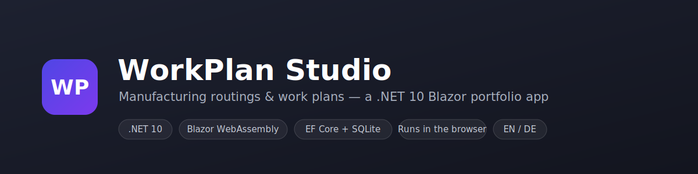

# WorkPlan Studio

[](https://dotnet.microsoft.com/)
[](https://learn.microsoft.com/aspnet/core/blazor/)
[](https://learn.microsoft.com/ef/core/)
[](LICENSE)

**WorkPlan Studio** is a small, self-contained portfolio application for managing **manufacturing routings** (work plans): the ordered list of operations needed to produce a part, the work centers those operations run on, and the resulting **time and cost** for a given lot size.

The whole thing — including a **real relational database** — runs entirely in the browser as a static WebAssembly app. There is no backend, no API and no server-side storage: it can be hosted for free on GitHub Pages and still behaves like a proper data-driven application.

> 🌐 **Live demo:** `https://aco993.github.io/WorkPlanStudio/`
> _(available once GitHub Pages finishes the first deployment — see [Deployment](#deployment))_

The interface is available in **English and German**, switchable at runtime.

---

## Highlights

- 📋 **Work plans / routings** — create, edit, search and filter work plans by status (Draft / Released / Archived).
- 🔧 **Operations editor** — an editable grid of operations (setup time, run time per piece, work center, remarks) with a **live summary** of total time and estimated cost that recalculates as you type.
- 🏭 **Work centers** — master data with hourly rates and cost centers, plus a guard that prevents deleting a work center still used by operations.
- 📊 **Dashboard** — key figures, a status distribution bar and the most recently updated plans.
- 🗓️ **Finite-capacity scheduling** — calculates a work-center timeline that respects operation sequence, machine availability and an 08:00-16:00 weekday calendar.
- 🌍 **Bilingual UI (EN / DE)** — full localization via `IStringLocalizer` and `.resx` resources, including culture-correct number, date and currency formatting.
- 💾 **Real database in the browser** — EF Core talks to a SQLite database that is compiled to WebAssembly and persisted to `localStorage`, so your data survives page reloads.
- 📱 **Responsive** — works from wide desktops down to a mobile drawer layout.

## What makes it technically interesting

The headline feature is that **EF Core + SQLite run client-side in WebAssembly**:

- The native SQLite engine is relinked into the app's `dotnet.native.wasm` at build time (via the `wasm-tools` workload).
- On startup the app reads a base64-encoded SQLite file from `localStorage` into the browser's in-memory file system; on first run it creates the schema and seeds sample data.
- After every change the SQLite file is written back to `localStorage`.
- A schema-version key guards against loading an incompatible database after a model change.

The scheduling page adds a small production-planning algorithm on top of that
data model. It uses a deterministic dispatching heuristic: each operation waits
for both the previous operation in the same work plan and the next free slot on
its work center, then the scheduler picks the ready operation with the earliest
feasible start time. Ties prefer shorter operations to reduce average flow time.
The result is displayed as a work-center timeline plus load/utilization figures.

This means the app demonstrates a full data layer — `DbContext`, relationships, LINQ queries, an `IDbContextFactory`, a service layer — **without any server**.

## Screenshots

> 📸 Drop two screenshots of the running app into `docs/` — `dashboard.png` and
> `work-plan-editor.png` — then uncomment the table below to show them here.

<!--
| Dashboard | Work plan editor |
| --- | --- |
|  |  |
-->


## Tech stack

| Area | Choice |
| --- | --- |
| Framework | .NET 10, Blazor WebAssembly (standalone) |
| Data | Entity Framework Core 10 + SQLite (compiled to WebAssembly) |
| Persistence | Browser `localStorage` via JS interop |
| Localization | `Microsoft.Extensions.Localization`, `IStringLocalizer`, `.resx` |
| Styling | Hand-written CSS design system (CSS custom properties) |
| Hosting | Static site — GitHub Pages via GitHub Actions |

## Project structure

```
WorkPlanStudio/
├─ .github/workflows/deploy.yml     # CI: publish + deploy to GitHub Pages
├─ docs/                            # banner + screenshots
└─ src/WorkPlanStudio/
   ├─ Models/                       # WorkPlan, Operation, WorkCenter, WorkPlanStatus
   ├─ Data/                         # AppDbContext, SeedData, BrowserDatabase
   ├─ Services/                     # WorkPlanService, WorkCenterService, Format
   │                                # + finite-capacity scheduling service
   ├─ Resources/                    # SharedResource(.de).resx — UI translations
   ├─ Components/                   # Modal, StatusBadge, CultureSelector
   ├─ Layout/                       # MainLayout, NavMenu
   ├─ Pages/                        # Home (Dashboard), WorkPlans, WorkPlanEditor, WorkCenters, About
   ├─ wwwroot/                      # index.html, css/app.css, js/app.js
   └─ Program.cs                    # DI registration + culture bootstrap
```

## Getting started

### Prerequisites

- [.NET 10 SDK](https://dotnet.microsoft.com/download)
- The WebAssembly tools workload (needed to relink native SQLite):

  ```bash
  dotnet workload install wasm-tools
  ```

### Run locally

```bash
dotnet run --project src/WorkPlanStudio/WorkPlanStudio.csproj
```

Then open the URL printed in the console (e.g. `http://localhost:5235`).
The first build is slower because the native SQLite engine is compiled to WebAssembly; subsequent builds are cached.

### Publish a static build

```bash
dotnet publish src/WorkPlanStudio/WorkPlanStudio.csproj -c Release -o publish
```

The deployable site is in `publish/wwwroot/` and can be served by any static file host.

## Deployment

The repository ships with a GitHub Actions workflow ([`.github/workflows/deploy.yml`](.github/workflows/deploy.yml)) that publishes the app to **GitHub Pages** on every push to `main`. It:

1. installs the `wasm-tools` workload and publishes the app,
2. rewrites `<base href="/" />` to `/<repository-name>/` so assets resolve under the project page sub-path,
3. adds a `404.html` SPA fallback and a `.nojekyll` marker,
4. uploads and deploys the artifact.

To enable it: push this repo to GitHub, then in **Settings → Pages** set **Source = GitHub Actions**.

## Notes

- All data is stored locally in your browser and never leaves your device. Use **About → Reset to sample data** to restore the original demo content.
- Sample part numbers, machines and times are fictitious and for illustration only.

## License

[MIT](LICENSE)
