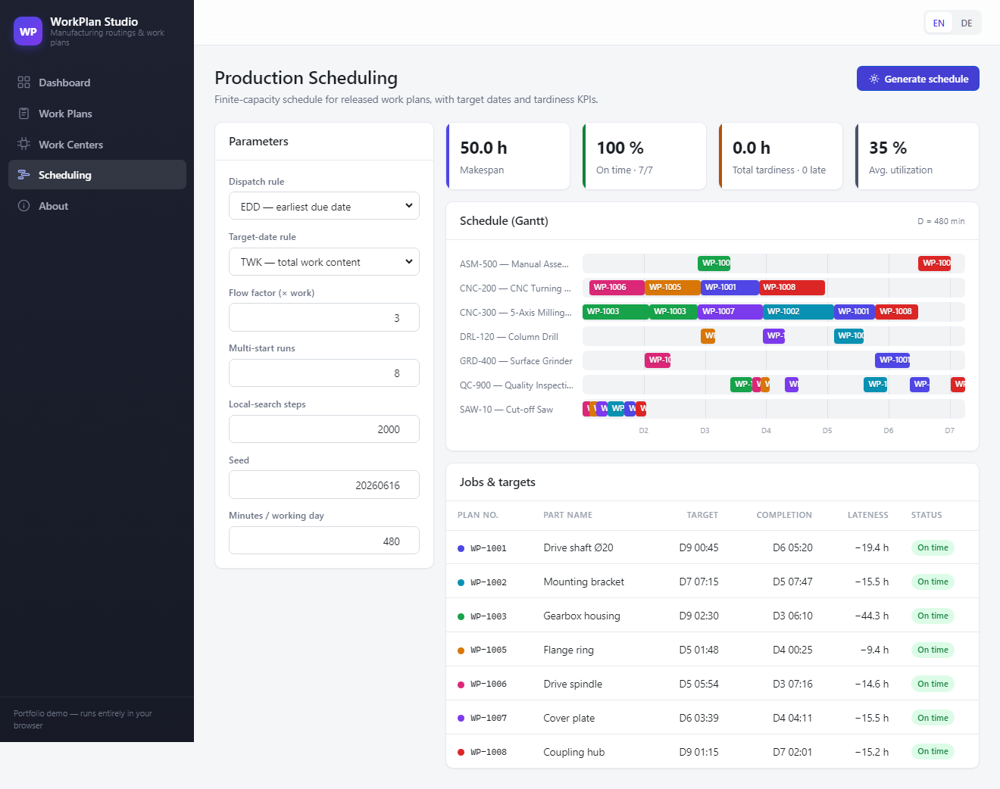
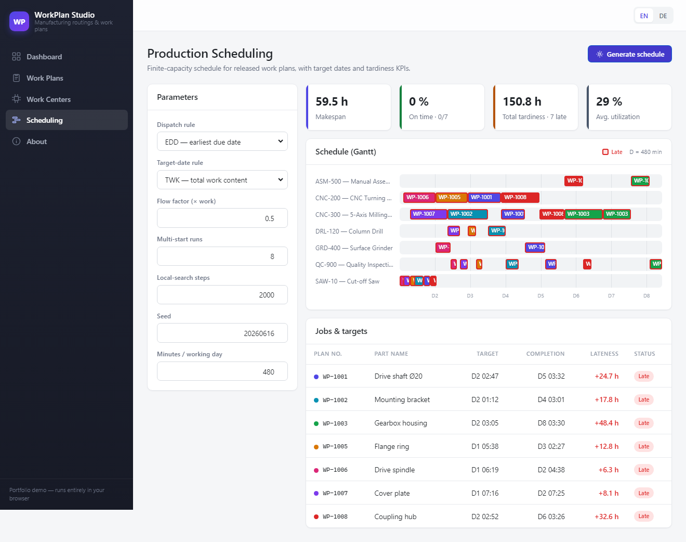

[](https://aco993.github.io/WorkPlanStudio/)

# WorkPlan Studio

**English** · [Deutsch](README.de.md)

[](https://dotnet.microsoft.com/)
[](https://learn.microsoft.com/aspnet/core/blazor/)
[](https://learn.microsoft.com/ef/core/)
[](https://github.com/aco993/WorkPlanStudio/actions/workflows/ci.yml)
[](docs/TESTING.md)
[](docs/TESTING.md)
[](LICENSE)

**WorkPlan Studio** is a small, self-contained portfolio application for managing **manufacturing routings** (work plans): the ordered list of operations needed to produce a part, the work centers those operations run on, and the resulting **time and cost** for a given lot size.

The whole thing — including a **real relational database** — runs entirely in the browser as a static WebAssembly app. There is no backend, no API and no server-side storage: it can be hosted for free on GitHub Pages and still behaves like a proper data-driven application.

> 🌐 **Live demo:** [https://aco993.github.io/WorkPlanStudio/](https://aco993.github.io/WorkPlanStudio/)

The interface is available in **English and German**, switchable at runtime.

---

## Highlights

- 📋 **Work plans / routings** — create, edit, search and filter work plans by status (Draft / Released / Archived).
- 🔧 **Operations editor** — an editable grid of operations (setup time, run time per piece, work center, remarks) with a **live summary** of total time and estimated cost that recalculates as you type.
- 🏭 **Work centers** — master data with hourly rates and cost centers, plus a guard that prevents deleting a work center still used by operations.
- 📊 **Dashboard** — key figures, a status distribution bar and the most recently updated plans.
- 🗓️ **Production scheduling** — a finite-capacity scheduler that assigns each released plan a target date and sequences its operations across the work centers, with six dispatch rules, configurable due-date assignment, multi-start + local-search optimisation, a Gantt chart and on-time / tardiness KPIs. Deterministic and covered by unit tests.
- 🌍 **Bilingual UI (EN / DE)** — full localization via `IStringLocalizer` and `.resx` resources, including culture-correct number, date and currency formatting.
- 💾 **Real database in the browser** — EF Core talks to a SQLite database that is compiled to WebAssembly and persisted to `localStorage`, so your data survives page reloads.
- 📱 **Responsive** — works from wide desktops down to a mobile drawer layout.

## What makes it technically interesting

The headline feature is that **EF Core + SQLite run client-side in WebAssembly**:

- The native SQLite engine is relinked into the app's `dotnet.native.wasm` at build time (via the `wasm-tools` workload).
- On startup the app reads a base64-encoded SQLite file from `localStorage` into the browser's in-memory file system; on first run it creates the schema and seeds sample data.
- After every change the SQLite file is written back to `localStorage`.
- A schema-version key guards against loading an incompatible database after a model change.

This means the app demonstrates a full data layer — `DbContext`, relationships, LINQ queries, an `IDbContextFactory`, a service layer — **without any server**.

## Production scheduling

The **Scheduling** page turns the released work plans into a finite-capacity production schedule — the most algorithm-heavy part of the project. It lives in its own dependency-free library (`src/WorkPlanStudio.Scheduling`) so the whole engine can be unit-tested on a plain .NET runner, without Blazor or the WebAssembly toolchain.

1. **Target dates ("meta").** Each job is assigned a due date by a configurable rule — Total Work Content (TWK), Number of Operations (NOP), Equal Slack (SLK), Constant Allowance (CON) or an explicit value.
2. **Dispatch scheduling.** A finite-capacity list scheduler places each job's operations on the earliest free slot of their work center, respecting operation precedence and machine capacity. Six dispatch rules decide who goes first on a contended machine: FIFO, SPT, LPT, EDD, Critical Ratio and WSPT.
3. **Optimisation.** A seeded multi-start search plus a first-improvement local search refine the sequence; the result is never worse than the pure rule schedule.
4. **Scoring.** Makespan, total / maximum tardiness, on-time rate and work-center utilisation are rolled up into a single penalty the search minimises.

A few choices make it portfolio-grade rather than a toy:

- **Deterministic.** All time is integer seconds and randomness comes from a small fixed-algorithm PRNG, so the same seed yields a bit-for-bit identical schedule on the desktop, in CI and in the browser.
- **Feasible by construction.** Local search perturbs the job *priority order* and re-dispatches, so every candidate it evaluates is a valid schedule.
- **Tested at every level.** ~90 tests across four layers — engine unit tests, an architecture test that *enforces* the pure-library boundary, EF→domain mapping tests, bUnit component tests for the page, and Playwright end-to-end tests in a real browser.

See [`docs/SCHEDULING.md`](docs/SCHEDULING.md) for the algorithm write-up and [`docs/TESTING.md`](docs/TESTING.md) for the test strategy.

## Screenshots

The Scheduling page reacting to a **single parameter change** — loosening vs. tightening the target dates. Tightening turns the jobs late: red-ringed Gantt bars, a "Late" legend and red status pills. _(Both images are captured automatically by the end-to-end test run.)_

| On-time — flow factor `3.0` | Late — flow factor `0.5` |
| --- | --- |
|  |  |

The sample data ships **seven released plans** competing for the same machines, so the dispatch rule and seed visibly change the result too — not just the target dates.


## Tech stack

| Area | Choice |
| --- | --- |
| Framework | .NET 10, Blazor WebAssembly (standalone) |
| Data | Entity Framework Core 10 + SQLite (compiled to WebAssembly) |
| Persistence | Browser `localStorage` via JS interop |
| Localization | `Microsoft.Extensions.Localization`, `IStringLocalizer`, `.resx` |
| Styling | Hand-written CSS design system (CSS custom properties) |
| Scheduling | Pure C# domain library — finite-capacity dispatch + due-date assignment |
| Testing | xUnit v3 (Microsoft Testing Platform), bUnit components, Playwright E2E |
| CI / Hosting | GitHub Actions — layered test workflows + test-gated GitHub Pages deploy |

## Documentation

| Topic | English | Deutsch |
| --- | --- | --- |
| Project overview | this README | [README.de.md](README.de.md) |
| Scheduling algorithm | [docs/SCHEDULING.md](docs/SCHEDULING.md) | [docs/SCHEDULING.de.md](docs/SCHEDULING.de.md) |
| Testing strategy | [docs/TESTING.md](docs/TESTING.md) | [docs/TESTING.de.md](docs/TESTING.de.md) |
| Decision records (ADR) | [docs/adr](docs/adr) | — |
| Contributing | [CONTRIBUTING.md](CONTRIBUTING.md) | — |
| AI-agent context | [AGENTS.md](AGENTS.md) | — |
| Review it with an AI agent | [docs/CODEX.md](docs/CODEX.md) | — |
| Publishing to GitHub | [docs/PUBLISHING.md](docs/PUBLISHING.md) | — |

## Engineering practices

Beyond the feature itself, the repository is wired up the way a production codebase would be:

- **Strict builds** — nullable reference types, .NET analyzers and **warnings treated as errors** (`Directory.Build.props`).
- **Central Package Management** — every NuGet version in one [`Directory.Packages.props`](Directory.Packages.props).
- **Consistent style** — a comprehensive [`.editorconfig`](.editorconfig) and line-ending normalisation via [`.gitattributes`](.gitattributes).
- **Layered tests + coverage** — 91 tests across four layers, ~98 % engine line coverage, all run in CI.
- **Architecture enforced by a test** — the engine cannot accrue a Blazor / EF / JS dependency.
- **Decisions recorded** — see the [Architecture Decision Records](docs/adr).
- **CI/CD** — per-layer test workflows on every PR plus a test-gated GitHub Pages deploy.

## Project structure

```
WorkPlanStudio/
├─ .github/workflows/
│  ├─ ci.yml                        # engine + mapper/component tests (PRs)
│  ├─ e2e.yml                       # Playwright end-to-end tests (PRs)
│  └─ deploy.yml                    # test-gated publish + deploy to GitHub Pages
├─ docs/                            # banner, screenshots, SCHEDULING.md, TESTING.md
├─ global.json                      # SDK pin + Microsoft Testing Platform runner
├─ src/
│  ├─ WorkPlanStudio/               # the Blazor WebAssembly app
│  │  ├─ Models/                    # WorkPlan, Operation, WorkCenter, WorkPlanStatus
│  │  ├─ Data/                      # AppDbContext, SeedData, BrowserDatabase
│  │  ├─ Services/                  # WorkPlan/WorkCenter services, IProductionScheduleService, ScheduleMapper, view models, Format
│  │  ├─ Resources/                 # SharedResource(.de).resx — UI translations
│  │  ├─ Components/                # Modal, StatusBadge, CultureSelector
│  │  ├─ Layout/                    # MainLayout, NavMenu
│  │  ├─ Pages/                     # Home, WorkPlans, WorkPlanEditor, WorkCenters, Schedule, About
│  │  ├─ wwwroot/                   # index.html, css/app.css, js/app.js
│  │  └─ Program.cs                 # DI registration + culture bootstrap
│  └─ WorkPlanStudio.Scheduling/    # pure scheduling engine (no Blazor / EF / WASM)
│     ├─ Inputs/                    # ProductionJob, JobStep, MachineCapacity
│     ├─ Parameters/                # SchedulingParameters, DispatchRule, DueDateRule
│     ├─ Core/                      # DispatchScheduler, DueDateAssigner, LocalSearch, PriorityOrdering, DeterministicRandom
│     ├─ Evaluation/                # ScheduleEvaluator, ScheduleEvaluation
│     ├─ Outputs/                   # Schedule, ScheduledOperation, JobSchedule
│     └─ SchedulingEngine.cs        # orchestrator: due dates → multi-start → local search
└─ tests/
   ├─ WorkPlanStudio.Scheduling.Tests/   # engine: determinism, feasibility, rules, search, architecture
   ├─ WorkPlanStudio.Web.Tests/          # EF→domain mapping + bUnit component tests
   └─ WorkPlanStudio.E2E/                # Playwright end-to-end (page object + scenarios)
```

## Getting started

### Prerequisites

- [.NET 10 SDK](https://dotnet.microsoft.com/download)
- The WebAssembly tools workload (needed to relink native SQLite):

  ```bash
  dotnet workload install wasm-tools
  ```

### Run locally

```bash
dotnet run --project src/WorkPlanStudio/WorkPlanStudio.csproj
```

Then open the URL printed in the console (e.g. `http://localhost:5235`).
The first build is slower because the native SQLite engine is compiled to WebAssembly; subsequent builds are cached.

### Run the tests

The engine is a pure .NET library, so most of the suite needs **no** WebAssembly workload and runs in seconds:

```bash
dotnet test tests/WorkPlanStudio.Scheduling.Tests/WorkPlanStudio.Scheduling.Tests.csproj   # engine + architecture
dotnet test tests/WorkPlanStudio.Web.Tests/WorkPlanStudio.Web.Tests.csproj                 # mapping + bUnit components
```

The Playwright end-to-end tests drive a real browser against the running app — see [`docs/TESTING.md`](docs/TESTING.md) for the full strategy and how to run them.

### Publish a static build

```bash
dotnet publish src/WorkPlanStudio/WorkPlanStudio.csproj -c Release -o publish
```

The deployable site is in `publish/wwwroot/` and can be served by any static file host.

## Deployment

> 🚀 New to publishing a repo? [`docs/PUBLISHING.md`](docs/PUBLISHING.md) is a step-by-step guide (first commit → create repo → enable the live demo).

The repository ships with a GitHub Actions workflow ([`.github/workflows/deploy.yml`](.github/workflows/deploy.yml)) that publishes the app to **GitHub Pages** on every push to `main`. It:

1. installs the `wasm-tools` workload and publishes the app,
2. rewrites `<base href="/" />` to `/<repository-name>/` so assets resolve under the project page sub-path,
3. adds a `404.html` SPA fallback and a `.nojekyll` marker,
4. uploads and deploys the artifact.

To enable it: push this repo to GitHub, then in **Settings → Pages** set **Source = GitHub Actions**.

## Notes

- All data is stored locally in your browser and never leaves your device. Use **About → Reset to sample data** to restore the original demo content.
- Sample part numbers, machines and times are fictitious and for illustration only.

## License

[MIT](LICENSE)
