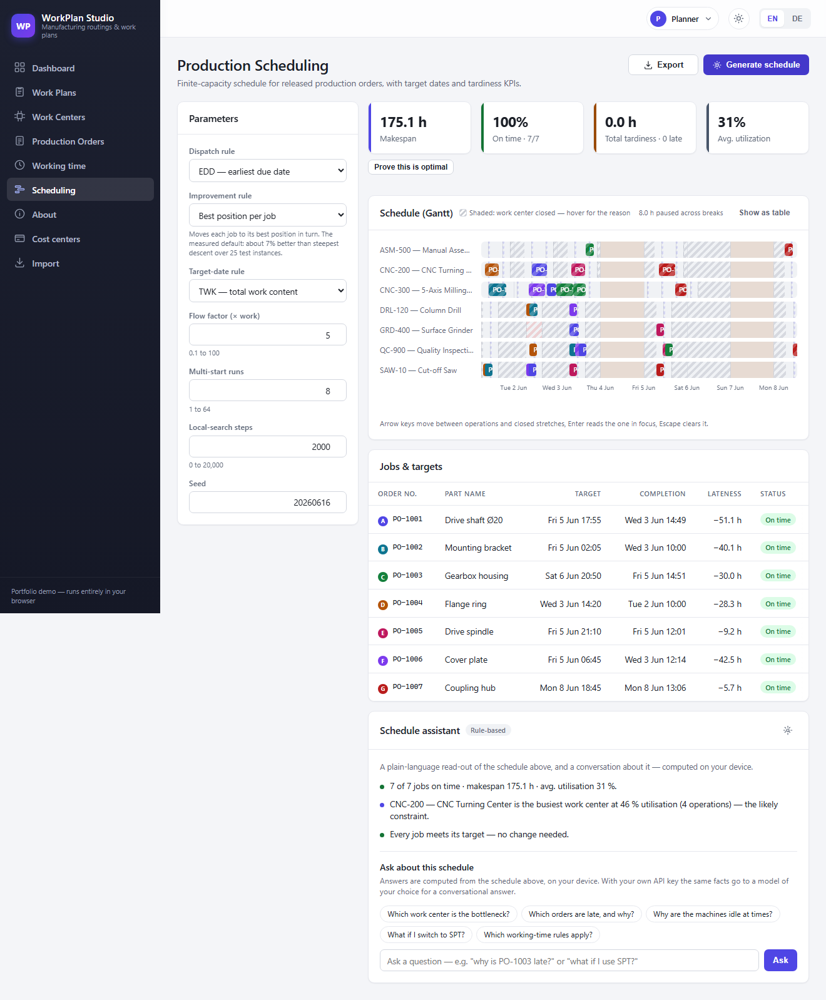
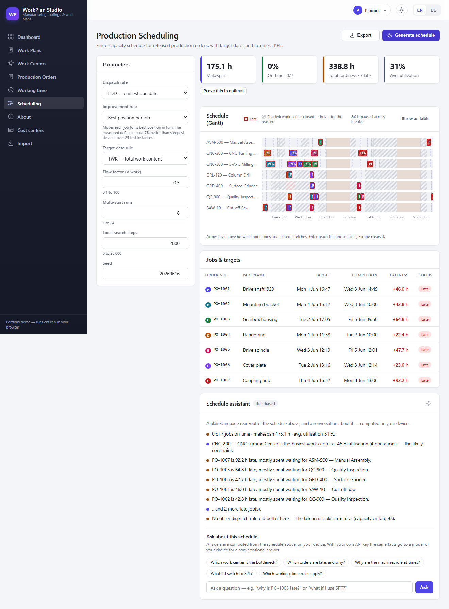
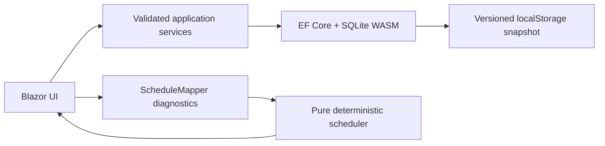

# WorkPlan Studio

**English** · [Deutsch](README.de.md)

[](.github/workflows/ci.yml)
[](LICENSE)

**WorkPlan Studio** is a small, self-contained portfolio application for managing **manufacturing routings** (work plans): the ordered list of operations needed to produce a part, the work centers those operations run on, and the resulting **time and cost** for a given lot size.

The application, including its relational database, runs entirely in the browser as a static WebAssembly app. There is no backend, API or server-side storage.

> **Live demo:** <https://aco993.github.io/WorkPlanStudio/>

The interface is available in **English and German**, switchable at runtime.

---

## Highlights

- 📋 **Work plans / routings** — create, edit, search and filter work plans by status (Draft / Released / Archived).
- 🔧 **Operations editor** — an editable grid of operations (setup time, run time per piece, work center, remarks) with a **live summary** of total time and estimated cost that recalculates as you type.
- 🏭 **Work centers** — master data with hourly rates, cost centers and validated parallel capacity, plus guards against deleting referenced centers or deactivating centers used by released plans.
- 📊 **Dashboard** — key figures, a status distribution bar and the most recently updated plans.
- 🧾 **Production orders** — a quantity of a part by a date. Releasing an order **freezes the routing** it will be built to, so editing the work plan afterwards cannot change work already on the shop floor.
- 🗓️ **Production scheduling** — a finite-capacity scheduler that sequences released orders across the work centers, with six dispatch rules, configurable due-date assignment, repeating availability calendars, sequence-dependent change-over, multi-start + insertion local search, a Gantt chart and on-time / tardiness KPIs.
- 🤖 **Schedule assistant** — explains each run in plain language (the bottleneck work center, why a job is late, a *computed* recommendation), derived **on-device** with no key needed. An optional **bring-your-own-key** AI narrator can rephrase it, with a graceful fallback to the built-in explanation. See [`docs/AI-ASSISTANT.md`](docs/AI-ASSISTANT.md).
- 🌍 **Bilingual UI (EN / DE)** — full localization via `IStringLocalizer` and `.resx` resources, including culture-correct number, date and currency formatting.
- 💾 **Real database in the browser** — EF Core talks to SQLite compiled to WebAssembly; WAL-safe snapshots survive reloads, while corrupt/incompatible payloads enter an explicit export/reset recovery flow.
- 📱 **Responsive** — works from wide desktops down to a mobile drawer layout.

## What makes it technically interesting

The headline feature is that **EF Core + SQLite run client-side in WebAssembly**:

- The native SQLite engine is relinked into the app's `dotnet.native.wasm` at build time (via the `wasm-tools` workload).
- On startup the app reads a base64-encoded SQLite file from `localStorage` into the browser's in-memory file system; on first run it creates the schema and seeds sample data.
- After every change the SQLite file is written back to `localStorage`.
- A schema-version key guards against loading an incompatible database after a model change. Incompatible data is preserved for export and requires an explicit reset; this demo does not pretend that reseeding is a migration.

This means the app demonstrates a full data layer — `DbContext`, relationships, LINQ queries, an `IDbContextFactory`, a service layer — **without any server**.

## Production scheduling

The **Scheduling** page turns the released work plans into a finite-capacity production schedule — the most algorithm-heavy part of the project. It lives in its own dependency-free library (`src/WorkPlanStudio.Scheduling`) so the whole engine can be unit-tested on a plain .NET runner, without Blazor or the WebAssembly toolchain.

1. **Target dates ("meta").** A released order carries its own customer due date, so the default rule is simply to use it. Where no customer date applies, a target can still be derived by Total Work Content (TWK), Number of Operations (NOP), Equal Slack (SLK) or Constant Allowance (CON).
1a. **Shop constraints.** Work centers may declare a repeating availability calendar (a day shift is one window in a 24-hour period) and a sequence-dependent change-over matrix between operation families. Both default to "no constraint".
2. **Dispatch scheduling.** A finite-capacity list scheduler places each order's operations on the earliest free slot of their work center, respecting operation precedence and machine capacity. Six dispatch rules set the initial job sequence: FIFO, SPT, LPT, EDD, Critical Ratio and WSPT.
3. **Optimisation.** A seeded multi-start, each restart followed by an insertion-neighbourhood descent over the job sequence; the result is never worse than the pure rule schedule.
4. **Scoring.** Makespan, total / maximum tardiness, on-time rate and work-center utilisation are rolled up into a single penalty the search minimises.

The scheduler is designed around three explicit constraints:

- **Deterministic.** All time is integer seconds and randomness comes from a small fixed-algorithm PRNG, so the same seed yields a bit-for-bit identical schedule on the desktop, in CI and in the browser.
- **Feasible by construction.** Local search perturbs the job *priority order* and re-dispatches, so every candidate it evaluates is a valid schedule.
- **Measured, not asserted.** On instances small enough to enumerate all `n!` job orders the true optimum is computable, so schedule quality is a test: the engine lands 0.2 % from optimal on average and solves 19 of 20 random instances exactly (the previous adjacent-swap search: 27.3 % and 0 of 20).
- **Honest about its parameters.** The dispatch and target rules interact — under the default targets EDD is the same sort as SPT, and critical ratio collapses to FIFO — so the page reports which other rules would give the identical order instead of returning a silently unchanged schedule.
- **Tested at several levels.** Unit, **property-based** and **brute-force optimality** tests cover the engine; an architecture test enforces its dependency boundary; mapper and bUnit tests cover the application boundary; Playwright scenarios exercise the running app.

See [`docs/SCHEDULING.md`](docs/SCHEDULING.md) for the algorithm write-up and [`docs/TESTING.md`](docs/TESTING.md) for the test strategy.

## Screenshots

The Scheduling page reacting to a **single parameter change** — loosening vs. tightening the target dates. Tightening turns the jobs late: red-ringed Gantt bars, a "Late" legend and red status pills. _(Both images are captured automatically by the end-to-end test run.)_

| On-time — flow factor `3.0` | Late — flow factor `0.5` |
| --- | --- |
|  |  |

The sample data ships **seven released plans** competing for the same machines, so the dispatch rule and seed visibly change the result too — not just the target dates.


## Tech stack

| Area | Choice |
| --- | --- |
| Framework | .NET 10, Blazor WebAssembly (standalone) |
| Data | Entity Framework Core 10 + SQLite (compiled to WebAssembly) |
| Persistence | Browser `localStorage` via JS interop |
| Localization | `Microsoft.Extensions.Localization`, `IStringLocalizer`, `.resx` |
| Styling | Hand-written CSS design system (CSS custom properties) |
| Scheduling | Pure C# domain library — finite-capacity dispatch + due-date assignment |
| Testing | xUnit v3 (Microsoft Testing Platform), CsCheck property tests, bUnit components, Playwright E2E |
| CI / Hosting | GitHub Actions — layered test workflows + test-gated GitHub Pages deploy |

## Architecture at a glance


```mermaid
flowchart LR
    UI["Blazor UI"] --> SVC["Validated application services"]
    SVC --> DB["EF Core + SQLite WASM"]
    DB --> LS["Versioned localStorage snapshot"]
    UI --> PREP["ScheduleMapper diagnostics"]
    PREP --> CORE["Pure deterministic scheduler"]
    CORE --> UI
```

See [docs/ARCHITECTURE.md](docs/ARCHITECTURE.md) for invariants, failure boundaries and the persistence lifecycle.

## Documentation

| Topic | English | Deutsch |
| --- | --- | --- |
| Project overview | this README | [README.de.md](README.de.md) |
| Scheduling algorithm | [docs/SCHEDULING.md](docs/SCHEDULING.md) | [docs/SCHEDULING.de.md](docs/SCHEDULING.de.md) |
| Schedule assistant (AI) | [docs/AI-ASSISTANT.md](docs/AI-ASSISTANT.md) | — |
| Testing strategy | [docs/TESTING.md](docs/TESTING.md) | [docs/TESTING.de.md](docs/TESTING.de.md) |
| Architecture | [docs/ARCHITECTURE.md](docs/ARCHITECTURE.md) | — |
| Interview defence | [docs/INTERVIEW.md](docs/INTERVIEW.md) | — |
| Security posture | [docs/SECURITY.md](docs/SECURITY.md) | — |
| Performance scenarios | [docs/PERFORMANCE.md](docs/PERFORMANCE.md) | — |
| Decision records (ADR) | [docs/adr](docs/adr) | — |
| Contributing | [CONTRIBUTING.md](CONTRIBUTING.md) | — |
| AI-agent context | [AGENTS.md](AGENTS.md) | — |

## Engineering practices

The repository applies the following engineering practices:

- **Strict builds** — nullable reference types, .NET analyzers and **warnings treated as errors** (`Directory.Build.props`).
- **Central Package Management** — every NuGet version in one [`Directory.Packages.props`](Directory.Packages.props).
- **Consistent style** — a comprehensive [`.editorconfig`](.editorconfig) and line-ending normalisation via [`.gitattributes`](.gitattributes).
- **Layered tests + coverage** — 211 tests across three test projects, including real-SQLite persistence, property-based invariants, brute-force optimality checks, adversarial algorithm cases, accessibility semantics, localization parity, components, browser reload/reset and mobile flows; the engine measures 96.37 % line and 89.05 % branch coverage.
- **Architecture enforced by a test** — the engine cannot accrue a Blazor / EF / JS dependency.
- **Decisions recorded** — see the [Architecture Decision Records](docs/adr).
- **Dependency hygiene** — [Dependabot](.github/dependabot.yml) keeps NuGet and GitHub Actions current.
- **CI/CD** — test workflows run for pull requests and `main`; deployment is gated by engine tests.

## What this project demonstrates

This is a public **learning and portfolio** project — it deliberately uses a
generic manufacturing domain and fictitious data, and shares no code with any
proprietary system. The point is to show *how* I build, not just that a feature
works:

| Area | Where to look | What it shows |
| --- | --- | --- |
| **Architecture boundary** | `src/WorkPlanStudio.Scheduling` vs the app | a pure domain core behind an *enforced* dependency boundary |
| **Algorithms** | `SchedulingEngine`, `DispatchScheduler`, `LocalSearch` | finite-capacity scheduling, dispatch rules, local-search optimisation |
| **Determinism & correctness** | `DeterministicRandom`, `DeterminismTests` | reproducible results pinned by golden-value tests |
| **Testing strategy** | `tests/`, [`docs/TESTING.md`](docs/TESTING.md) | four layers from unit to end-to-end, plus an architecture test |
| **Modern .NET** | `Directory.*.props`, `.editorconfig` | .NET 10, nullable, analyzers, warnings-as-errors, central packages |
| **Front-end** | `Pages/Schedule.razor`, `wwwroot/css` | Blazor WebAssembly, a hand-written design system, a Gantt chart |
| **Data engineering** | `Data/BrowserDatabase.cs` | a real relational DB (EF Core + SQLite) running client-side |
| **Internationalisation** | `Resources/`, `CultureSelector` | full EN/DE localization with culture-correct formatting |
| **Documentation** | `docs/`, ADRs, `AGENTS.md` | decisions recorded, not just code written |
| **DevOps** | `.github/workflows` | per-layer CI and a test-gated deploy |

Short on time? The fastest tour is `AGENTS.md` → `SchedulingEngine.cs` →
`DeterminismTests.cs` → `ScheduleMapper.cs` → `Pages/Schedule.razor`.

## Project structure

```
WorkPlanStudio/
├─ .github/workflows/
│  ├─ ci.yml                        # engine + mapper/component tests (PRs)
│  ├─ e2e.yml                       # Playwright end-to-end tests (PRs)
│  └─ deploy.yml                    # test-gated publish + deploy to GitHub Pages
├─ docs/                            # banner, screenshots, SCHEDULING.md, TESTING.md
├─ global.json                      # SDK pin + Microsoft Testing Platform runner
├─ src/
│  ├─ WorkPlanStudio/               # the Blazor WebAssembly app
│  │  ├─ Models/                    # WorkPlan, Operation, WorkCenter, WorkPlanStatus
│  │  ├─ Data/                      # AppDbContext, SeedData, BrowserDatabase
│  │  ├─ Services/                  # WorkPlan/WorkCenter services, IProductionScheduleService, ScheduleMapper, view models, Format
│  │  ├─ Resources/                 # SharedResource(.de).resx — UI translations
│  │  ├─ Components/                # Modal, StatusBadge, CultureSelector
│  │  ├─ Layout/                    # MainLayout, NavMenu
│  │  ├─ Pages/                     # Home, WorkPlans, WorkPlanEditor, WorkCenters, Schedule, About
│  │  ├─ wwwroot/                   # index.html, css/app.css, js/app.js
│  │  └─ Program.cs                 # DI registration + culture bootstrap
│  └─ WorkPlanStudio.Scheduling/    # pure scheduling engine (no Blazor / EF / WASM)
│     ├─ Inputs/                    # ProductionJob, JobStep, MachineCapacity
│     ├─ Parameters/                # SchedulingParameters, DispatchRule, DueDateRule
│     ├─ Core/                      # DispatchScheduler, DueDateAssigner, LocalSearch, PriorityOrdering, DeterministicRandom
│     ├─ Evaluation/                # ScheduleEvaluator, ScheduleEvaluation
│     ├─ Outputs/                   # Schedule, ScheduledOperation, JobSchedule
│     └─ SchedulingEngine.cs        # orchestrator: due dates → multi-start → local search
└─ tests/
   ├─ WorkPlanStudio.Scheduling.Tests/   # engine: determinism, feasibility, rules, search, architecture
   ├─ WorkPlanStudio.Web.Tests/          # EF→domain mapping + bUnit component tests
   └─ WorkPlanStudio.E2E/                # Playwright end-to-end (page object + scenarios)
```

## Getting started

### Prerequisites

- [.NET 10 SDK](https://dotnet.microsoft.com/download)
- The WebAssembly tools workload (needed to relink native SQLite):

  ```bash
  dotnet workload install wasm-tools
  ```

### Run locally

```bash
dotnet run --project src/WorkPlanStudio/WorkPlanStudio.csproj
```

Then open the URL printed in the console (e.g. `http://localhost:5235`).
The first build is slower because the native SQLite engine is compiled to WebAssembly; subsequent builds are cached.

### Run the tests

The engine is a pure .NET library, so most of the suite needs **no** WebAssembly workload and runs in seconds:

```bash
dotnet test tests/WorkPlanStudio.Scheduling.Tests/WorkPlanStudio.Scheduling.Tests.csproj   # engine + architecture
dotnet test tests/WorkPlanStudio.Web.Tests/WorkPlanStudio.Web.Tests.csproj                 # mapping + bUnit components
```

The Playwright end-to-end tests drive a real browser against the running app — see [`docs/TESTING.md`](docs/TESTING.md) for the full strategy and how to run them.

### Publish a static build

```bash
dotnet publish src/WorkPlanStudio/WorkPlanStudio.csproj -c Release -o publish
```

The deployable site is in `publish/wwwroot/` and can be served by any static file host.

## Deployment

The repository ships with a GitHub Actions workflow ([`.github/workflows/deploy.yml`](.github/workflows/deploy.yml)) that publishes the app to **GitHub Pages** on every push to `main`. It:

1. installs the `wasm-tools` workload and publishes the app,
2. rewrites `<base href="/" />` to `/<repository-name>/` so assets resolve under the project page sub-path,
3. adds a `404.html` SPA fallback and a `.nojekyll` marker,
4. uploads and deploys the artifact.

To enable it: push this repo to GitHub, then in **Settings → Pages** set **Source = GitHub Actions**.

## Notes

- Routing data is stored locally in your browser. The optional BYOK narrator sends structured schedule facts to the endpoint you configure; the base application works without it.
- Browser storage is local demo persistence, not a backup/migration system or secret vault. Schema mismatch preserves the payload for export and requires confirmed reset.
- Sample part numbers, machines and times are fictitious and for illustration only.

## Limitations and roadmap

- The scheduler is a deterministic heuristic and does not prove a globally optimal schedule.
- A released work plan currently acts as one demonstration job. Customer orders, calendars, routing-revision snapshots and order-specific due dates require a future `ProductionOrder` model.
- Scheduling runs on the browser UI thread. The reproducible 250-job scenario completed in about 395 ms on the documented review machine but allocated roughly 243 MB; a Worker or backend is justified only after representative browser profiling.
- The versioned SQLite payload supports safe recovery/reset, not cross-version migration or cloud synchronization.
- One high transitive SQLite advisory is explicitly tracked and risk-assessed in [docs/SECURITY.md](docs/SECURITY.md); the repository does not claim zero vulnerabilities.

## AI-assisted development disclosure

AI tools were used intensively to help generate and review the initial code and later hardening changes. The project is not represented as entirely hand-written. The candidate remains responsible for the specification, verification, debugging, tests, integration and final engineering decisions, and should be able to explain every accepted part. No percentage of “AI-written lines” is claimed because that number is neither known nor meaningful; AI output is accepted only after review and executable evidence.

## License

[MIT](LICENSE)
