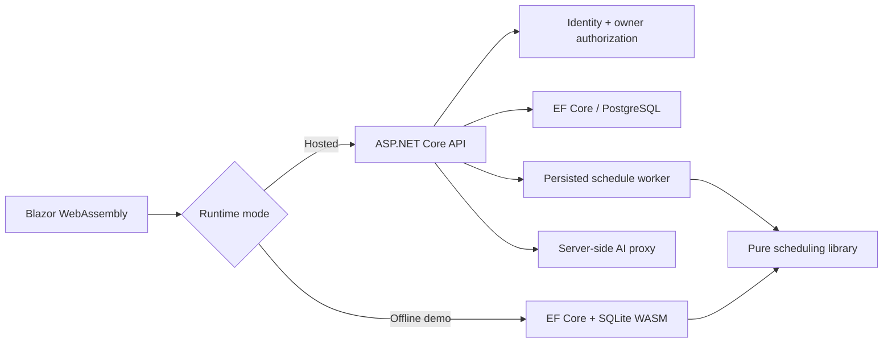

# WorkPlan Studio

[](.github/workflows/ci.yml)
[](.github/workflows/e2e.yml)
[](LICENSE)

WorkPlan Studio manages manufacturing routings, production orders and finite-capacity schedules. A routing defines the ordered operations for a part; a production order freezes that routing revision together with quantity, release time, due time and priority; the scheduler then places work inside machine calendars while respecting capacity, downtime and sequence-dependent setup.

> **Offline portfolio demo:** <https://aco993.github.io/WorkPlanStudio/>
> The GitHub Pages build deliberately runs without a backend. Production-only identity, orders, calendars and durable jobs are available in the hosted API mode.

The UI is localized in English and German and is responsive from desktop to mobile.

## What is implemented

- Validated work-plan and work-center CRUD with relational constraints and optimistic concurrency.
- `ProductionOrder` lifecycle with an immutable routing snapshot, explicit release/due timestamps, quantity and priority.
- Deterministic finite-capacity heuristic with six dispatch rules, seeded multi-start/local search, parallel resources, availability windows, downtime and sequence-dependent setup.
- Persisted background schedule runs with progress, cancellation and restart recovery.
- ASP.NET Core Identity cookie authentication, owner-scoped authorization, antiforgery validation, rate limiting and audit entries.
- PostgreSQL production persistence with a separate provider-correct migration assembly; SQLite remains available for development and the offline browser demo.
- OpenTelemetry traces/metrics, liveness/readiness probes, security headers, Docker Compose and backup/restore scripts.
- Deterministic rule-based schedule explanation plus an optional authenticated server-side AI proxy. AI never makes scheduling decisions.

## Screenshots

| On-time scenario | Tight-target late scenario |
| --- | --- |
|  |  |

## Architecture


```mermaid
flowchart LR
    UI["Blazor WebAssembly"] --> MODE{"Runtime mode"}
    MODE -->|Hosted| API["ASP.NET Core API"]
    API --> AUTH["Identity + owner authorization"]
    API --> DB["EF Core / PostgreSQL"]
    API --> JOB["Persisted schedule worker"]
    JOB --> CORE["Pure scheduling library"]
    API --> AIP["Server-side AI proxy"]
    MODE -->|Offline demo| WASM["EF Core + SQLite WASM"]
    WASM --> CORE
```

The important boundary is `WorkPlanStudio.Scheduling`: it has no Blazor, EF Core, JavaScript or network dependency, and an architecture test enforces that rule. See [Architecture](docs/ARCHITECTURE.md), [Security](docs/SECURITY.md) and the [production runbook](docs/PRODUCTION.md).

## Technology

| Area | Choice |
| --- | --- |
| Runtime/UI | .NET 10, C#, hosted Blazor WebAssembly |
| API/security | ASP.NET Core, Identity cookies, antiforgery, authorization policies, rate limiting |
| Data | EF Core 10, PostgreSQL 18 production, SQLite development/browser demo |
| Scheduling | Pure deterministic C# heuristic, integer-second time model |
| Operations | OpenTelemetry, health checks, Docker/Compose, non-root read-only container |
| Tests | xUnit v3, CsCheck property tests, bUnit, real-SQLite API integration tests, Playwright |
| Delivery | GitHub Actions for tests, audit, migration scripts, performance ceilings, container and Pages demo |

## Repository map

```text
src/
  WorkPlanStudio.Domain/              shared entities and validators
  WorkPlanStudio.Contracts/           client/server API contracts
  WorkPlanStudio.Scheduling/          dependency-free scheduling core
  WorkPlanStudio.Persistence/         DbContext + SQLite migrations
  WorkPlanStudio.PostgresMigrations/  PostgreSQL migration set
  WorkPlanStudio.Api/                 auth, API, audit, telemetry, worker
  WorkPlanStudio/                     Blazor UI + offline demo adapter
tests/
  WorkPlanStudio.Scheduling.Tests/    unit, property and architecture tests
  WorkPlanStudio.Web.Tests/           persistence, mapping and bUnit tests
  WorkPlanStudio.Api.Tests/           auth/CSRF/tenant integration tests
  WorkPlanStudio.E2E/                 real Chromium flows
```

## Run it

Prerequisite: [.NET 10 SDK](https://dotnet.microsoft.com/download) and the WebAssembly workload.

```bash
dotnet workload install wasm-tools
dotnet restore WorkPlanStudio.slnx
```

Offline demo:

```bash
dotnet run --project src/WorkPlanStudio/WorkPlanStudio.csproj --launch-profile http
```

Hosted development mode (SQLite, registration enabled):

```bash
dotnet run --project src/WorkPlanStudio.Api/WorkPlanStudio.Api.csproj --launch-profile http
```

Production-like PostgreSQL deployment:

```bash
cp .env.example .env
# replace all required placeholders
docker compose up --build -d
```

Never commit `.env`. Put TLS at the ingress and remove bootstrap-admin variables after first startup.

## Verify it

Verified locally on 2026-07-13: **93 scheduling + 54 web/data/component + 5 API + 10 Chromium E2E = 162 passed, 0 failed, 0 skipped**. Release build completed with 0 errors and the two documented `WASM0001` warning groups; package vulnerability and outdated audits were clean.

```bash
dotnet build WorkPlanStudio.slnx -c Release --no-restore
dotnet format WorkPlanStudio.slnx --verify-no-changes
dotnet test tests/WorkPlanStudio.Scheduling.Tests/WorkPlanStudio.Scheduling.Tests.csproj -c Release
dotnet test tests/WorkPlanStudio.Web.Tests/WorkPlanStudio.Web.Tests.csproj -c Release
dotnet test tests/WorkPlanStudio.Api.Tests/WorkPlanStudio.Api.Tests.csproj -c Release
dotnet list WorkPlanStudio.slnx package --vulnerable --include-transitive
```

Playwright setup and full test-layer details are in [docs/TESTING.md](docs/TESTING.md). CI also generates both migration scripts, verifies performance regression ceilings and builds the production container.

## Engineering decisions and limitations

- The scheduler is a deterministic heuristic; it does **not** prove global optimality.
- The in-process worker is a durable single-consumer design. Run one API replica until job claiming is moved to a distributed lease/queue.
- The browser database is explicit demo persistence, not confidential multi-user storage or a cross-version migration service.
- GitHub Pages demonstrates the offline feature set; it cannot demonstrate server identity or PostgreSQL.
- AI is optional narration over computed facts. It is not required and cannot change a schedule.
- Native SQLite still produces the known linker warning `WASM0001` for unused varargs entry points. Runtime CRUD/reload behavior is covered by Playwright; the dependency audit is clean with `SQLitePCLRaw.bundle_e_sqlite3` 3.0.3 and no advisory suppression.

## AI-assisted development disclosure

AI tools were used intensively for initial implementation and hardening. This repository is not represented as entirely hand-written, and no invented percentage of AI-generated lines is claimed. The candidate is responsible for the specification, code review, threat/failure analysis, debugging, integration, executable tests and final decisions, and should be able to explain every accepted component and limitation.

## Documentation

- [Architecture](docs/ARCHITECTURE.md)
- [Scheduling algorithm](docs/SCHEDULING.md)
- [Testing strategy](docs/TESTING.md)
- [Security posture](docs/SECURITY.md)
- [Production runbook](docs/PRODUCTION.md)
- [Production hardening report and verdict (SR)](docs/PRODUCTION-HARDENING-REPORT-SR.md)
- [Performance scenarios](docs/PERFORMANCE.md)
- [Interview defense (SR)](docs/INTERVIEW-DEFENSE-SR.md)
- [Demo script (SR)](docs/DEMO-SCRIPT-SR.md)
- [Architecture decision records](docs/adr)

## License

[MIT](LICENSE)
