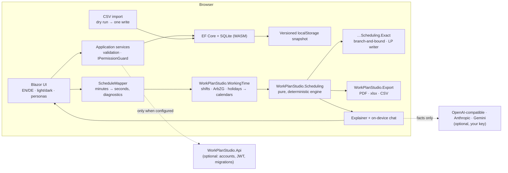

# WorkPlan Studio

**English** · [Deutsch](README.de.md)

[](https://github.com/aco993/WorkPlanStudio/actions/workflows/ci.yml)
[](https://github.com/aco993/WorkPlanStudio/actions/workflows/e2e.yml)
[](https://github.com/aco993/WorkPlanStudio/actions/workflows/quality.yml)
[](https://github.com/aco993/WorkPlanStudio/actions/workflows/codeql.yml)
[](https://github.com/aco993/WorkPlanStudio/actions/workflows/performance.yml)
[](https://aco993.github.io/WorkPlanStudio/)
[](docs/TESTING.md#coverage)
[](docs/TESTING.md#coverage)
[](docs/TESTING.md#coverage)
[](docs/TESTING.md#coverage)
[](LICENSE)

**WorkPlan Studio** is a self-contained production-planning application: manufacturing **routings** (work plans), the **work centers** and **cost centers** they run on, **production orders** with frozen routings, and a **finite-capacity scheduler** that respects shift calendars and the German Working Hours Act (ArbZG) — with a chat that explains the result and a branch-and-bound solver that will tell you how far from optimal it is. The whole application, including its relational database, runs in the browser as a static WebAssembly site. An optional ASP.NET Core backend with real accounts exists and is off unless you configure it.

> **Live demo:** <https://aco993.github.io/WorkPlanStudio/> — English and German, light and dark, desktop and mobile. Nothing to install, nothing to sign up for.


---

## Highlights

- 📋 **Work plans / routings** — create, edit, search and filter by status (Draft / Released / Archived), with an operations editor whose total time and cost recalculate as you type.
- 🏭 **Work centers and cost centers** — hourly rates, a **cost center as real master data** (not a free-text column) with referential integrity at the database, validated parallel capacity, a **shift pattern** (continuous, one, two or three shifts) and **absences**, with guards against deleting or deactivating a center a released order still needs.
- 🧾 **Production orders** — a quantity of a part by a date. Releasing an order **freezes the routing** it will be built to, so editing the work plan afterwards cannot change work already on the shop floor.
- 🗓️ **Finite-capacity scheduling** — six dispatch rules, four target-date rules, three local-search acceptance rules, seeded multi-start plus insertion local search, a Gantt chart with real dates that is fully **keyboard operable** and readable as a table, and KPIs for makespan, tardiness, on-time rate and utilisation *of open time*.
- 🎯 **A real optimality answer** — a disjunctive **branch-and-bound** solver that shares no code with the heuristic, plus an LP export for anyone who trusts neither. The page can prove the plan on screen optimal, or report the gap, or report the lower bound it did prove. On a committed twenty-instance study the heuristic is exact on **18 of 20** against the best dispatch order and on **7 of 20** against the true optimum — see below, because the difference between those two numbers is the interesting part.
- ⚖️ **Working time as a constraint** — shifts, breaks, rest periods, Sundays, public holidays per federal state and absences become machine calendars. Every rule of the ArbZG the app applies is a **parameter with a legal reference**, and the §3 / §6 (2) **averaging periods are computed and shown**: the crew, the average per Werktag, the date it is first exceeded and the compensation days owed.
- 🔄 **CSV import with a dry run** — the preview and the commit are one code path, so the preview cannot lie. Every rejected row carries its line, column and reason, and the whole file lands as **one** atomic write or none of it.
- 📄 **Export to PDF, Excel and CSV** — written by hand, in the browser, with **no package reference and no native dependency**: the PDF has its own object table and a vector Gantt, the workbook is OOXML zipped in order, and both languages get their own date rule.
- 🧵 **A run that does not freeze the tab** — the scheduling search is sliced across browser turns with a real progress bar and a Cancel that leaves the previous schedule untouched. Why there is no Web Worker is measured, not assumed.
- 💬 **A chat over the schedule** — "which work center is the bottleneck?", "why is PO-1003 late?", "what if I use SPT?" (that one re-runs the scheduler). Answers are computed **on your device**, in English or German, with no key. With your own API key the same facts — bounded, sanitised and fenced as data — go to **OpenAI-compatible, Anthropic or Gemini** models, falling back to the on-device answer on any failure.
- 👥 **Personas, and optionally real accounts** — Planner, Supervisor and Guest go through the real ASP.NET Core authorization pipeline. Point the app at the included backend and the *same policy table* is enforced by a server against a JWT, with Identity, password hashing and rotating refresh tokens.
- 🌗 **Light, dark and system theme**, WCAG 2.2 AA verified by axe on every route in light, dark **and German**, keyboard paths with a skip link and focus management, `prefers-reduced-motion`, forced-colours support, and a mobile layout with a drawer.
- 🌍 **Bilingual UI (EN / DE)** with culture-correct numbers, dates and currency.
- 💾 **A real database in the browser** — EF Core over SQLite compiled to WebAssembly, at schema version 7, with a **real migration** from 5 and 6 that preserves primary keys; WAL-safe atomic snapshots, and incompatible data entering an explicit export/import/reset recovery flow instead of being lost.

## Screenshots

| Dashboard, light | Dashboard, dark |
| --- | --- |
|  |  |

| Schedule with closed time shaded, dark | Working time: the rules, the averaging, the holidays |
| --- | --- |
|  |  |

| The chat, in English | Auf Deutsch | Mobile |
| --- | --- | --- |
|  |  |  |

The Scheduling page reacting to a **single parameter change** — the same seven orders under a loose and a tight flow factor. At `5.0` every order is on time; at `0.5` all seven are late, with red-ringed Gantt bars and red status pills. _(Captured with Playwright against a running build of this tip, not hand-edited.)_

| On-time — flow factor `5.0` | Late — flow factor `0.5` |
| --- | --- |
|  |  |

## How the pieces fit


```mermaid
flowchart LR
    subgraph Browser
        UI["Blazor UI<br/>EN/DE · light/dark · personas"]
        SVC["Application services<br/>validation · IPermissionGuard"]
        IMP["CSV import<br/>dry run → one write"]
        DB["EF Core + SQLite (WASM)"]
        LS["Versioned localStorage snapshot"]
        MAP["ScheduleMapper<br/>minutes → seconds, diagnostics"]
        WT["WorkPlanStudio.WorkingTime<br/>shifts · ArbZG · holidays → calendars"]
        ENG["WorkPlanStudio.Scheduling<br/>pure, deterministic engine"]
        EXACT["…Scheduling.Exact<br/>branch-and-bound · LP writer"]
        EXP["WorkPlanStudio.Export<br/>PDF · xlsx · CSV"]
        CHAT["Explainer + on-device chat"]
    end
    AI["OpenAI-compatible · Anthropic · Gemini<br/>(optional, your key)"]
    API["WorkPlanStudio.Api<br/>(optional: accounts, JWT, migrations)"]

    UI --> SVC --> DB --> LS
    IMP --> DB
    UI --> MAP --> WT --> ENG --> CHAT --> UI
    ENG --> EXP
    ENG --> EXACT
    CHAT -. facts only .-> AI
    SVC -. only when configured .-> API
```

Four **pure libraries** carry the logic — the scheduler, the working-time rules and the export writers have no Blazor, EF, JavaScript or network dependency, and an architecture test fails the build if that changes. The app is the shell around them. See [docs/ARCHITECTURE.md](docs/ARCHITECTURE.md).

## Production scheduling

The **Scheduling** page turns released production orders into a finite-capacity schedule — the most algorithm-heavy part of the project, in `src/WorkPlanStudio.Scheduling`.

1. **Target dates.** A released order carries its own customer due date, so the default is to use it. Where none applies, a target can be derived by Total Work Content (TWK), Number of Operations (NOP), Equal Slack (SLK) or Constant Allowance (CON).
2. **Shop constraints.** Each work center brings its calendar from the working-time library (windows, breaks an operation may pause across, and blackouts it never may), plus an optional sequence-dependent change-over matrix between operation families.
3. **Dispatch scheduling.** A list scheduler places each operation on the placement that *finishes* earliest, respecting precedence, capacity, the calendar and the change-over. Six dispatch rules set the initial sequence: FIFO, SPT, LPT, EDD, Critical Ratio and WSPT.
4. **Optimisation.** A seeded multi-start, each restart followed by an insertion-neighbourhood descent over the job sequence; the result is never worse than the pure rule schedule. Which improving neighbour the descent adopts was measured over 75 runs and changed the default ([ADR 0022](docs/adr/0022-local-search-acceptance.md)).
5. **Scoring.** Makespan, total and maximum tardiness, on-time rate and utilisation of open time roll up into one penalty the search minimises.

### How good is the schedule, really

Two things are measured on a fixed, committed twenty-instance set, and they are different things.

Against the **best job order the dispatcher can be handed** — the search's own ceiling — the search is exact on **18 of 20** and **0.27 %** off on average. Against the **optimum of the scheduling problem**, proved by the branch-and-bound in `WorkPlanStudio.Scheduling.Exact`, it is exact on **7 of 20**, with a median gap of **5.3 %**. The difference between those two numbers is the dispatch-order model — one whole job at a time, never back-filling an idle gap — and not the search.

That is a more interesting result than the one this README used to claim, and it is the one the artefacts support. `OptimalityStudyTests` pins both figures; [ADR 0015](docs/adr/0015-exact-solver.md) has the per-instance table and the one command that regenerates it.

The engine is **deterministic** (integer placement arithmetic, a fixed-algorithm PRNG, bit-identical results on desktop, CI and browser), **feasible by construction** (candidates permute the priority order and re-dispatch) and **honest about its parameters** (it reports which other rules would give the identical order instead of returning a silently unchanged schedule, and it refuses a parameter product that would ask the browser for 1.28 million candidate schedules). Details: [docs/SCHEDULING.md](docs/SCHEDULING.md).

## Working time and the German Working Hours Act

The plant, not the scheduler, decides when a machine may run. `src/WorkPlanStudio.WorkingTime` turns a shift pattern and the plant's settings into a week of open windows and a list of closed stretches, each carrying the rule that closed it:

| Rule | Parameter | Default |
| --- | --- | --- |
| §3 daily working time | 8 h, or 10 h while the average over 24 weeks or six months stays at 8 — **and the average is computed**, with the crew, the first breach date and the compensation days owed | 10 h |
| §4 breaks | 30 min after 6 h, 45 min after 9 h, in pieces of at least 15 min | statutory |
| §5 rest between working days | 11 h, per crew, across the week wrap. The 10 h exception is **gated on a declared §5 (2) sector** and states the 12 h compensating rest it incurs | 11 h, no sector |
| §6 night work | 8 h, or 10 h while the average over four weeks stays at 8 — also computed and shown | 8 h |
| §9 Sundays and public holidays | closed, unless a §10 exception applies; the rest window may shift by up to 6 h **forward or back** for multi-shift plants, and the multi-shift precondition is checked | closed |
| §11 free Sundays | at least 15 per year, counted against the year's real 52 or 53 Sundays and a declared rota | counted |
| Public holidays | computed from Easter for all 16 federal states, **year-aware over 1990–2200** (Reformationstag is nationwide in 2017 only; Buß- und Bettag nationwide through 1994) | North Rhine-Westphalia |

The Working-time page shows the rules in force, a live preview of the week per work center, the averaging card, the year's holidays for the chosen state and the absences. The Gantt chart names the rule that closed a machine when you reach a shaded stretch. See [ADR 0012](docs/adr/0012-working-time-as-capacity.md) and [ADR 0024](docs/adr/0024-arbzg-in-the-ui.md).

## The schedule assistant

Every run is explained twice. A deterministic **explainer** in the engine finds the bottleneck, the late orders and the resource each one queued on, and one *computed* recommendation (it re-runs the other rules and only suggests a switch that measurably beats the current result on the objective). Under that narration a **chat** answers questions about the run — from the same facts the page renders, on your device, in English or German.

With a key of your own, the same facts and the on-device answer go to a model of your choice for a conversational reply; on any failure the on-device answer is shown with a note. The key is stored per provider, is never read back into the page, and can be forgotten in one click. See [docs/AI-ASSISTANT.md](docs/AI-ASSISTANT.md) and [ADR 0025](docs/adr/0025-hostile-input-on-the-model-path.md).

## Personas, and the optional backend

The top bar lets you be the **Planner** (everything), the **Supervisor** (release orders and record absences, but not redefine routings or plant rules) or a **Guest** (look, touch nothing). These are not a UI switch: the persona is a `ClaimsPrincipal` fed into ASP.NET Core's real authorization pipeline, pages use `AuthorizeView` policies, and every mutating service checks the same policy through an `IPermissionGuard` — a set a reflection test discovers rather than a list someone maintains.

"Swapping the demo identity for a real one is one class" was a claim; it is now a project. `src/WorkPlanStudio.Api` references the client's *own* policy table — the same assembly, `WorkPlanStudio.Domain` — and enforces it against a JWT issued to an Identity account, with rotating refresh tokens, lockout, rate limiting and a start-up that refuses a weak signing key. Configure `Api:BaseAddress` and the persona switcher disappears. The published demo does not configure it, and [docs/SECURITY.md](docs/SECURITY.md) says plainly that the demo protects nothing. See [ADR 0013](docs/adr/0013-personas-through-the-real-authorization-pipeline.md) and [ADR 0020](docs/adr/0020-optional-backend-and-real-auth.md).

## Tech stack

| Area | Choice |
| --- | --- |
| Framework | .NET 10, Blazor WebAssembly (standalone) |
| Data | Entity Framework Core 10 + SQLite compiled to WebAssembly, persisted to `localStorage`, schema-versioned with real upgrade steps |
| Domain libraries | `WorkPlanStudio.Scheduling` (finite-capacity engine + exact solver), `WorkPlanStudio.WorkingTime` (ArbZG rules, holidays, calendars), `WorkPlanStudio.Export` (CSV, xlsx, PDF) — all pure C#, no package references |
| Optional backend | ASP.NET Core 10 minimal API, EF Core migrations, ASP.NET Core Identity, JWT + refresh tokens, OpenAPI, Docker |
| Authorization | `Microsoft.AspNetCore.Components.Authorization`, policies, `IAuthorizationService` — one policy table, in one assembly both hosts reference |
| Localization | `Microsoft.Extensions.Localization`, `IStringLocalizer`, `.resx` (EN / DE) |
| Styling | Hand-written CSS design system on custom-property tokens; light, dark and system themes; forced-colours support |
| AI | Provider seam with OpenAI-compatible, Anthropic and Gemini clients; source-generated JSON; on-device fallback |
| Testing | xUnit v3 on the Microsoft Testing Platform, CsCheck property tests, bUnit, Playwright, axe-core, BenchmarkDotNet, Lighthouse CI |
| CI / Hosting | GitHub Actions — coverage-gated tests, browser suite, CodeQL, formatting and link checks, pinned action SHAs, Dependabot; deploy to GitHub Pages gated on every suite |

## Documentation

| Topic | English | Deutsch |
| --- | --- | --- |
| Project overview | this README | [README.de.md](README.de.md) |
| Architecture | [docs/ARCHITECTURE.md](docs/ARCHITECTURE.md) | [docs/ARCHITECTURE.de.md](docs/ARCHITECTURE.de.md) |
| Scheduling algorithm | [docs/SCHEDULING.md](docs/SCHEDULING.md) | [docs/SCHEDULING.de.md](docs/SCHEDULING.de.md) |
| Schedule assistant and chat | [docs/AI-ASSISTANT.md](docs/AI-ASSISTANT.md) | [docs/AI-ASSISTANT.de.md](docs/AI-ASSISTANT.de.md) |
| Testing strategy | [docs/TESTING.md](docs/TESTING.md) | [docs/TESTING.de.md](docs/TESTING.de.md) |
| Performance | [docs/PERFORMANCE.md](docs/PERFORMANCE.md) | [docs/PERFORMANCE.de.md](docs/PERFORMANCE.de.md) |
| Security posture | [docs/SECURITY.md](docs/SECURITY.md) | [docs/SECURITY.de.md](docs/SECURITY.de.md) |
| Decision records (25 ADRs) | [docs/adr](docs/adr/README.md) | [docs/adr/README.de.md](docs/adr/README.de.md) (index only) |
| Changelog | [CHANGELOG.md](CHANGELOG.md) | — |
| Contributing | [CONTRIBUTING.md](CONTRIBUTING.md) | [CONTRIBUTING.de.md](CONTRIBUTING.de.md) |
| AI-agent context | [AGENTS.md](AGENTS.md) | — |

## Engineering practices — measured, not asserted

- **1 652 unit and integration tests across five projects, plus 76 browser tests**: unit, property-based (CsCheck), proved optimality against an independent solver, architecture, performance budgets, real-SQLite data and schema-upgrade tests, authorization as a reflection-discovered closed set, bUnit components, provider clients against a hostile stubbed transport, HTTP integration tests against the backend, byte-level tests of the PDF and xlsx writers, Playwright flows in both languages, **axe WCAG 2.2 AA on every route in light, dark and German**, and **visual regression** against pixel baselines. [docs/TESTING.md](docs/TESTING.md).
- **Coverage gated per assembly in CI** — the build fails below 95 % lines for the engine (measured **96.6 %**), 93 % for the working-time library (**94.2 %**), 97 % for the export writers (**98.5 %**), 87 % for the shared domain (**89.6 %**), 78 % for the app (**79.4 %**) and 68 % for the backend (**69.7 %**). Each threshold sits about two points under what is measured, so it defends what has been reached rather than a number from the day it was written. The badges above come from the same measurement on every deployment.
- **Deploy gated on everything** — the test matrix with its coverage gates *and* the browser suite must pass before GitHub Pages is updated, and the job that executes third-party test code holds no deployment credentials.
- **Performance measured, including the unflattering parts** — BenchmarkDotNet over the libraries, wall-clock tripwires, and Lighthouse CI on the published site, which scores the page load **36 / 100** for performance and 100 for accessibility, best practices and SEO. All of it, with the machine it was measured on, is in [docs/PERFORMANCE.md](docs/PERFORMANCE.md).
- **Strict builds** — nullable reference types, .NET analyzers, warnings as errors, a 25-rule `.editorconfig` enforced by `dotnet format --severity warn` in CI, central package management, Dependabot, CodeQL security-extended.
- **Decisions recorded** — twenty-five [Architecture Decision Records](docs/adr/README.md), each with the options that lost, and several with a postscript recording where a later decision dissolved an earlier one's premise.
- **Every relative link and heading anchor in the docs is checked** by the Quality workflow, so nothing here points at a file or a section that moved.

## What this project demonstrates

This is a public **portfolio** project. It uses a generic manufacturing domain and fictitious data, and shares no code with any proprietary system. The point is to show *how* I build, not just that a feature works:

| Area | Where to look | What it shows |
| --- | --- | --- |
| **Architecture boundary** | `src/WorkPlanStudio.Scheduling`, `.WorkingTime`, `.Export` | three pure domain cores behind an *enforced* dependency boundary |
| **Algorithms** | `SchedulingEngine`, `DispatchScheduler`, `LocalSearch`, `Exact/` | finite-capacity scheduling with calendars and change-over, local search, and a disjunctive branch-and-bound with relaxation bounds and propagation |
| **Measuring your own work** | `OptimalityStudyTests`, `tools/…Scenarios -- exact` | an independent oracle that proved the project's own headline claim was measured against the wrong reference |
| **Domain modelling** | `WorkingTimeRules`, `WorkingTimeCompliance`, `GermanHolidays` | statute as parameters, averaging periods computed, holidays that know which year they are in |
| **Data engineering** | `Data/BrowserDatabase.cs`, `Data/SchemaUpgrades.cs` | a relational database running client-side, with atomic snapshots and a real key-preserving migration |
| **File formats** | `src/WorkPlanStudio.Export` | PDF and xlsx written from the specification, with the bytes read back in tests |
| **Backend & auth** | `src/WorkPlanStudio.Api` | minimal API, Identity, JWT with refresh-token rotation and reuse detection, migrations, ProblemDetails, Docker |
| **Hostile input** | `Services/Assistant/**`, `Services/Import/**` | a model path and a file path that survive what an adversary sends |
| **Front-end** | `Pages/`, `wwwroot/css/app.css` | Blazor WebAssembly, a tokenised design system, a Gantt that works without a mouse, WCAG AA in two languages |
| **DevOps** | `.github/workflows` | per-layer CI, browser suite, CodeQL, performance, coverage badges, least-privilege gated deploy |
| **Documentation** | `docs/`, ADRs, `AGENTS.md` | decisions recorded, numbers measured, limitations stated |

Short on time? The fastest tour is `AGENTS.md` → `SchedulingEngine.cs` → `Exact/DisjunctiveBranchAndBound.cs` → `WorkingTimelineBuilder.cs` → `ScheduleMapper.cs` → `Pages/Schedule.razor`.

## Project structure

```
WorkPlanStudio/
├─ .github/
│  ├─ workflows/                    # ci, e2e, quality, codeql, performance, deploy
│  └─ scripts/                      # coverage gate, doc-link and .resx checks — with their own tests
├─ docs/                            # ARCHITECTURE, SCHEDULING, TESTING, AI-ASSISTANT, PERFORMANCE, SECURITY (+ .de), adr/, images/
├─ src/
│  ├─ WorkPlanStudio/               # the Blazor WebAssembly app
│  │  ├─ Models/  Data/  Validation/
│  │  ├─ Services/                  # ScheduleMapper, ShopCalendar, Auth/, Assistant/, Import/, Export/, Scheduling/, Remote/
│  │  ├─ Resources/  Components/  Layout/  Pages/  wwwroot/
│  ├─ WorkPlanStudio.Scheduling/    # pure engine: Inputs, Parameters, Core, Evaluation, Explain, Outputs, Exact/
│  ├─ WorkPlanStudio.WorkingTime/   # pure rules: GermanHolidays, ShiftPattern, WorkingTimeRules, WorkingTimelineBuilder, compliance
│  ├─ WorkPlanStudio.Export/        # pure writers: Csv/, Xlsx/, Pdf/
│  ├─ WorkPlanStudio.Contracts/     # DTOs and policy names shared with the API
│  ├─ WorkPlanStudio.Domain/        # entities, validation, policies, EF→engine mapping
│  └─ WorkPlanStudio.Api/           # optional backend: Identity, JWT, EF migrations, endpoints
├─ tests/
│  ├─ WorkPlanStudio.Scheduling.Tests/    # unit, property, optimality study, exact solver, architecture, budgets
│  ├─ WorkPlanStudio.WorkingTime.Tests/   # holidays, rules, averaging, DST, timeline invariants, budgets
│  ├─ WorkPlanStudio.Web.Tests/           # SQLite, upgrades, mapper, authorization, import, bUnit, assistant
│  ├─ WorkPlanStudio.Api.Tests/           # HTTP integration against a real SQLite file
│  ├─ WorkPlanStudio.Export.Tests/        # the produced bytes, read back
│  ├─ WorkPlanStudio.E2E/                 # Playwright flows, axe, visual baselines
│  ├─ WorkPlanStudio.Scheduling.Testing/  # the one problem generator and the optimality instances
│  └─ WorkPlanStudio.Benchmarks/          # BenchmarkDotNet
└─ tools/WorkPlanStudio.Scheduling.Scenarios/   # reproducible scenarios: performance, acceptance, optimality, LP export
```

## Getting started

### Prerequisites

- [.NET 10 SDK](https://dotnet.microsoft.com/download) (the repository pins the SDK band in `global.json`)
- The WebAssembly tools workload, needed once to relink native SQLite:

  ```bash
  dotnet workload install wasm-tools
  ```

### Run locally

```bash
dotnet run --project src/WorkPlanStudio/WorkPlanStudio.csproj
```

Open <http://localhost:5235>. The first build takes a few minutes because SQLite is compiled to WebAssembly; later builds are cached. The app seeds a demo plant (seven work centers with shift patterns, cost centers, seven released orders, one absence) on first start; **About → Reset** brings it back at any time.

### Run the tests

```bash
dotnet test tests/WorkPlanStudio.Scheduling.Tests/WorkPlanStudio.Scheduling.Tests.csproj    # engine — no WASM needed
dotnet test tests/WorkPlanStudio.WorkingTime.Tests/WorkPlanStudio.WorkingTime.Tests.csproj  # working time — no WASM needed
dotnet test tests/WorkPlanStudio.Export.Tests/WorkPlanStudio.Export.Tests.csproj            # the export writers — no WASM needed
dotnet test tests/WorkPlanStudio.Api.Tests/WorkPlanStudio.Api.Tests.csproj                  # the optional backend — no WASM needed
dotnet test tests/WorkPlanStudio.Web.Tests/WorkPlanStudio.Web.Tests.csproj                  # data, mapper, import, components, assistant
```

The browser suite (flows, axe, visual regression) needs the app running and a Chromium once:

```bash
dotnet build tests/WorkPlanStudio.E2E/WorkPlanStudio.E2E.csproj
pwsh tests/WorkPlanStudio.E2E/bin/Debug/net10.0/playwright.ps1 install chromium
dotnet test tests/WorkPlanStudio.E2E/WorkPlanStudio.E2E.csproj
```

[docs/TESTING.md](docs/TESTING.md) explains the layers, the environment variables and how to update visual baselines.

### Run the optional backend

```bash
dotnet user-secrets set "Jwt:SigningKey" "<at least 32 bytes>" --project src/WorkPlanStudio.Api
dotnet run --project src/WorkPlanStudio.Api
```

It refuses to start without a signing key, which is the point. In Development it maps `/swagger` and seeds demo accounts; then put `{ "Api": { "BaseAddress": "https://…" } }` into `src/WorkPlanStudio/wwwroot/appsettings.json` to run the browser app against it.

### Publish a static build

```bash
dotnet publish src/WorkPlanStudio/WorkPlanStudio.csproj -c Release -o publish
```

The deployable site is in `publish/wwwroot/` — 103 files, 19.8 MB, of which 5.8 MB of Brotli siblings is what a browser transfers — and can be served by any static file host.

## Deployment

[`deploy.yml`](.github/workflows/deploy.yml) publishes to **GitHub Pages** on every push to `main`, after the test matrix and the browser suite pass — it *calls* those workflows rather than copying them, so the thresholds live in one place. It publishes the app, rewrites `<base href>` for the project sub-path, adds a `404.html` SPA fallback and a `.nojekyll` marker, copies the coverage badge data next to the site and deploys. To enable it on a fork: **Settings → Pages → Source = GitHub Actions**.

## Limitations, stated plainly

- **Personas are not access control.** In the published demo anyone can be the planner by choosing to; the code runs in the visitor's browser. Real protection needs a server that owns the data — which is what the optional backend is, and it is not what the demo runs.
- **The scheduler is a heuristic, and now there is a number for how much that costs.** It is within 0.27 % of the best dispatch order on the twenty-instance study, and a median 5.3 % from the true optimum, because the dispatcher never back-fills an idle gap. Fixing that is a redesign, not a tuning exercise, and it is not done.
- **The exact solver has a cliff, not a slope.** Up to eighteen operations every sampled instance is proved optimal inside a second; at twenty-one and twenty-four, three of five are proved in milliseconds and the other two are not proved in a minute. Size is not the predictor — how much of the optimum the relaxation already knows is.
- **Proving optimality freezes the tab** for up to the two seconds it is allowed. The search is a tight loop with no hand-back, and slicing it was not attempted.
- **No external MILP solver was run.** The LP files are written and checked two ways inside the repository; neither HiGHS nor CBC was installed on the machine that measured the study, and the recipe in [ADR 0015](docs/adr/0015-exact-solver.md) is offered untested.
- **The app cannot be built with threads at all.** `SQLitePCLRaw`'s `browser-wasm` binary is compiled without `atomics`, so `WasmEnableThreads=true` fails at the linker — threads or a database, not both. The scheduling run is sliced on the one thread instead, which costs wall clock. Measured in [ADR 0019](docs/adr/0019-off-thread-scheduling.md).
- **Loading a .NET runtime and SQLite** is 5.8 MB compressed; the boot screen paints at 0.3 s and the dashboard at about 7.7 s on a desktop connection. Lighthouse scores the page load 36 and reports it rather than gating it.
- **The chat's on-device recogniser is keyword-based.** It now says so when it cannot resolve a reference instead of answering about something else, but it is still a recogniser, not a parser.
- **Prompt injection is mitigated, not solved.** The facts sent to a model are bounded, sanitised and fenced, and the model is told the fence is data — but the text inside it is what a person typed into a part name.
- **Model calls go browser-to-provider**, so the provider must allow CORS; a production deployment would put a proxy in front and keep the key there.
- **Connected-mode editing is not wired up.** The backend has the full write surface and the tests exercise it, but the browser pages still write locally and the pull is one-way. That boundary is stated in the UI rather than faked.
- **Visual baselines exist for Linux only.** On any other operating system those ten tests skip with a reason; there is no cross-OS pixel guarantee, and there was never a runner that provided one.
- **Mutation testing is blocked upstream.** Stryker does not yet support the Microsoft Testing Platform, so no mutation score is claimed.
- **The CSV import will not delete, and will not partially apply.** A file cannot say "remove this row", and rejected rows are not imported — you fix the file and import again.
- **Server-side storage is SQLite.** It is a real file with real migrations and it is not a production database; nothing here has been run against PostgreSQL or SQL Server.
- Browser storage is local demo persistence: versioned snapshots with an upgrade path and recovery, not synchronisation. Sample parts, machines and times are fictitious.

## AI-assisted development disclosure

AI tools were used intensively to generate and review code, tests and documentation. The project is not represented as entirely hand-written. The author remains responsible for the specification, verification, debugging, tests, integration and final engineering decisions, and can explain every accepted part. No percentage of "AI-written lines" is claimed because that number is neither known nor meaningful; AI output is accepted only after review and executable evidence.

## License

[MIT](LICENSE)
