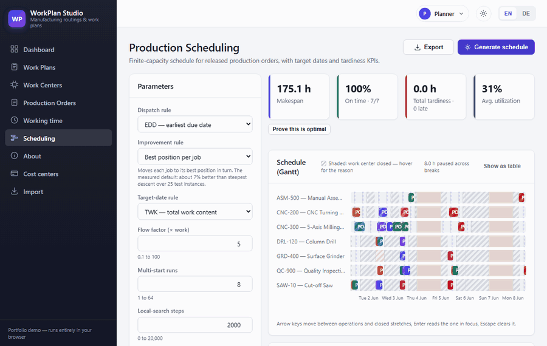
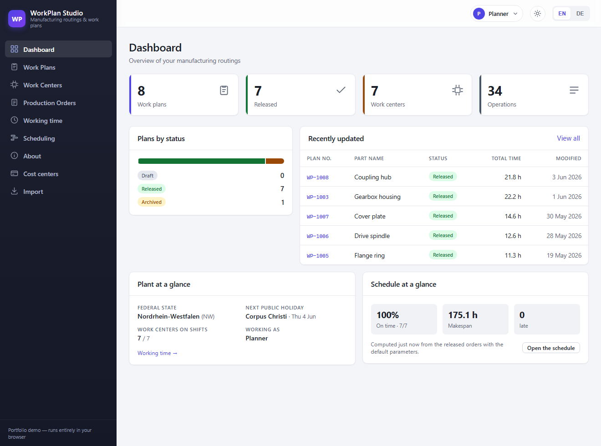
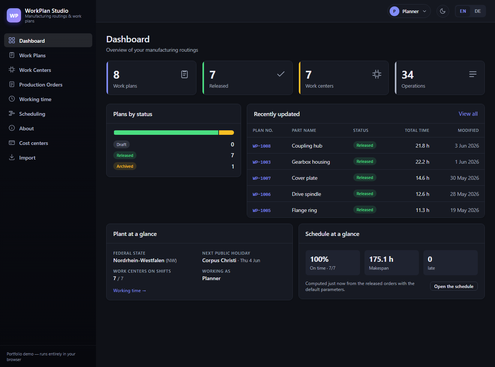
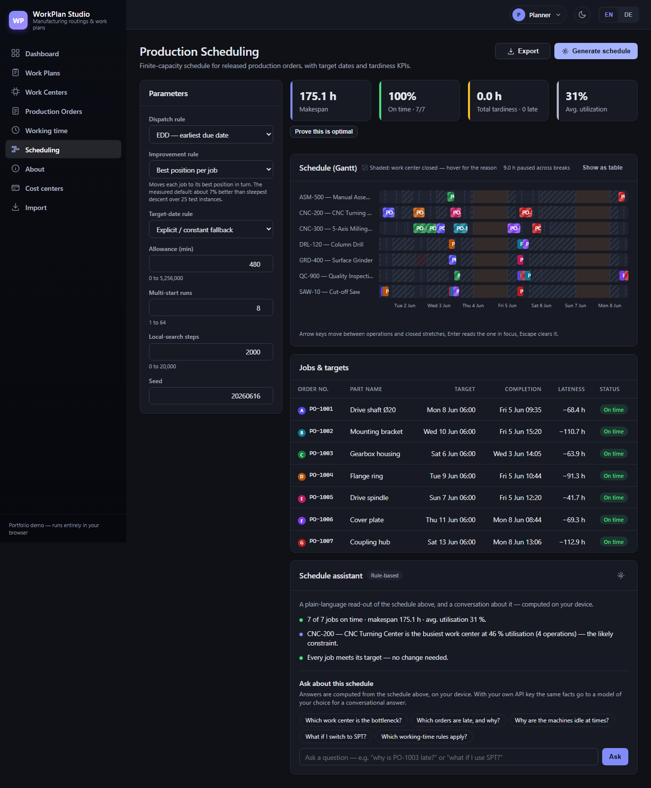
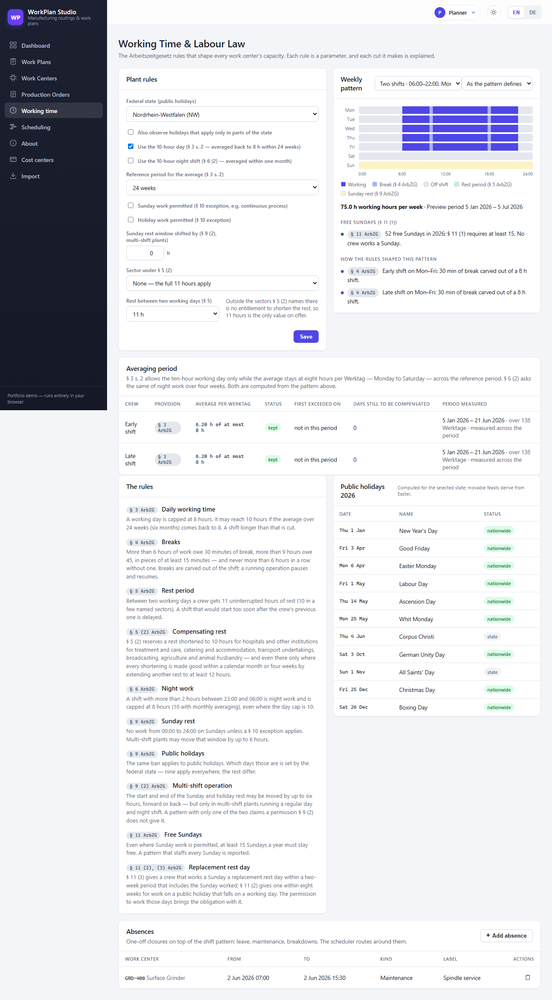
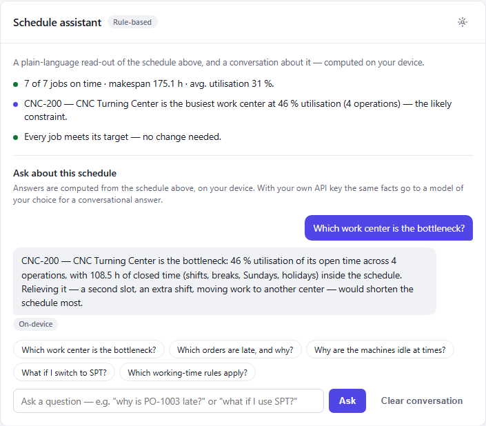
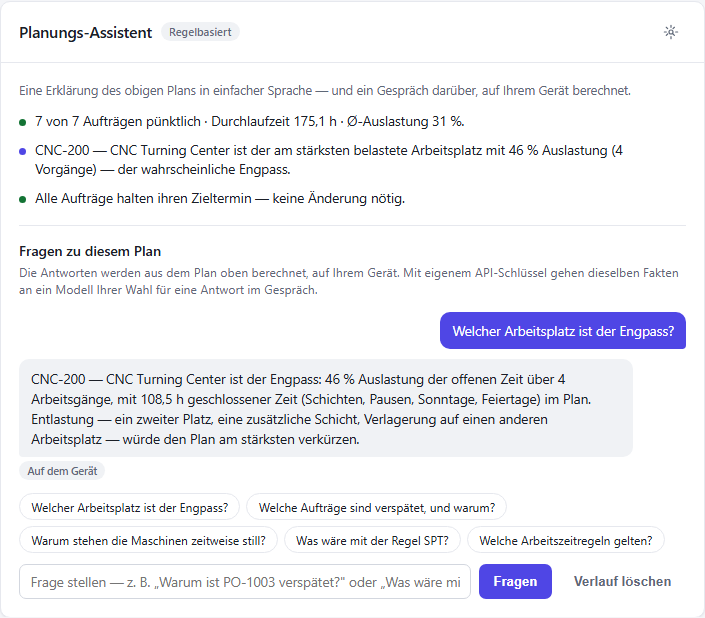
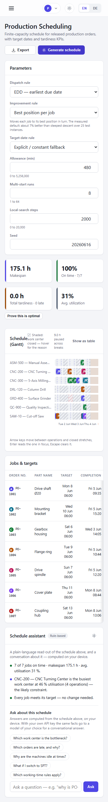
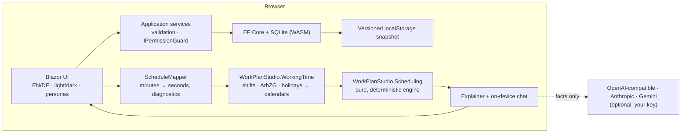

# WorkPlan Studio

**English** · [Deutsch](README.de.md)

[](https://github.com/aco993/WorkPlanStudio/actions/workflows/ci.yml)
[](https://github.com/aco993/WorkPlanStudio/actions/workflows/e2e.yml)
[](https://github.com/aco993/WorkPlanStudio/actions/workflows/quality.yml)
[](https://github.com/aco993/WorkPlanStudio/actions/workflows/codeql.yml)
[](https://github.com/aco993/WorkPlanStudio/actions/workflows/performance.yml)
[](https://aco993.github.io/WorkPlanStudio/)
[](docs/TESTING.md#coverage)
[](docs/TESTING.md#coverage)
[](docs/TESTING.md#coverage)
[](LICENSE)

**WorkPlan Studio** is a self-contained production-planning application: manufacturing **routings** (work plans), the **work centers** they run on, **production orders** with frozen routings, and a **finite-capacity scheduler** that respects shift calendars and the German Working Hours Act (ArbZG) — with a chat that explains the result. The whole application, including its relational database, runs in the browser as a static WebAssembly site. No backend, no API, no server-side storage.

> **Live demo:** <https://aco993.github.io/WorkPlanStudio/> — English and German, light and dark, desktop and mobile. Nothing to install, nothing to sign up for.



---

## Highlights

- 📋 **Work plans / routings** — create, edit, search and filter by status (Draft / Released / Archived), with an operations editor whose total time and cost recalculate as you type.
- 🏭 **Work centers** — hourly rates, cost centers, validated parallel capacity, a **shift pattern** (continuous, one, two or three shifts) and **absences** (maintenance, vacation, unplanned), with guards against deleting or deactivating a center that is still in use.
- 🧾 **Production orders** — a quantity of a part by a date. Releasing an order **freezes the routing** it will be built to, so editing the work plan afterwards cannot change work already on the shop floor.
- 🗓️ **Finite-capacity scheduling** — six dispatch rules, four target-date rules, seeded multi-start plus insertion local search, exact enumeration on small instances, a Gantt chart with real dates, KPIs for makespan, tardiness, on-time rate and utilisation *of open time*.
- ⚖️ **Working time as a constraint** — the plant's shifts, breaks, rest periods, Sundays, public holidays per federal state and absences become machine calendars. Every rule of the ArbZG the app applies is a **parameter with a legal reference**, explained on the Working-time page with a live preview of the week, and every closed stretch on the Gantt chart names the rule behind it.
- 💬 **A chat over the schedule** — "which work center is the bottleneck?", "why is PO-1003 late?", "what if I use SPT?" (that one re-runs the scheduler). Answers are computed **on your device**, in English or German, with no key. With your own API key the same facts go to **OpenAI-compatible, Anthropic or Gemini** models for a conversational answer, falling back to the on-device answer on any failure.
- 👥 **Personas with real consequences** — Planner, Supervisor and Guest go through the real ASP.NET Core authorization pipeline: policies hide what a persona cannot do, and every mutating service refuses it too.
- 🌗 **Light, dark and system theme**, WCAG 2.2 AA verified by axe on every page, keyboard paths with a skip link and focus traps, `prefers-reduced-motion`, and a mobile layout with a drawer.
- 🌍 **Bilingual UI (EN / DE)** with culture-correct numbers, dates and currency.
- 💾 **A real database in the browser** — EF Core over SQLite compiled to WebAssembly; WAL-safe snapshots survive reloads, and incompatible data enters an explicit export/reset recovery flow instead of being lost.

## Screenshots

| Dashboard, light | Dashboard, dark |
| --- | --- |
|  |  |

| Schedule with closed time shaded, dark | Working time: the rules, the week, the holidays |
| --- | --- |
|  |  |

| The chat, in English | Auf Deutsch | Mobile |
| --- | --- | --- |
|  |  |  |

The Scheduling page reacting to a **single parameter change** — loosening vs. tightening the target dates turns the orders late: red-ringed Gantt bars and red status pills. _(Both images are captured by the end-to-end test run.)_

| On-time — flow factor `3.0` | Late — flow factor `0.5` |
| --- | --- |
|  |  |

## How the pieces fit


```mermaid
flowchart LR
    subgraph Browser
        UI["Blazor UI<br/>EN/DE · light/dark · personas"]
        SVC["Application services<br/>validation · IPermissionGuard"]
        DB["EF Core + SQLite (WASM)"]
        LS["Versioned localStorage snapshot"]
        MAP["ScheduleMapper<br/>minutes → seconds, diagnostics"]
        WT["WorkPlanStudio.WorkingTime<br/>shifts · ArbZG · holidays → calendars"]
        ENG["WorkPlanStudio.Scheduling<br/>pure, deterministic engine"]
        EXP["Explainer + on-device chat"]
    end
    AI["OpenAI-compatible · Anthropic · Gemini<br/>(optional, your key)"]

    UI --> SVC --> DB --> LS
    UI --> MAP --> WT --> ENG --> EXP --> UI
    EXP -. facts only .-> AI
```

Two **pure libraries** carry the logic — the scheduler and the working-time rules have no Blazor, EF, JavaScript or network dependency, and an architecture test fails the build if that changes. The app is the shell around them: master data, persistence, authorization, the pages, and the assistant. See [docs/ARCHITECTURE.md](docs/ARCHITECTURE.md).

## Production scheduling

The **Scheduling** page turns released production orders into a finite-capacity schedule — the most algorithm-heavy part of the project, in `src/WorkPlanStudio.Scheduling`.

1. **Target dates.** A released order carries its own customer due date, so the default is to use it. Where none applies, a target can be derived by Total Work Content (TWK), Number of Operations (NOP), Equal Slack (SLK) or Constant Allowance (CON).
2. **Shop constraints.** Each work center brings its calendar from the working-time library (windows, breaks an operation may pause across, and blackouts it never may), plus an optional sequence-dependent change-over matrix between operation families.
3. **Dispatch scheduling.** A list scheduler places each operation on the earliest feasible slot of its work center, respecting precedence, capacity and the calendar. Six dispatch rules set the initial sequence: FIFO, SPT, LPT, EDD, Critical Ratio and WSPT.
4. **Optimisation.** A seeded multi-start, each restart followed by an insertion-neighbourhood descent over the job sequence; the result is never worse than the pure rule schedule. On instances small enough to enumerate all `n!` orders the optimum is computed exactly and compared: the search lands 0.2 % from optimal on average and solves 19 of 20 random instances exactly — a tested property, not a claim.
5. **Scoring.** Makespan, total and maximum tardiness, on-time rate and utilisation of open time roll up into one penalty the search minimises.

The engine is **deterministic** (integer seconds, a fixed-algorithm PRNG, bit-identical results on desktop, CI and browser), **feasible by construction** (candidates permute the priority order and re-dispatch) and **honest about its parameters** (the page reports which other rules would give the identical order instead of returning a silently unchanged schedule). Details: [docs/SCHEDULING.md](docs/SCHEDULING.md).

## Working time and the German Working Hours Act

The plant, not the scheduler, decides when a machine may run. `src/WorkPlanStudio.WorkingTime` turns a shift pattern and the plant's settings into a week of open windows and a list of closed stretches, each carrying the rule that closed it:

| Rule | Parameter | Default |
| --- | --- | --- |
| §3 daily working time | 8 h, or 10 h with averaging | 10 h |
| §4 breaks | 30 min after 6 h, 45 min after 9 h, in pieces of at least 15 min | statutory |
| §5 rest between working days | 11 h (10 h for some sectors), per crew, across the week wrap | 11 h |
| §6 night work | 8 h, or 10 h with averaging | 8 h |
| §9 Sundays and public holidays | closed, unless a §10 exception applies; the rest window may shift by up to 6 h for multi-shift plants | closed |
| §11 free Sundays | at least 15 per year | reported |
| Public holidays | computed from Easter for all 16 federal states, partial holidays optional | North Rhine-Westphalia |

The Working-time page shows the rules in force, a live preview of the resulting week per work center, the year's holidays for the chosen state, and the absences. The choices are the plant's: a §10 exception is a checkbox, a shorter rest period is a number, and the Gantt chart tells you which rule closed the machine when you hover a shaded stretch. See [ADR 0012](docs/adr/0012-working-time-as-capacity.md).

## The schedule assistant

Every run is explained twice. A deterministic **explainer** in the engine finds the bottleneck, the late orders and the resource each one queued on, and one *computed* recommendation (it re-runs the other rules and only suggests a switch that measurably helps). Under that narration a **chat** answers questions about the run — bottleneck, late orders and why, the status of one order or work center, why machines are idle, which rules apply, and what-ifs that actually re-run the scheduler — from the same facts the page renders, on your device, in English or German.

With a key of your own, the same facts and the on-device answer go to a model of your choice (any OpenAI-compatible endpoint, Anthropic's Messages API or Google Gemini) for a conversational reply; on any failure the on-device answer is shown with a note. The key lives in your browser's `localStorage` and is sent only to the endpoint you configured. See [docs/AI-ASSISTANT.md](docs/AI-ASSISTANT.md) and [ADR 0014](docs/adr/0014-schedule-chat-on-device-first-with-pluggable-models.md).

## Personas

The top bar lets you be the **Planner** (everything), the **Supervisor** (release orders and record absences, but not redefine routings or plant rules) or a **Guest** (look, touch nothing). These are not a UI switch: the persona is a `ClaimsPrincipal` fed into ASP.NET Core's real authorization pipeline, pages use `AuthorizeView` policies, and every mutating service checks the same policy through an `IPermissionGuard` and returns `Forbidden`. Swapping the demo identity for a real one is one class. It is authorization plumbing, not security — the code runs in your browser, and [docs/SECURITY.md](docs/SECURITY.md) says so plainly. See [ADR 0013](docs/adr/0013-personas-through-the-real-authorization-pipeline.md).

## Tech stack

| Area | Choice |
| --- | --- |
| Framework | .NET 10, Blazor WebAssembly (standalone) |
| Data | Entity Framework Core 10 + SQLite compiled to WebAssembly, persisted to `localStorage` |
| Domain libraries | `WorkPlanStudio.Scheduling` (finite-capacity engine), `WorkPlanStudio.WorkingTime` (ArbZG rules, holidays, calendars) — both pure C#, no dependencies |
| Authorization | `Microsoft.AspNetCore.Components.Authorization`, policies, `IAuthorizationService` with a demo identity |
| Localization | `Microsoft.Extensions.Localization`, `IStringLocalizer`, `.resx` (EN / DE) |
| Styling | Hand-written CSS design system on custom-property tokens; light, dark and system themes |
| AI | Provider seam with OpenAI-compatible, Anthropic and Gemini clients; source-generated JSON; on-device fallback |
| Testing | xUnit v3 on the Microsoft Testing Platform, CsCheck property tests, bUnit, Playwright, axe-core, BenchmarkDotNet, Lighthouse CI |
| CI / Hosting | GitHub Actions — coverage-gated tests, browser suite, CodeQL, formatting and link checks, Dependabot; deploy to GitHub Pages gated on every suite |

## Documentation

| Topic | English | Deutsch |
| --- | --- | --- |
| Project overview | this README | [README.de.md](README.de.md) |
| Architecture | [docs/ARCHITECTURE.md](docs/ARCHITECTURE.md) | — |
| Scheduling algorithm | [docs/SCHEDULING.md](docs/SCHEDULING.md) | [docs/SCHEDULING.de.md](docs/SCHEDULING.de.md) |
| Schedule assistant and chat | [docs/AI-ASSISTANT.md](docs/AI-ASSISTANT.md) | — |
| Testing strategy | [docs/TESTING.md](docs/TESTING.md) | [docs/TESTING.de.md](docs/TESTING.de.md) |
| Performance | [docs/PERFORMANCE.md](docs/PERFORMANCE.md) | — |
| Security posture | [docs/SECURITY.md](docs/SECURITY.md) | — |
| Decision records (14 ADRs) | [docs/adr](docs/adr) | — |
| Interview notes | [docs/INTERVIEW.md](docs/INTERVIEW.md) | — |
| Changelog | [CHANGELOG.md](CHANGELOG.md) | — |
| Contributing | [CONTRIBUTING.md](CONTRIBUTING.md) | — |
| AI-agent context | [AGENTS.md](AGENTS.md) | — |

## Engineering practices — measured, not asserted

- **452 tests in four projects**, every kind the app needs: unit, property-based (CsCheck), brute-force optimality, architecture, performance budgets, real-SQLite data tests, authorization, bUnit components, provider clients over a stubbed transport, Playwright flows in both languages, **axe WCAG 2.2 AA on every page in both themes**, and **visual regression** against pixel baselines. [docs/TESTING.md](docs/TESTING.md).
- **Coverage gated per assembly in CI** — the build fails below 90 % lines for the engine (measured 96.0 %), 90 % for the working-time library (94.0 %) and 65 % for the app (69.3 %). The badges above are generated from the same measurement on every deployment.
- **Deploy gated on everything** — the three test projects with their coverage gates *and* the browser suite must pass before GitHub Pages is updated.
- **Performance measured** — BenchmarkDotNet over both libraries, budget tests on every pull request, Lighthouse CI on the published site. The numbers, including the unflattering ones, are in [docs/PERFORMANCE.md](docs/PERFORMANCE.md).
- **Strict builds** — nullable reference types, .NET analyzers, warnings as errors, `dotnet format` verified in CI, central package management, Dependabot for NuGet and Actions, CodeQL security-extended.
- **Decisions recorded** — fourteen [Architecture Decision Records](docs/adr), each with the options that lost.
- **Every relative link in the docs is checked** by the Quality workflow, so nothing here points at a file that moved.

## What this project demonstrates

This is a public **portfolio** project. It uses a generic manufacturing domain and fictitious data, and shares no code with any proprietary system. The point is to show *how* I build, not just that a feature works:

| Area | Where to look | What it shows |
| --- | --- | --- |
| **Architecture boundary** | `src/WorkPlanStudio.Scheduling`, `src/WorkPlanStudio.WorkingTime` | two pure domain cores behind an *enforced* dependency boundary |
| **Algorithms** | `SchedulingEngine`, `DispatchScheduler`, `LocalSearch`, `ExactDispatchOrderOptimizer` | finite-capacity scheduling with calendars, dispatch rules, local search, exact enumeration |
| **Domain modelling** | `WorkingTimeRules`, `WorkingTimelineBuilder`, `GermanHolidays` | statute as parameters, computed holidays, rules that explain themselves |
| **Determinism & correctness** | `DeterministicRandom`, `DeterminismTests`, `OptimalityTests` | reproducible results pinned by golden values and compared with the true optimum |
| **AI integration** | `Services/Assistant/` | on-device first, a provider seam with three clients, graceful fallback, tested without a network |
| **Authorization** | `Services/Auth/`, `Permissions` | the real pipeline with a demo identity, checked at the service boundary |
| **Front-end** | `Pages/`, `wwwroot/css/app.css` | Blazor WebAssembly, a tokenised design system with themes, a Gantt with real dates, WCAG AA |
| **Data engineering** | `Data/BrowserDatabase.cs` | a relational database (EF Core + SQLite) running client-side, with explicit recovery |
| **Testing strategy** | `tests/`, [docs/TESTING.md](docs/TESTING.md) | every layer from property tests to axe and pixel baselines, coverage gated |
| **DevOps** | `.github/workflows` | per-layer CI, browser suite, CodeQL, performance, coverage badges, gated deploy |
| **Documentation** | `docs/`, ADRs, `AGENTS.md` | decisions recorded, numbers measured, limitations stated |

Short on time? The fastest tour is `AGENTS.md` → `SchedulingEngine.cs` → `WorkingTimelineBuilder.cs` → `ScheduleMapper.cs` → `Pages/Schedule.razor` → `Services/Assistant/Chat/ScheduleChat.cs`.

## Project structure

```
WorkPlanStudio/
├─ .github/
│  ├─ workflows/                    # ci, e2e, quality, codeql, performance, deploy
│  └─ scripts/coverage_gate.py      # per-assembly coverage thresholds + badge JSON
├─ docs/                            # ARCHITECTURE, SCHEDULING(.de), TESTING(.de), AI-ASSISTANT, PERFORMANCE, SECURITY, adr/, images/
├─ src/
│  ├─ WorkPlanStudio/               # the Blazor WebAssembly app
│  │  ├─ Models/                    # WorkPlan, Operation, WorkCenter, ProductionOrder, PlantSettings, WorkCenterAbsence
│  │  ├─ Data/                      # AppDbContext, SeedData, BrowserDatabase
│  │  ├─ Services/                  # services, ScheduleMapper, ShopCalendar, Auth/, Assistant/ (narrator, Chat/)
│  │  ├─ Resources/                 # SharedResource(.de).resx
│  │  ├─ Components/                # Modal, PersonaMenu, ThemeToggle, WeekStrip, ReadOnlyNotice, …
│  │  ├─ Pages/                     # Home, WorkPlans, WorkPlanEditor, WorkCenters, ProductionOrders, Schedule, WorkingTimePage, About
│  │  └─ wwwroot/                   # index.html, css/app.css, js/app.js
│  ├─ WorkPlanStudio.Scheduling/    # pure engine: Inputs, Parameters, Core, Evaluation, Explain, Outputs
│  └─ WorkPlanStudio.WorkingTime/   # pure rules: GermanHolidays, ShiftPattern, WorkingTimeRules, WorkingTimelineBuilder
├─ tests/
│  ├─ WorkPlanStudio.Scheduling.Tests/   # unit, property, optimality, architecture, budgets
│  ├─ WorkPlanStudio.WorkingTime.Tests/  # holidays, rules, timeline invariants, budgets
│  ├─ WorkPlanStudio.Web.Tests/          # SQLite, mapper, authorization, bUnit, assistant + chat
│  ├─ WorkPlanStudio.E2E/                # Playwright flows, axe, visual baselines
│  └─ WorkPlanStudio.Benchmarks/         # BenchmarkDotNet
└─ tools/WorkPlanStudio.Scheduling.Scenarios/   # reproducible performance scenarios
```

## Getting started

### Prerequisites

- [.NET 10 SDK](https://dotnet.microsoft.com/download) (the repository pins the SDK band in `global.json`)
- The WebAssembly tools workload, needed once to relink native SQLite:

  ```bash
  dotnet workload install wasm-tools
  ```

### Run locally

```bash
dotnet run --project src/WorkPlanStudio/WorkPlanStudio.csproj
```

Open <http://localhost:5235>. The first build takes a few minutes because SQLite is compiled to WebAssembly; later builds are cached. The app seeds a demo plant (seven work centers with shift patterns, seven released orders, one absence) on first start; **About → Reset** brings it back at any time.

### Run the tests

```bash
dotnet test tests/WorkPlanStudio.Scheduling.Tests/WorkPlanStudio.Scheduling.Tests.csproj    # engine — no WASM needed
dotnet test tests/WorkPlanStudio.WorkingTime.Tests/WorkPlanStudio.WorkingTime.Tests.csproj  # working time — no WASM needed
dotnet test tests/WorkPlanStudio.Web.Tests/WorkPlanStudio.Web.Tests.csproj                  # data, mapper, components, assistant
```

The browser suite (flows, axe, visual regression) needs the app running and a Chromium once:

```bash
dotnet build tests/WorkPlanStudio.E2E/WorkPlanStudio.E2E.csproj
pwsh tests/WorkPlanStudio.E2E/bin/Debug/net10.0/playwright.ps1 install chromium
dotnet test tests/WorkPlanStudio.E2E/WorkPlanStudio.E2E.csproj
```

[docs/TESTING.md](docs/TESTING.md) explains the layers, the environment variables and how to update visual baselines.

### Publish a static build

```bash
dotnet publish src/WorkPlanStudio/WorkPlanStudio.csproj -c Release -o publish
```

The deployable site is in `publish/wwwroot/` and can be served by any static file host.

## Deployment

[`deploy.yml`](.github/workflows/deploy.yml) publishes to **GitHub Pages** on every push to `main`, after all four test projects pass. It publishes the app, rewrites `<base href>` for the project sub-path, adds a `404.html` SPA fallback and a `.nojekyll` marker, copies the coverage badge data next to the site and deploys. To enable it on a fork: **Settings → Pages → Source = GitHub Actions**.

## Limitations, stated plainly

- **Personas are not access control.** Anyone can be the planner by choosing to; the code runs in the visitor's browser. Real protection needs a server that owns the data.
- **The scheduler is a heuristic.** It is exact on instances small enough to enumerate and measured against that; it does not prove global optimality otherwise. The optimiser allocates about 0.5 MB per evaluated candidate (a medium run about 1 GB), which is measured, documented and the first thing to attack if the browser ever feels it.
- **Loading a .NET runtime and SQLite** is 5.8 MB compressed; the branded boot screen paints at 0.4 s and the dashboard at about 7 s on a desktop connection. Lighthouse reports this rather than gating it.
- **The chat's on-device recogniser is keyword-based.** A question outside its vocabulary gets the help text — unless a model is configured, which is the division of labour intended.
- **Model calls go browser-to-provider**, so the provider must allow CORS; a production deployment would put a proxy in front and keep the key there.
- **Visual baselines are per operating system.** Windows baselines are committed; a Linux runner writes its own on the first run and uploads them for committing.
- Browser storage is local demo persistence: versioned snapshots with recovery, not migrations or synchronisation. Sample parts, machines and times are fictitious.

## AI-assisted development disclosure

AI tools were used intensively to generate and review code, tests and documentation. The project is not represented as entirely hand-written. The author remains responsible for the specification, verification, debugging, tests, integration and final engineering decisions, and can explain every accepted part. No percentage of "AI-written lines" is claimed because that number is neither known nor meaningful; AI output is accepted only after review and executable evidence.

## License

[MIT](LICENSE)
