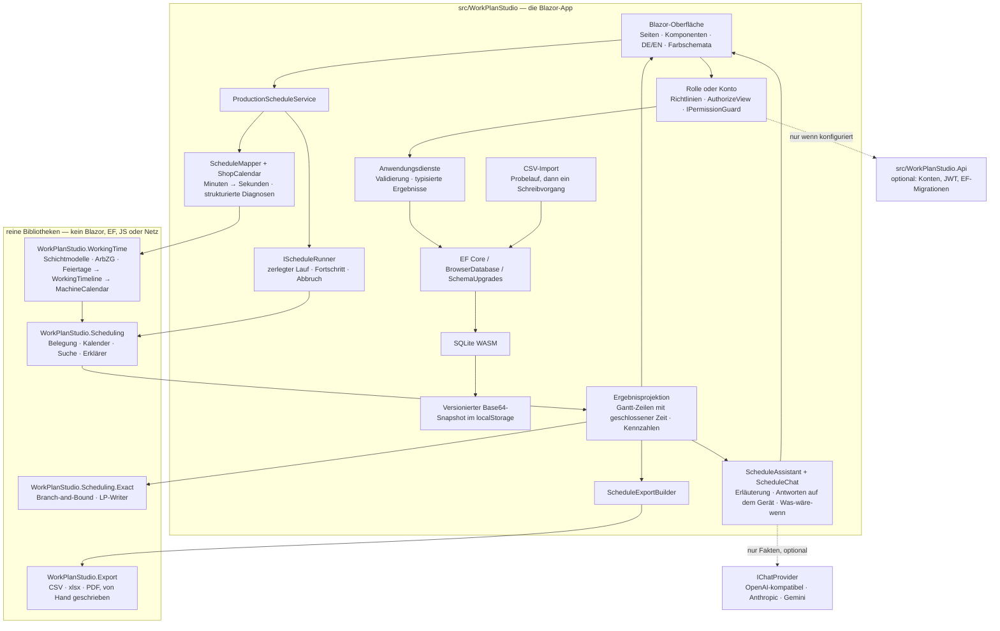

# Architektur

[English](ARCHITECTURE.md) · **Deutsch**

WorkPlan Studio ist eine statische Blazor-WebAssembly-Anwendung. Der Browser trägt die Oberfläche,
die Anwendungsdienste, EF Core, SQLite, die Persistenz, die Berechtigungsprüfung, den Planungslauf
und den Assistenten. Vier Bibliotheken tragen die Logik, deren Isolation sich lohnt; die App ist die
Hülle darum. Ein fünftes Projekt ist ein **optionales** ASP.NET-Core-Backend, das der Browser-Build
übergeht, solange es nicht konfiguriert ist, ein sechstes enthält die Verträge, die beide Seiten
kompilieren.

> Die ADR-Texte selbst sind auf Englisch. [docs/adr/README.de.md](adr/README.de.md) fasst jeden
> Datensatz in einem deutschen Satz zusammen.

## Die Projekte

| Projekt | Was es ist | Hängt ab von |
| --- | --- | --- |
| `src/WorkPlanStudio` | die Blazor-WebAssembly-App | allem außer der API |
| `src/WorkPlanStudio.Scheduling` | die kapazitätsbeschränkte Engine, der Erklärer und der exakte Löser | nur der Basisklassenbibliothek |
| `src/WorkPlanStudio.WorkingTime` | Schichtmodelle, ArbZG-Regeln, gesetzliche Feiertage, Maschinenkalender | nur der Basisklassenbibliothek |
| `src/WorkPlanStudio.Export` | CSV-, xlsx- und PDF-Writer | nur der Basisklassenbibliothek |
| `src/WorkPlanStudio.Contracts` | die DTOs und Richtliniennamen, die App und API teilen | nur der Basisklassenbibliothek |
| `src/WorkPlanStudio.Domain` | die Entitäten, die Validierungsregeln, die Richtlinientabelle und die EF→Engine-Abbildung | den Autorisierungs-Abstraktionen, sonst nichts |
| `src/WorkPlanStudio.Api` | das optionale Backend: Identity, JWT, EF-Migrationen, Minimal API | ASP.NET Core 10 |

`ArchitectureTests` in den Testprojekten für Planung und Arbeitszeit spiegeln über diese Assemblies
und lassen den Build scheitern, sobald `Microsoft.AspNetCore`, `Microsoft.EntityFrameworkCore`,
`Microsoft.JSInterop` oder `SQLitePCLRaw` in ihrem Referenzgraphen auftaucht. Die Export-Bibliothek
hat überhaupt keine Paketreferenz — dieselbe Eigenschaft, durchgesetzt von ihrer `.csproj` statt von
einem Test.

App und API **referenzieren beide `WorkPlanStudio.Domain`**, damit die Entitätsformen, die
Validatoren und die Richtlinientabelle eine Kopie bleiben statt zweier, die auseinanderlaufen. Diese
gemeinsame Assembly ist zugleich die Auflage: nichts darin darf von Blazor, EF Core oder JS-Interop
abhängen, und die Persistenz bleibt bewusst draußen — der `DbContext` des Browsers und der
`IdentityDbContext` des Servers widersprechen sich mit Absicht, und ein gemeinsamer Kontext wäre
eine gemeinsame Lüge.

Früher zog die API diese Dateien per `<Compile Include>` aus der App herein. Das funktionierte und
war die einzige Stelle im Repository, an der „zu welchem Projekt gehört dieser Typ" anders
beantwortet wurde als überall sonst — und es verdeckte einen echten Fehler: Der eine Validator, der
sich nicht verlinken ließ, war von Hand in die API kopiert worden, und die Kopie hatte drei Regeln
weniger als das Original.

## Grenzen und Invarianten

- **Arbeitszeit ist Kapazität.** Die Betriebseinstellungen sowie Schichtmodell und Abwesenheiten
  jedes Arbeitsplatzes werden zu einem `MachineCalendar`: wöchentliche Zeitfenster mit einer Phase
  (der Planungshorizont beginnt selten montags um 00:00), markierte Sperrzeiten (Feiertage,
  Abwesenheiten, Sonntagsruhe — nie überbrückbar) und eine überbrückbare Lücke (eine Pause, über die
  ein Arbeitsgang unterbrechen darf). Die Engine kennt Fenster, Sperrzeiten und Lücken; was ein
  Sonntag ist, weiß sie nicht. Siehe [ADR 0012](adr/0012-working-time-as-capacity.md).
- **Ein Zeitmodell.** `WorkPlanStudio.WorkingTime.PlantTime` schreibt es fest: Ortszeit des Betriebs
  als `DateTime` mit `Kind.Unspecified`. `ProductionOrder.ReleaseLocal` und `DueLocal` sind Ablesungen
  auf dieser Uhr, keine Zeitpunkte. Ein Quelltext-Test stellt sicher, dass nirgends in der App
  `ToLocalTime` oder `ToUniversalTime` aufgerufen wird; die echten UTC-Stempel (`CreatedUtc`,
  `ModifiedUtc`) sind Protokolldaten und gehen nie in die Planungsarithmetik ein.
- **`ScheduleMapper.ToSeconds` ist die einzige Umrechnung von Dezimalminuten in ganze Sekunden.**
  Mit `checked`-Arithmetik, kaufmännischer Rundung zur geraden Zahl und einem Quelltext-Scan, der
  dafür sorgt, dass es die einzige bleibt.
- **Ein freigegebener Auftrag wird vollständig abgebildet oder vollständig abgelehnt.**
  `SchedulePreparationIssue` trägt Auftrag, gegebenenfalls Arbeitsgang und einen stabilen
  Ablehnungsgrund; die Oberfläche lokalisiert den Grund, statt eine Ausnahme zu zerlegen. Ein
  Arbeitsgang, der länger ist als jedes offene Fenster seines Arbeitsplatzes, einer, der länger ist
  als die Dauerschranke der Engine, und ein Arbeitsplatz, den die Arbeitszeitregeln ganz geschlossen
  haben, sind drei verschiedene Gründe mit je eigenem Satz.
- **Jede schreibende Dienstmethode fragt zuerst die Berechtigungsrichtlinie** über `IPermissionGuard`
  und gibt sonst `Forbidden` zurück. Das ist keine Liste, die jemand pflegen muss:
  `ServiceAuthorizationArchitectureTests` ermittelt die Menge per Reflexion — eine Methode, die etwas
  ändern kann, liefert `ApplicationResult<T>`, eine lesende nicht — und prüft, dass alle **14**
  derzeit gefundenen einen Gast abweisen. `BrowserDatabase.ResetAsync` und `ImportAsync` fragen
  dieselbe Instanz, denn alle Zeilen zu ersetzen ist ein Schreibvorgang, wie die Aufrufstelle auch
  aussieht. Der Export fragt bewusst nicht: Der Besucher hat die Daten bereits vor sich.
  Siehe [ADR 0013](adr/0013-personas-through-the-real-authorization-pipeline.md).
- **Ein Commit-Pfad.** `DatabaseMutation.RunAsync` sichert den Zustand vorher, führt die Änderung
  aus, schreibt den Snapshot und stellt den Vorzustand wieder her, wenn eine der beiden Hälften
  scheitert. Eine verletzte Datenbankbedingung wird zu einem typisierten `Conflict`, statt als
  `DbUpdateException` bis zur Fehlergrenze durchzuschlagen. Der CSV-Import geht **einmal** für eine
  ganze Datei durch diesen Pfad, nicht einmal je Zeile.
- **Referenzielle Integrität liegt in der Datenbank, nicht nur in einem Dienst.**
  `WorkCenter.CostCenterId` und die Verknüpfungstabelle `OrderRoutingCenter` sind Fremdschlüssel mit
  `DeleteBehavior.Restrict`. Die Vorprüfung im Dienst gibt es für den verständlichen Satz; wahr macht
  die Regel der Fremdschlüssel.
- **Planungsbudgets sind deterministische Zählgrenzen, keine Zeitschranken.** `MultiStartRuns`,
  `LocalSearchMaxSteps` und ihr **Produkt** sind begrenzt, damit ein Formular nicht 1 280 000
  Kandidatenpläne verlangen kann. Der Abbruch ist kooperativ und verändert ein fertiges Ergebnis nie.
- **Die Zahlen des Assistenten stammen aus dem Sichtmodell — und hängen an dem Gegenstand, nach dem
  gefragt wurde.** Erklärer und Antwortgeber rechnen auf derselben Projektion, die die Seite anzeigt;
  eine Bezugnahme, die der Antwortgeber erkennt, aber nicht auflösen kann, endet mit „PO-9999 kann
  ich nicht finden“, statt auf die nächste passende Absicht mit einer plausiblen Zahl
  durchzufallen. Ist ein Modell konfiguriert, bekommt es diese Fakten als Daten eingefasst und soll
  sie umformulieren. Siehe [ADR 0005](adr/0005-explainable-scheduling-and-optional-ai.md),
  [ADR 0014](adr/0014-schedule-chat-on-device-first-with-pluggable-models.md) und
  [ADR 0025](adr/0025-hostile-input-on-the-model-path.md).

## Lebenszyklus der Browser-Persistenz

1. Den versionierten Datenblock aus dem `localStorage` lesen — ein JSON-Wert unter einem Schlüssel.
2. Ungültiges Base64, zu kurze oder abgeschnittene Daten, einen falschen SQLite-Header oder einen
   nicht unterstützten Schemastand ablehnen, **ohne den Speicher zu überschreiben**.
3. Einen Block, der ein oder zwei Stände zurückliegt, über `SchemaUpgrades` aufwerten; einen aus
   einer neueren Auslieferung unangetastet ablehnen, aber weiterhin exportierbar halten.
4. Verträgliche Bytes in den Pfad des WASM-Dateisystems schreiben, `PRAGMA quick_check` ausführen,
   dann jedes `DbSet` über EF prüfen.
5. Vor jedem Snapshot `PRAGMA wal_checkpoint(TRUNCATE)` ausführen — aber nur, wenn `journal_mode`
   tatsächlich WAL ist, und einen belegten Checkpoint als gescheiterten Snapshot behandeln, statt ihn
   zu verwerfen.
6. Die Hauptdatei als Base64 unter einem Schlüssel speichern, zurücklesen und erst dann Erfolg
   melden. Eine Kontingentüberschreitung wird ein typisierter Persistenzfehler, nie ein erfolgreicher
   dauerhafter Schreibvorgang.

Der aktuelle Schemastand ist **7**; eine gespeicherte Datenbank auf **5 oder 6** wird an Ort und
Stelle aufgewertet. Der Schritt liest die alte Datenbank über seine eigene eingefrorene Beschreibung
der alten Form — nicht über das aktuelle Modell, das beim ersten hinzugefügten Feld nicht mehr passen
würde —, lässt EF das aktuelle Schema bauen und schreibt die Zeilen **mit ihren ursprünglichen
Primärschlüsseln** zurück, weil ein freigegebener Auftrag Arbeitsplatz-Schlüssel in seinen
eingefrorenen Arbeitsplan übernommen hat. Ein Stand, der sich nicht aufwerten lässt, führt weiterhin
zu Export und einem ausdrücklichen zweistufigen Zurücksetzen. Siehe
[ADR 0006](adr/0006-explicit-browser-storage-recovery.md) und
[ADR 0016](adr/0016-cost-centre-master-data.md).

## Stammdaten

Eine **Kostenstelle** ist eine Entität mit Nummer, Bezeichnung, Beschreibung und Aktivkennzeichen,
auf die Arbeitsplätze über einen optionalen Fremdschlüssel verweisen. Optional mit Absicht: Die
Textspalte, die sie ersetzt, ließ `""` zu, und während einer Aufwertung Stammdaten zu erfinden, die
niemandem gehören, ist schlimmer als „nicht zugeordnet“ festzuhalten — ein Zustand, den das
Controlling kennt. Geschäftsschlüssel — Arbeitsplatznummer, Arbeitsplannummer, Teilenummer, Änderungs­
index, Auftragsnummer — tragen die Kollation `NOCASE` und werden in Großbuchstaben abgelegt, sodass
`PO-1001` und `po-1001` nicht nebeneinander existieren können. Geldbeträge liegen auf `TEXT`-Spalten
mit `CAST(... AS REAL)` in jeder Bereichsprüfung, denn eine `decimal(10,2)`-Spalte hat in SQLite
NUMERIC-Affinität und würde einen Preis stillschweigend als IEEE-754-Gleitkommazahl speichern.

Der **CSV-Import** (`Services/Import/**`) liest, was ein Tabellenkalkulationsprogramm tatsächlich
schreibt — UTF-8, UTF-16 und Windows-1252, Komma, Semikolon oder Tabulator anhand der Gleichmäßigkeit
der Spaltenzahl erkannt, gemischte Zeilenenden — und geht denselben Codepfad zweimal: `PlanAsync`
löst auf, validiert alles und schreibt nichts; `CommitAsync` spielt genau diesen Plan nach und
verweigert, wenn sich die Datenbank dazwischen bewegt hat. Abgelehnte Zeilen nennen Zeile, Spalte und
Grund und lassen sich herunterladen. Siehe [ADR 0018](adr/0018-csv-import.md).

## Planungsmodell

Geplant werden **Fertigungsaufträge**, nicht Arbeitspläne. Ein Arbeitsplan ist Stammdatum und darf
jederzeit geändert werden; ein Auftrag übernimmt den Arbeitsplan bei der Freigabe als unveränderliche
Kopie, sodass eine spätere Änderung Arbeit, die bereits in der Fertigung ist, nicht mehr verändert.
Das gibt der Engine zugleich einen echten Kundentermin, und erst damit ist `DueDateRule.Explicit`
brauchbar — sie ist die Vorbelegung. Siehe
[ADR 0011](adr/0011-production-orders-own-routing-snapshots.md), die
[ADR 0007](adr/0007-defer-production-order.md) ablöst.

Die Planung ist eine deterministische Heuristik:

1. Zieltermine vergeben;
2. eine Prioritätsreihenfolge nach der gewählten Regel erzeugen;
3. einen begrenzten Abstieg über die **Insertion-Nachbarschaft** von dieser Reihenfolge aus und von
   jeder Multi-Start-Permutation aus laufen lassen;
4. jeden Kandidaten neu einplanen, damit Reihenfolge, Kapazität und Kalender per Konstruktion
   eingehalten bleiben.

Auf die Nachbarschaft kommt es an. Vertauschungen benachbarter Aufträge — die frühere Umsetzung —
bewegen einen Auftrag je Verbesserungsschritt um eine Position und bleiben bei einer
Verspätungszielfunktion fast sofort stecken; eine Insertion setzt ihn in einem Schritt an jede Stelle.
Gegen die Aufzählung aller `n!` Auftragsreihenfolgen sank der mittlere Abstand damit von 27,3 % auf
0,2 % ([ADR 0008](adr/0008-insertion-neighbourhood.md)). Welchen verbessernden Nachbarn der Abstieg
übernimmt, wurde eigens gemessen und hat die Vorbelegung geändert
([ADR 0022](adr/0022-local-search-acceptance.md)).

**Diese Referenz ist nicht das Optimum, und darauf kommt es an.** Der Dispatcher plant einen ganzen
Auftrag nach dem anderen ein und füllt Lücken nie nachträglich, also ist die beste Reihenfolge, die
er bekommen kann, nicht der beste Plan. `WorkPlanStudio.Scheduling.Exact` beweist das echte Optimum
mit einem disjunktiven Branch-and-Bound, das keine Zeile Code mit dem Dispatcher teilt, und auf dem
festen Satz von zwanzig Instanzen aus [ADR 0015](adr/0015-exact-solver.md) liegen beide Referenzen
weit auseinander:

| Gemessen gegen | Exakt bei | Mittlerer Abstand | Median |
| --- | ---: | ---: | ---: |
| die beste Auftragsreihenfolge (Obergrenze der Suche) | 18 von 20 | 0,27 % | 0,00 % |
| das wahre Optimum (per Branch-and-Bound bewiesen) | 7 von 20 | 327 % | 5,34 % |

`OptimalityStudyTests` berechnet und fixiert beides auf sechs Nachkommastellen, und
`tools/WorkPlanStudio.Scheduling.Scenarios -- exact` erzeugt die Tabelle neu. Der Mittelwert von
327 % wird von einer einzigen Instanz getragen, bei der das Optimum keinen verspäteten Auftrag hat
und die beste Auftragsreihenfolge zwei, sodass ein pauschaler Strafterm je verspätetem Auftrag zu
einem Verhältnis von 61 wird; der Median daneben ist die Zahl, die man lesen sollte. Der Schluss ist
der interessante: **Die Suche ist nah an ihrer Obergrenze, und die Obergrenze ist das Modell.** Das
nachträgliche Füllen von Lücken — nicht eine bessere Metaheuristik — würde etwas bewegen.

Die Anwendung kann den Beweis anfordern. `IOptimalityProver` lässt das Branch-and-Bound unter einer
Zeitschranke auf den gerade angezeigten Plan laufen, und die Seite berichtet nur, was bewiesen wurde
— „optimal“, der Abstand zu einem besseren Plan, oder die bewiesene untere Schranke, wenn die Zeit
nicht reichte. Es ist ein eigener, vom Benutzer ausgelöster Schritt und liegt nicht auf dem Weg eines
gewöhnlichen Laufs.

`ExhaustiveDispatchOrderSearch` — die ältere Klasse — zählt alle `n!` Reihenfolgen für Instanzen bis
neun Aufträge auf. Sie ist exakt *innerhalb des Dispatch-Order-Modells* und bleibt als Zweitmeinung
zur Suche erhalten, nicht als Orakel für das Optimum: Auf einer Instanz mit zwei Aufträgen und drei
Arbeitsplätzen nennt sie 60 Sekunden, wo das Optimum 40 ist.

Prioritätsregel und Terminregel sind nicht unabhängig: Unter TWK-Terminen ist EDD buchstäblich
dieselbe Sortierung wie SPT, und Critical Ratio ist konstant und fällt mit FIFO zusammen. Die Seite
meldet diesen Zusammenfall, statt stumm denselben Plan zurückzugeben; siehe
[ADR 0009](adr/0009-report-rule-equivalences.md). Gestaffelte Freigabetermine brechen die meisten
Identitäten, weshalb auf den aktuellen Beispieldaten kein Zusammenfall auftritt — und genau deshalb
wird er aus den Aufträgen berechnet und nicht aus einer Tabelle abgelesen.

## Den Lauf ausführen, ohne den Tab einzufrieren

WebAssembly hat in dieser App genau einen Thread, und das nicht aus freien Stücken:
`SQLitePCLRaw.lib.e_sqlite3` liefert ein `browser-wasm`-Binary ohne `atomics` aus, also scheitert
`WasmEnableThreads=true` schon am Linker — Threads oder Datenbank, nicht beides. GitHub Pages kann
zudem die Kopfzeilen `Cross-Origin-Opener-Policy` und `Cross-Origin-Embedder-Policy` nicht senden,
die eine Thread-fähige Laufzeit verlangt.

Also wird der Lauf **auf dem einen vorhandenen Thread zerlegt**. `SchedulingEngine.Begin(context)`
legt die Neustartgrenze des Multi-Starts offen; `CooperativeScheduleRunner` meldet Fortschritt und
gibt den Thread zwischen den Abstiegen zurück. Die Rückgabe erfolgt über eine `MessageChannel`-Aufgabe
statt über `setTimeout`, denn ein Hintergrund-Tab drosselt Timer auf etwa einen Aufruf je Sekunde,
und derselbe Lauf blieb zuvor zehn Sekunden lang bei 25 % stehen. Es gibt weiterhin genau eine
Multi-Start-Schleife im Code, und ein Test prüft, dass zerlegter und durchlaufender Lauf denselben
Plan erzeugen. Siehe [ADR 0019](adr/0019-off-thread-scheduling.md).

## Export

`WorkPlanStudio.Export` schreibt CSV, eine xlsx-Arbeitsmappe und einen PDF-Bericht von Hand, **ohne
Paketreferenz** — die Alternative wären 5 bis 20 MB nativer oder verwalteter Abhängigkeit, die jeder
Besucher herunterlädt. Der PDF-Writer erzeugt seine eigene Objekttabelle, den Seitenbaum,
WinAnsi-kodierten Text und ein Vektor-Gantt; die Arbeitsmappe besteht aus den OOXML-Teilen, in der
richtigen Reihenfolge gezippt. Beide Sprachen bekommen ihre eigene Datumsregel, ihre eigenen
Blattbezeichnungen und ihre eigene Achseneinheit, und ein Test prüft, dass der Export ein Datum genau
so schreibt wie der Bildschirm. Das PDF deklariert `/MarkInfo << /Marked false >>`, statt eine
Barrierefreiheit zu behaupten, die es nicht liefert. Siehe [ADR 0017](adr/0017-in-browser-export.md).

## Arbeitszeitmodell

`WorkingTimelineBuilder` macht aus einem `ShiftPattern`, einem `WorkingTimeRules`-Datensatz (jeder
Parameter mit gesetzlicher Vorbelegung und Fundstelle) und den Abwesenheiten des Betriebs eine
`WorkingTimeline`: die offenen Zeitfenster der Woche, die Lücken dazwischen, datierte Ausnahmen und
eine Liste von `RuleApplication`s, die festhält, welche Vorschrift welche Schicht an welchem Tag um
wie viel gekürzt hat. Die Reihenfolge der Schritte ist die Reihenfolge des Gesetzes, sodass die
Erläuterung auf der Seite die Spur der Berechnung ist und kein getrennt gepflegter Text.

Zwei Dinge sind eigens zu nennen, weil sie vorher falsch waren. `WeekCapacity` ist ein geschlossener
Summentyp — `Unconstrained`, `Staffed`, `Closed` —, sodass ein leer geräumtes Schichtmodell nicht
mehr als durchgehend laufende Maschine gelesen werden kann; und die **Ausgleichszeiträume** nach § 3
Satz 2 und § 6 Abs. 2 werden **berechnet**, nicht nur als Obergrenze eingehalten, mit Besatzung,
Durchschnitt je Werktag, Datum der ersten Überschreitung und noch auszugleichenden Tagen.
`Evaluate(TimeZoneInfo)` misst diese in tatsächlich verstrichenen Stunden, sodass eine Nachtschicht
über die Umstellung auf Normalzeit neun Stunden lang ist und als Überschreitung von § 6 Abs. 2
gemeldet wird, die sie nach der Uhr einzuhalten scheint. Siehe
[ADR 0012](adr/0012-working-time-as-capacity.md) und [ADR 0024](adr/0024-arbzg-in-the-ui.md).

`GermanHolidays` berechnet die beweglichen Feste aus dem Osterdatum und tabelliert das *Recht* statt
der Termine: Jeder Ländereintrag trägt die Jahre, in denen er galt, also ist der Reformationstag nur
2017 bundesweit, der Buß- und Bettag bundesweit bis 1994 und danach sächsisch, und der Berliner Tag
der Befreiung existiert 2020 und 2025. Der unterstützte Bereich ist 1990–2200; ein Jahr außerhalb
wirft eine Ausnahme, statt stillschweigend die falsche Liste zu liefern.

## Berechtigungsmodell

Ohne Backend ist `DemoAuthenticationStateProvider` ein `AuthenticationStateProvider`, dessen
Principal einen Rollen-Claim für die in der Kopfleiste gewählte Rolle trägt (Planer, Meister, Gast),
je Browser gemerkt. `Permissions` ist eine Tabelle von Richtlinie zu Rollen, angemeldet über
`AddAuthorizationCore`. Seiten nutzen `AuthorizeView Policy="…"`, Dienste nutzen `IPermissionGuard`,
der `IAuthorizationService` kapselt.

Im verbundenen Betrieb wird dieselbe Tabelle **aus derselben Assembly** in der API angemeldet, der
Principal stammt aus einem JWT, das der Server für ein Identity-Konto ausgestellt hat, und der
Rollenwechsler verschwindet aus der Oberfläche. Das ist die Nahtstelle, die ADR 0013 behauptet hat,
vorgeführt statt behauptet. Die statische Demo ist weiterhin der Rollen-Build und schützt weiterhin
nichts; [SECURITY.de.md](SECURITY.de.md) sagt das deutlich.

## Das optionale Backend

`src/WorkPlanStudio.Api` bleibt aus, solange `wwwroot/appsettings.json` keine `Api:BaseAddress` nennt
— und der GitHub-Pages-Build tut das nicht. Ist sie konfiguriert, ersetzt `AddOptionalApi` den
Rollenanbieter durch eine echte Anmeldung und die lokale Planung durch einen Serveraufruf; fehlt sie,
meldet die Registrierung ein Wertobjekt an, und sonst ändert sich nichts.

Der Server hat echte EF-Core-Migrationen (nie `EnsureCreated`), ASP.NET Core Identity für
Benutzerverwaltung und Passwort-Hashing, JWT-Zugriffstokens mit rotierenden Refresh-Tokens, die nur
als SHA-256 gespeichert werden, ProblemDetails bei jedem Fehler, Ratenbegrenzung auf den
Anmelderouten, eine konfigurierte CORS-Herkunftsliste und einen Start, der einen fehlenden, zu kurzen
oder den Beispiel-Signaturschlüssel außerhalb der Entwicklungsumgebung verweigert. Stammdaten werden
**nur in eine Richtung** geholt — der Browser schickt seine lokalen Zeilen nie zurück, und die
Oberfläche sagt das, statt „letzter gewinnt“ vorzutäuschen.
`ScheduleEndpointTests.The_server_produces_the_schedule_the_browser_would_have_produced` prüft, dass
beide Wirte auf dieselbe Plan-Signatur kommen. Siehe
[ADR 0020](adr/0020-optional-backend-and-real-auth.md).

## Fehlerbehandlung

Validierung, Konflikt, Nicht-gefunden, Verboten, Abgebrochen und Persistenzfehler laufen über kleine
typisierte Anwendungsergebnisse. Eine Seite **erklärt**, für welche Felder sie einen Fehlerplatz
zeichnet, und `FormErrorState` legt alles Übrige in eine Zusammenfassung, die den Fokus übernimmt —
ein Validierungsfehler ohne Anzeigeort ist damit strukturell unmöglich statt einmal je Seite
behoben. Unerwartete Renderfehler fängt eine lokalisierte `ErrorBoundary` auf oberster Ebene;
technische Einzelheiten gehen an `ILogger`, nicht an den Benutzer. Busy-Kennzeichen werden in
`finally`-Blöcken zurückgesetzt.

## Bewusst nicht vorhandene Muster

Es gibt keine Repository-Hülle über EF, kein MediatR, kein CQRS, kein AutoMapper und keinen
Event-Bus. Die Anwendung ist klein genug, dass jedes davon eine Zwischenschicht wäre, die kein
gemessenes Problem löst. `IProductionScheduleService`, `IScheduleRunner`, `IScheduleYield`,
`IPermissionGuard`, `IBrowserDatabaseStorage`, `IAssistantConfig`, `IChatProvider` und
`IOptimalityProver` gibt es, weil jede dieser Schnittstellen von einem echten Test oder einer echten
zweiten Umsetzung ersetzt wird; die reine Engine bleibt direkt konstruierbar.
