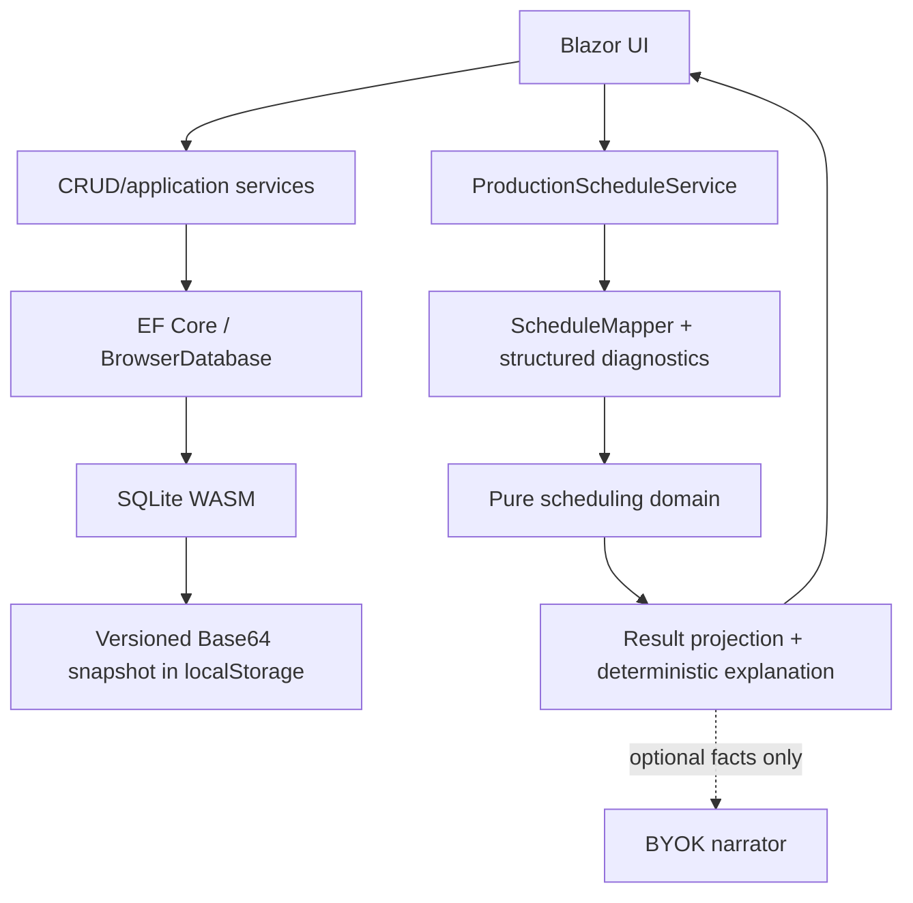

# Architecture

WorkPlan Studio is a static Blazor WebAssembly portfolio application. Its architecture is intentionally small: the browser owns UI, application services, EF Core, SQLite and persistence. There is no server-side API.

## Boundaries and invariants

- The scheduling project has no Blazor, EF Core, JavaScript or network dependency. An architecture test enforces this boundary.
- EF entities are persistence models. Mutating services normalize and validate them again; SQLite constraints and unique indexes are the final defense.
- `ScheduleMapper.ToSeconds` is the only decimal-minute to integer-second conversion. It uses checked arithmetic and midpoint-to-even rounding.
- A released routing is mapped completely or rejected completely. `SchedulePreparationIssue` carries plan, optional operation and stable reason code; UI text is localized without parsing exceptions.
- Work-center parallel capacity is validated as 1–64 and passed to the finite-capacity engine.
- Scheduling budgets are deterministic count limits, not wall-clock cutoffs. Cancellation is cooperative and does not alter a completed result.

## Browser persistence lifecycle

1. Read the versioned payload from `localStorage`.
2. Reject invalid Base64, short/truncated data, wrong SQLite header or unsupported schema without overwriting storage.
3. Write compatible bytes to the WASM file-system path, run `PRAGMA quick_check`, then verify the expected schema through EF.
4. Before every snapshot, run `PRAGMA wal_checkpoint(TRUNCATE)` so committed WAL pages are merged into the main database file.
5. Save the main file as Base64. A storage/quota exception becomes a typed persistence failure, never a successful durable save.

This is explicit local demo storage, not a migration system. Schema mismatch presents export and confirmed reset actions. See [ADR 0006](adr/0006-explicit-browser-storage-recovery.md).

## Scheduling model

The current application treats each released `WorkPlan` as one schedulable demonstration job with its plan lot size as weight. The domain engine can model an explicit due second, but the application does not claim customer-order due-date support and hides that option. A real system would introduce `ProductionOrder`; see [ADR 0007](adr/0007-defer-production-order.md).

The scheduler is a deterministic heuristic:

1. assign target dates;
2. produce a dispatch-rule priority order;
3. evaluate seeded multi-start permutations;
4. improve the best order with bounded adjacent-swap local search;
5. re-dispatch every candidate so precedence and capacity remain feasible by construction.

It does not prove global optimality. For larger or constraint-rich instances, CP-SAT/MILP or a background service is a roadmap choice, not a hidden capability.

## Failure handling

Validation, conflict, not-found and persistence outcomes use small typed application results. Expected failures remain local to the page. Unexpected render failures are handled by a localized top-level `ErrorBoundary`; technical details go to `ILogger`, not to the user. Busy flags are released in `finally` blocks.

## Deliberately absent patterns

There is no repository wrapper over EF, MediatR, CQRS, AutoMapper or event bus. The application is small enough that these would add indirection without solving a measured problem. `IProductionScheduleService` exists because it provides a valuable component-test seam; the pure engine stays directly constructible.
