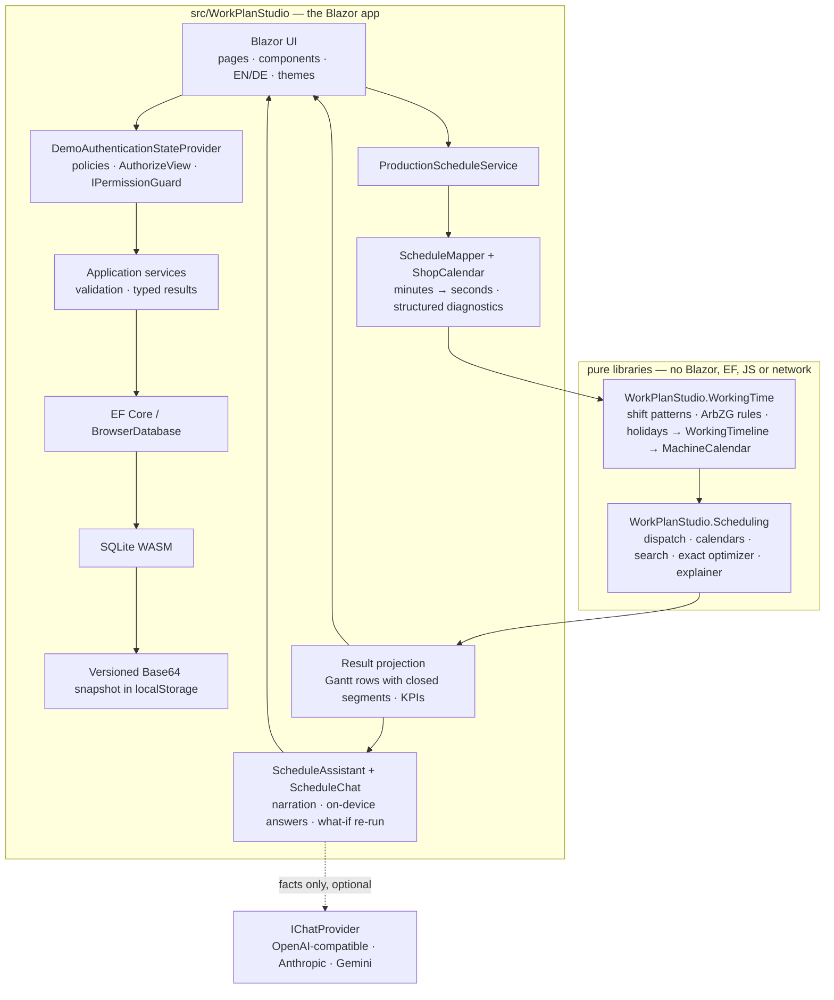

# Architecture

WorkPlan Studio is a static Blazor WebAssembly application. Its architecture is deliberately small: the browser owns the UI, the application services, EF Core, SQLite, persistence, authorization and the assistant. There is no server-side API. Two pure libraries carry the logic; the app is the shell around them.

## Boundaries and invariants

- The two library projects have no Blazor, EF Core, JavaScript or network dependency. An architecture test in each test project enforces the boundary.
- EF entities are persistence models. Mutating services normalise and validate them again; SQLite constraints and unique indexes are the final defence.
- `ScheduleMapper.ToSeconds` is the only decimal-minute to integer-second conversion. It uses checked arithmetic and midpoint-to-even rounding.
- A released order is mapped completely or rejected completely. `SchedulePreparationIssue` carries order, optional operation and a stable reason code; UI text is localized without parsing exceptions. An operation longer than any open window of its work center is one such reason — refused with an explanation, never scheduled "never".
- Work-center parallel capacity is validated as 1–64 and passed to the finite-capacity engine.
- **Working time is capacity.** The plant's settings and each work center's shift pattern and absences become a `MachineCalendar`: weekly windows with a phase (the horizon rarely starts on Monday 00:00), tagged blackouts (holidays, absences, Sunday rest — never bridged) and a bridgeable gap (a break an operation may pause across). The engine knows windows, blackouts and gaps; it does not know what a Sunday is. See [ADR 0012](adr/0012-working-time-as-capacity.md).
- Sequence-dependent change-over is keyed by operation family; the transition matrix is flattened into a lookup once per context because it is queried on every slot of every step of every candidate order.
- Scheduling budgets are deterministic count limits, not wall-clock cutoffs. Cancellation is cooperative and does not alter a completed result.
- **Every mutating service method asks the authorization policy first** through `IPermissionGuard` and returns `Forbidden` otherwise; the `AuthorizeView` in the page is a courtesy, the guard is the check. See [ADR 0013](adr/0013-personas-through-the-real-authorization-pipeline.md).
- **The assistant never invents numbers.** The explainer and the on-device answerer compute from the same view-model the page renders; a model, when configured, is shown those facts and the on-device answer and asked to rephrase. Any provider failure falls back to the on-device text with a note. See [ADR 0005](adr/0005-explainable-scheduling-and-optional-ai.md) and [ADR 0014](adr/0014-schedule-chat-on-device-first-with-pluggable-models.md).

## Browser persistence lifecycle

1. Read the versioned payload from `localStorage`.
2. Reject invalid Base64, short/truncated data, wrong SQLite header or unsupported schema without overwriting storage.
3. Write compatible bytes to the WASM file-system path, run `PRAGMA quick_check`, then verify the expected schema through EF.
4. Before every snapshot, run `PRAGMA wal_checkpoint(TRUNCATE)` so committed WAL pages are merged into the main database file.
5. Save the main file as Base64. A storage/quota exception becomes a typed persistence failure, never a successful durable save.

This is explicit local demo storage, not a migration system. Schema mismatch presents export and confirmed reset actions. See [ADR 0006](adr/0006-explicit-browser-storage-recovery.md).

## Scheduling model

The scheduler consumes **production orders**, not work plans. A work plan is master data and may be edited at any time; an order captures the routing as an immutable snapshot when it is released, so a later edit cannot change work already on the shop floor. That also gives the engine a real customer due date, which is what makes `DueDateRule.Explicit` usable — it is the default. See [ADR 0011](adr/0011-production-orders-own-routing-snapshots.md), which supersedes [ADR 0007](adr/0007-defer-production-order.md).

The scheduler is a deterministic heuristic:

1. assign target dates;
2. produce a dispatch-rule priority order;
3. run a bounded **insertion-neighbourhood** descent from the rule order and from each seeded multi-start permutation;
4. re-dispatch every candidate so precedence, capacity and calendars remain feasible by construction.

The neighbourhood is the part that matters. Adjacent swaps — the previous implementation — move a job one position per improving step and stall almost immediately on a tardiness objective; insertion moves it anywhere in one step. Measured against brute-force enumeration of all `n!` orders over 20 random 8-job instances, the mean gap to the optimum went from 27.3 % to 0.2 %, and 19 of 20 instances are now solved to optimality. `OptimalityTests` asserts this, so it is a tested property rather than a claim. See [ADR 0008](adr/0008-insertion-neighbourhood.md).

`ExactDispatchOrderOptimizer` enumerates all `n!` orders for instances up to nine jobs. It is exact *within the dispatch-order model* — the best of every order the dispatcher can be handed — and deliberately not described as a general job-shop optimality proof, since the dispatcher never back-fills idle gaps.

The heuristic still does not *prove* global optimality — it is a descent, so it finds a local optimum that happens to be global on instances of this size. For larger or constraint-rich instances, CP-SAT/MILP or a background service is a roadmap choice, not a hidden capability. The cost of the descent is allocation, not time: each candidate re-dispatch allocates a fresh schedule, about 0.5 MB on the medium problem, which [PERFORMANCE.md](PERFORMANCE.md) measures and names as the first optimisation if the browser ever feels it.

The dispatch rule and the target rule are not independent: under TWK targets EDD is literally the same sort as SPT, and critical ratio is constant so it collapses to FIFO. Six rules produce four schedules on the default targets. The page reports the collapse rather than returning a silently identical schedule; see [ADR 0009](adr/0009-report-rule-equivalences.md).

## Working-time model

`WorkingTimelineBuilder` turns a `ShiftPattern` (shift definitions with start, end, weekdays and crew), a `WorkingTimeRules` record (every parameter with its statutory default and legal reference) and the plant's absences into a `WorkingTimeline`: the week's open windows, the gaps between them, dated exceptions (holidays, absences), and a list of `RuleApplication`s that say which rule changed which shift on which day and by how much. The build order is the law's order — instances, Sunday and holiday closure with the §9 (2) boundary shift, the §3/§6 daily cap, §5 rest per crew across the week wrap, §4 breaks on a five-minute grid — so the explanation the page shows is the trace of the computation, not a separate text.

`ToMachineCalendar` projects the timeline onto the engine's vocabulary. Holidays are computed, not tabled, from the Easter date for all sixteen states; the tests pin the 2026 calendar and the partial-holiday variants.

## Authorization model

`DemoAuthenticationStateProvider` is an `AuthenticationStateProvider` whose principal carries a role claim for the persona chosen in the top bar (Planner, Supervisor, Guest), remembered per browser. `Permissions` is one table from policy to roles, registered with `AddAuthorizationCore`. Pages use `AuthorizeView Policy="…"`; services use `IPermissionGuard`, which wraps `IAuthorizationService`. Swapping the identity source for OIDC is one class. This is authorization plumbing, not access control — the code runs in the visitor's browser; [SECURITY.md](SECURITY.md) says so.

## Assistant model

Three layers, each testable without the next: `ScheduleExplainer` (engine, structured, language-neutral) → `IScheduleNarrator` / `OfflineScheduleAnswerer` (app, localized text computed on the device) → `IChatProvider` (optional, three wire formats behind one seam). `ScheduleChat` holds the conversation for the current run and resets it on every new run. Details in [AI-ASSISTANT.md](AI-ASSISTANT.md).

## Failure handling

Validation, conflict, not-found, forbidden and persistence outcomes use small typed application results. Expected failures remain local to the page. Unexpected render failures are handled by a localized top-level `ErrorBoundary`; technical details go to `ILogger`, not to the user. Busy flags are released in `finally` blocks.

## Deliberately absent patterns

There is no repository wrapper over EF, MediatR, CQRS, AutoMapper or event bus. The application is small enough that these would add indirection without solving a measured problem. `IProductionScheduleService` exists because it provides a valuable component-test seam; the pure engine stays directly constructible.
