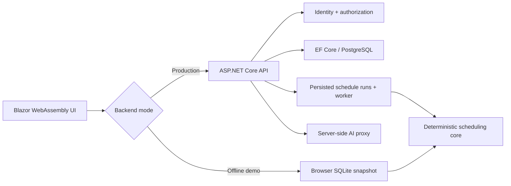

# Architecture

WorkPlan Studio is a hosted Blazor WebAssembly application with a production API and a deliberately isolated offline demo path.

## Projects and boundaries

- `WorkPlanStudio.Domain`: shared entities, invariants and validators; no UI or database provider dependency.
- `WorkPlanStudio.Contracts`: API request/response records shared by client and server.
- `WorkPlanStudio.Scheduling`: deterministic, cancellable scheduling core; no Blazor, EF, network or wall-clock dependency.
- `WorkPlanStudio.Persistence`: production DbContext and SQLite migration set.
- `WorkPlanStudio.PostgresMigrations`: provider-correct PostgreSQL migrations kept separate from SQLite migrations.
- `WorkPlanStudio.Api`: identity, authorization, endpoints, audit, health, telemetry and background scheduling.
- `WorkPlanStudio`: UI plus the explicit offline demo adapter.

## Production flow

All tenant data carries an `OwnerId`; endpoints apply owner filters before reads or mutation. Released work plans are copied into immutable production-order routing snapshots. A schedule request persists its parameters before queueing. The worker reloads only owner-scoped released orders and their snapshots, builds timezone/DST-aware capacity windows, subtracts downtime, applies sequence-dependent setup matrices and stores the result. Queued/running jobs are recovered after a process restart.

Each worker remains single-consumer, but PostgreSQL is now also the durable coordination boundary. Replicas atomically claim a run with a two-minute lease, renew it every ten seconds, persist cross-replica cancellation and reclaim only expired work. The local channel is a low-latency hint; database polling guarantees eventual pickup. See [ADR 0008](adr/0008-durable-schedule-run-leases.md).

## Offline demo

Auto mode probes readiness and falls back to local browser storage only when the production service is unavailable. Forced Server mode never silently falls back. Offline data is versioned, validated and recoverable, but has no server identity or multi-user guarantees.

## Scheduling limits

The default scheduler is a deterministic heuristic. It enforces precedence, finite parallel capacity, availability windows and setup transitions. `ExactDispatchOrderOptimizer` exhaustively evaluates every job order for up to nine jobs and returns an explicit proof that the result is optimal within this dispatch-order model. That bounded proof is not unrestricted job-shop global optimality or a lower bound for larger instances; use a CP-SAT/MILP model when the business SLA requires those guarantees.
