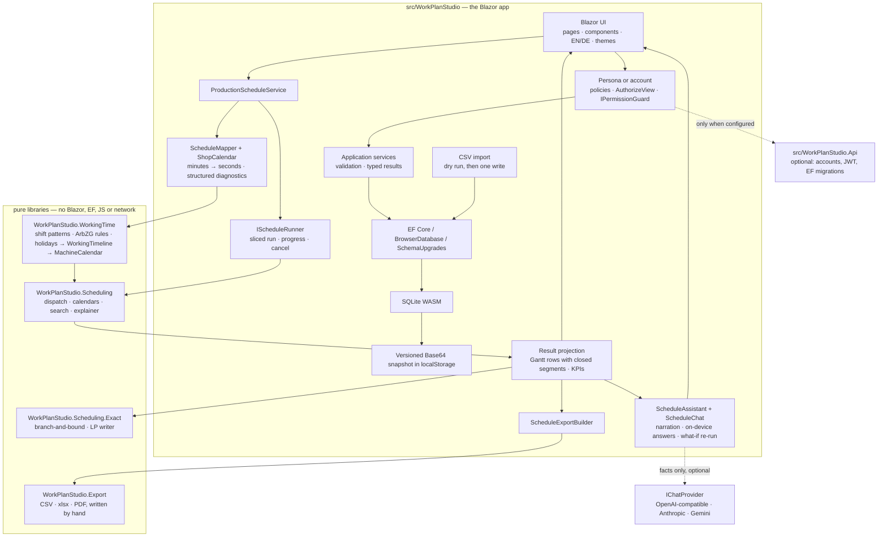

# Architecture

**English** · [Deutsch](ARCHITECTURE.de.md)

WorkPlan Studio is a static Blazor WebAssembly application. The browser owns the UI, the application
services, EF Core, SQLite, persistence, authorization, the scheduling run and the assistant. Four
libraries carry the logic that is worth isolating; the app is the shell around them. A fifth project
is an **optional** ASP.NET Core backend that the browser build ignores unless it is configured, and a
sixth holds the wire contracts both sides compile.

## The projects

| Project | What it is | Depends on |
| --- | --- | --- |
| `src/WorkPlanStudio` | the Blazor WebAssembly app | everything below except the API |
| `src/WorkPlanStudio.Scheduling` | the finite-capacity engine, the explainer and the exact solver | base class library only |
| `src/WorkPlanStudio.WorkingTime` | shift patterns, the ArbZG rules, German public holidays, machine calendars | base class library only |
| `src/WorkPlanStudio.Export` | CSV, xlsx and PDF writers | base class library only |
| `src/WorkPlanStudio.Contracts` | the DTOs and policy names the app and the API share | base class library only |
| `src/WorkPlanStudio.Domain` | the entities, the validation rules, the policy table and the EF→engine mapping | the authorization abstractions, nothing else |
| `src/WorkPlanStudio.Api` | the optional backend: Identity, JWT, EF migrations, minimal API | ASP.NET Core 10 |

`ArchitectureTests` in the scheduling and working-time test projects reflect over those assemblies
and fail the build if `Microsoft.AspNetCore`, `Microsoft.EntityFrameworkCore`, `Microsoft.JSInterop`
or `SQLitePCLRaw` ever appears in their reference graph. The export library carries no package
reference at all, which is the same property enforced by its `.csproj` rather than by a test.

The app and the API both **reference `WorkPlanStudio.Domain`**, so the entity shapes, the validators
and the policy table are one copy rather than two that drift. That shared assembly is also the
constraint it imposes: nothing in it may take a dependency on Blazor, EF Core or JS interop, and
persistence is deliberately left out of it — the browser's `DbContext` and the server's
`IdentityDbContext` disagree on purpose, and a shared context would be a shared lie.

The API used to compile those files out of the app with `<Compile Include>`. It worked, and it
was the one place in the repository where "which project does this type belong to" had a different
answer from everywhere else — and it hid a real defect: the one validator that could not be linked
had been copied into the API by hand, and the copy had three rules fewer than the original.

## Boundaries and invariants

- **Working time is capacity.** The plant's settings and each work center's shift pattern and
  absences become a `MachineCalendar`: weekly windows with a phase (the horizon rarely starts on
  Monday 00:00), tagged blackouts (holidays, absences, Sunday rest — never bridged) and a bridgeable
  gap (a break an operation may pause across). The engine knows windows, blackouts and gaps; it does
  not know what a Sunday is. See [ADR 0012](adr/0012-working-time-as-capacity.md).
- **One time model.** `WorkPlanStudio.WorkingTime.PlantTime` states it: plant-local wall clock as a
  `DateTime` with `Kind.Unspecified`. `ProductionOrder.ReleaseLocal` and `DueLocal` are readings on
  that clock, not instants. A source-level test asserts that nothing in the app calls `ToLocalTime`
  or `ToUniversalTime`; the genuine UTC stamps (`CreatedUtc`, `ModifiedUtc`) are audit data and are
  never mixed into planning arithmetic.
- **`ScheduleMapper.ToSeconds` is the only decimal-minute to integer-second conversion.** Checked
  arithmetic, midpoint-to-even rounding, and a source scan that keeps it the only one.
- **A released order is mapped completely or rejected completely.** `SchedulePreparationIssue`
  carries order, optional operation and a stable reason code; the UI localises the code rather than
  parsing an exception. An operation longer than any open window of its work center, an operation
  longer than the engine's own duration bound, and a work center the working-time rules have closed
  outright are three separate reasons, each with its own sentence.
- **Every mutating service method asks the authorization policy first** through `IPermissionGuard`
  and returns `Forbidden` otherwise. This is not a list someone remembers to extend:
  `ServiceAuthorizationArchitectureTests` discovers the set by reflection — a method that can change
  something returns `ApplicationResult<T>`, a read does not — and asserts that every one of the
  **14** it currently finds refuses a guest. `BrowserDatabase.ResetAsync` and `ImportAsync` ask the
  same guard, because replacing every row is a mutation whatever the call site looks like. Export
  deliberately does not: the visitor already has the data on screen.
  See [ADR 0013](adr/0013-personas-through-the-real-authorization-pipeline.md).
- **One commit path.** `DatabaseMutation.RunAsync` captures the pre-image, runs the change, writes
  the snapshot, and restores the pre-image if either half fails. A constraint violation becomes a
  typed `Conflict` rather than a `DbUpdateException` reaching the error boundary. The CSV import
  goes through it **once** for a whole file rather than once per row.
- **Referential integrity is in the database, not only in a service.** `WorkCenter.CostCenterId` and
  the `OrderRoutingCenter` join table are foreign keys with `DeleteBehavior.Restrict`. The service
  pre-check exists to produce a friendly sentence; the foreign key is what makes the rule true.
- **Scheduling budgets are deterministic count limits, not wall-clock cutoffs.** `MultiStartRuns`,
  `LocalSearchMaxSteps` and their **product** are bounded, so a form cannot ask for 1.28 million
  candidate schedules. Cancellation is cooperative and never alters a completed result.
- **The assistant's numbers come from the view model, and they are attached to the subject the
  question named.** The explainer and the on-device answerer compute from the same projection the
  page renders; a reference the answerer recognises but cannot resolve ends the search with "I
  cannot find PO-9999" rather than falling through to a different intent with a plausible number.
  When a model is configured it is shown those facts, fenced as data, and asked to rephrase. See
  [ADR 0005](adr/0005-explainable-scheduling-and-optional-ai.md),
  [ADR 0014](adr/0014-schedule-chat-on-device-first-with-pluggable-models.md) and
  [ADR 0025](adr/0025-hostile-input-on-the-model-path.md).

## Browser persistence lifecycle

1. Read the versioned payload from `localStorage` — one JSON value under one key.
2. Reject invalid Base64, short or truncated data, a wrong SQLite header or an unsupported schema
   **without overwriting storage**.
3. Upgrade a payload one or two versions behind through `SchemaUpgrades`; refuse one from a newer
   deployment, untouched and still exportable.
4. Write compatible bytes to the WASM file-system path, run `PRAGMA quick_check`, then verify every
   `DbSet` through EF.
5. Before every snapshot, run `PRAGMA wal_checkpoint(TRUNCATE)` — but only when `journal_mode`
   really is WAL, and treat a busy checkpoint as a failed snapshot rather than discarding it.
6. Save the main file as Base64 under one key, read it back, and only then report success. A quota
   exception becomes a typed persistence failure, never a successful durable save.

The current schema version is **7**, and a stored database at **5 or 6** is upgraded in place. The
step reads the old database through its own frozen description of the old shape — not through the
current model, which would stop matching the first time someone adds a property — lets EF build the
current schema, and writes the rows back **with their original primary keys**, because a released
order has frozen work-center ids into its routing snapshot. A schema mismatch it cannot upgrade
still presents export and a confirmed two-step reset. See
[ADR 0006](adr/0006-explicit-browser-storage-recovery.md) and
[ADR 0016](adr/0016-cost-centre-master-data.md).

## Master data

A **cost centre** is an entity with a code, a name, a description and an active flag, referenced by
work centers through a nullable foreign key. Nullable deliberately: the string column it replaced
allowed `""`, and inventing master data nobody owns during an upgrade is worse than recording "not
assigned", which is a state Controlling recognises. Business keys — work-center code, plan number,
part number, revision, order number — carry `NOCASE` collation and are stored upper-cased, so
`PO-1001` and `po-1001` cannot coexist. Money is stored on `TEXT` columns with `CAST(... AS REAL)`
inside every range check, because a `decimal(10,2)` column has NUMERIC affinity in SQLite and would
silently store a price as an IEEE-754 double.

**CSV import** (`Services/Import/**`) reads what a spreadsheet actually writes — UTF-8, UTF-16 and
Windows-1252, comma, semicolon or tab detected by column-count consistency, mixed line endings — and
runs the same code path twice: `PlanAsync` resolves and validates everything and writes nothing;
`CommitAsync` replays that plan and refuses if the database moved underneath it. Rejected rows carry
line, column and reason and can be downloaded. See [ADR 0018](adr/0018-csv-import.md).

## Scheduling model

The scheduler consumes **production orders**, not work plans. A work plan is master data and may be
edited at any time; an order captures the routing as an immutable snapshot when it is released, so a
later edit cannot change work already on the shop floor. That also gives the engine a real customer
due date, which is what makes `DueDateRule.Explicit` usable — it is the default. See
[ADR 0011](adr/0011-production-orders-own-routing-snapshots.md), which supersedes
[ADR 0007](adr/0007-defer-production-order.md).

The scheduler is a deterministic heuristic:

1. assign target dates;
2. produce a dispatch-rule priority order;
3. run a bounded **insertion-neighbourhood** descent from the rule order and from each seeded
   multi-start permutation;
4. re-dispatch every candidate so precedence, capacity and calendars remain feasible by construction.

The neighbourhood is the part that matters. Adjacent swaps — the previous implementation — move a
job one position per improving step and stall almost immediately on a tardiness objective; insertion
moves it anywhere in one step. Against enumeration of all `n!` dispatch orders that took the mean gap
from 27.3 % to 0.2 % ([ADR 0008](adr/0008-insertion-neighbourhood.md)). Which improving neighbour the
descent adopts was measured separately and changed the default
([ADR 0022](adr/0022-local-search-acceptance.md)).

**That reference is not the optimum, and saying so is the point.** The dispatcher schedules one
whole job at a time and never back-fills, so the best order it can be handed is not the best
schedule. `WorkPlanStudio.Scheduling.Exact` proves the real optimum with a disjunctive
branch-and-bound that shares no code with the dispatcher, and on the fixed twenty-instance set of
[ADR 0015](adr/0015-exact-solver.md) the two references are far apart:

| Measured against | Exact on | Mean gap | Median gap |
| --- | ---: | ---: | ---: |
| the best dispatch order (the search's own ceiling) | 18 of 20 | 0.27 % | 0.00 % |
| the true optimum (proved by branch-and-bound) | 7 of 20 | 327 % | 5.34 % |

`OptimalityStudyTests` computes both and pins both to six decimal places, and
`tools/WorkPlanStudio.Scheduling.Scenarios -- exact` reproduces the table. The mean of 327 % is
carried by one instance where the optimum has no late job and the best dispatch order has two, so a
flat per-late-job term turns into a 61× ratio; the median beside it is the number to read. The
conclusion is the interesting one: **the search is close to its ceiling, and the ceiling is the
model.** Gap back-filling, not a better metaheuristic, is what would move it.

The application can ask for the proof. `IOptimalityProver` runs the branch-and-bound on the plan
currently on screen under a wall-clock budget, and the page reports only what was proved — "optimal",
or the gap to a better schedule, or the proved lower bound when the budget ran out. It is a separate,
user-initiated act and is not on the path a normal run takes.

`ExhaustiveDispatchOrderSearch` — the older class — enumerates all `n!` orders for instances up to nine
jobs. It is exact *within the dispatch-order model* and is kept as a second opinion on the search,
not as an optimality oracle: on a two-job, three-work-center instance its answer is 60 seconds where
the optimum is 40.

The dispatch rule and the target rule are not independent: under TWK targets EDD is literally the
same sort as SPT, and critical ratio is constant so it collapses to FIFO. The page reports the
collapse rather than returning a silently identical schedule; see
[ADR 0009](adr/0009-report-rule-equivalences.md). Staggered release dates break most of the
identities, so on the current sample data no collapse occurs — which is why it is computed from the
orders rather than from a table.

## Running the search without freezing the tab

WebAssembly in this app has exactly one thread, and not by choice:
`SQLitePCLRaw.lib.e_sqlite3` ships a `browser-wasm` binary built without `atomics`, so
`WasmEnableThreads=true` fails at the linker — threads or a database, not both. GitHub Pages also
cannot send the `Cross-Origin-Opener-Policy` and `Cross-Origin-Embedder-Policy` headers a threaded
runtime requires.

So the run is **sliced on the one thread there is**. `SchedulingEngine.Begin(context)` exposes the
multi-start restart boundary; `CooperativeScheduleRunner` reports progress and hands the thread back
between descents. The yield is a `MessageChannel` task rather than `setTimeout`, because a background
tab throttles timers to roughly one wake-up a second and the same run stalled at 25 % for ten seconds
before that changed. There is still exactly one multi-start loop in the codebase, and a test asserts
the sliced and straight-through runs produce the identical schedule. See
[ADR 0019](adr/0019-off-thread-scheduling.md).

## Export

`WorkPlanStudio.Export` writes CSV, an xlsx workbook and a PDF report by hand, with **no package
reference** — the alternative was 5–20 MB of native or managed dependency downloaded by every
visitor. The PDF writer emits its own object table, page tree, WinAnsi-encoded text and a vector
Gantt; the workbook is the OOXML parts zipped in order. Both languages get their own date rule, their
own sheet labels and their own axis units, and a test asserts the export writes a date exactly as the
screen does. The PDF declares `/MarkInfo << /Marked false >>` rather than claiming an accessibility
it does not deliver. See [ADR 0017](adr/0017-in-browser-export.md).

## Working-time model

`WorkingTimelineBuilder` turns a `ShiftPattern`, a `WorkingTimeRules` record (every parameter with
its statutory default and legal reference) and the plant's absences into a `WorkingTimeline`: the
week's open windows, the gaps between them, dated exceptions, and a list of `RuleApplication`s
saying which rule changed which shift on which day and by how much. The build order is the law's
order, so the explanation the page shows is the trace of the computation rather than a separate text.

Two things are worth naming because they were wrong before. `WeekCapacity` is a closed sum type —
`Unconstrained`, `Staffed`, `Closed` — so an emptied pattern can no longer be read as a 24/7 machine;
and the §3 and §6 (2) **averaging periods are computed**, not just honoured as caps, with the crew,
the werktäglich average, the first breach date and the compensation days owed. `Evaluate(TimeZoneInfo)`
measures those in real elapsed hours, so a night shift across the autumn clock change is nine hours
and is reported as a §6 (2) breach it appears on the clock to keep. See
[ADR 0012](adr/0012-working-time-as-capacity.md) and [ADR 0024](adr/0024-arbzg-in-the-ui.md).

`GermanHolidays` computes movable feasts from Easter and tables the *law* rather than the dates:
every state entry carries the years it was in force, so Reformationstag is nationwide in 2017 only,
Buß- und Bettag is nationwide through 1994 and Saxon after, and Berlin's Tag der Befreiung exists in
2020 and 2025. The supported range is 1990–2200 and a year outside it throws rather than quietly
returning the wrong list.

## Authorization model

Offline, `DemoAuthenticationStateProvider` is an `AuthenticationStateProvider` whose principal
carries a role claim for the persona chosen in the top bar (Planner, Supervisor, Guest), remembered
per browser. `Permissions` is one table from policy to roles, registered with `AddAuthorizationCore`.
Pages use `AuthorizeView Policy="…"`; services use `IPermissionGuard`, which wraps
`IAuthorizationService`.

Connected, the same table is registered in the API **from the same assembly**, the principal comes
from a JWT the server issued against an Identity account, and the persona switcher disappears from the UI.
That is the seam ADR 0013 said existed, demonstrated rather than asserted. The static demo is still
the persona build and still protects nothing; [SECURITY.md](SECURITY.md) says so plainly.

## The optional backend

`src/WorkPlanStudio.Api` is off unless `wwwroot/appsettings.json` names an `Api:BaseAddress`, which
the GitHub Pages build does not. When it is configured, `AddOptionalApi` replaces the persona
provider with a real sign-in and the local scheduler with a server call; with it absent, the
registration adds one value object and nothing else changes.

The server has real EF Core migrations (never `EnsureCreated`), ASP.NET Core Identity for the user
store and password hashing, JWT access tokens with rotating refresh tokens stored only as SHA-256,
ProblemDetails on every failure, rate limiting on the auth routes, a configured CORS origin list, and
a start-up that refuses a missing, short or sample signing key outside Development. Master data is
pulled **one way** — the browser never sends its local rows back, and the UI says so rather than
faking last-write-wins. `ScheduleEndpointTests.The_server_produces_the_schedule_the_browser_would_have_produced`
asserts the two hosts agree on the schedule signature. See
[ADR 0020](adr/0020-optional-backend-and-real-auth.md).

## Failure handling

Validation, conflict, not-found, forbidden, cancelled and persistence outcomes use small typed
application results. A page **declares** the fields it renders an error slot for, and
`FormErrorState` puts anything else in a summary that takes focus — so a validation issue with
nowhere to render is structurally impossible rather than fixed once per page. Unexpected render
failures are handled by a localized top-level `ErrorBoundary`; technical details go to `ILogger`, not
to the user. Busy flags are released in `finally` blocks.

## Deliberately absent patterns

There is no repository wrapper over EF, no MediatR, CQRS, AutoMapper or event bus. The application is
small enough that these would add indirection without solving a measured problem.
`IProductionScheduleService`, `IScheduleRunner`, `IScheduleYield`, `IPermissionGuard`,
`IBrowserDatabaseStorage`, `IAssistantConfig`, `IChatProvider` and `IOptimalityProver` exist because
each one is substituted by a real test or a real second implementation; the pure engine stays
directly constructible.
