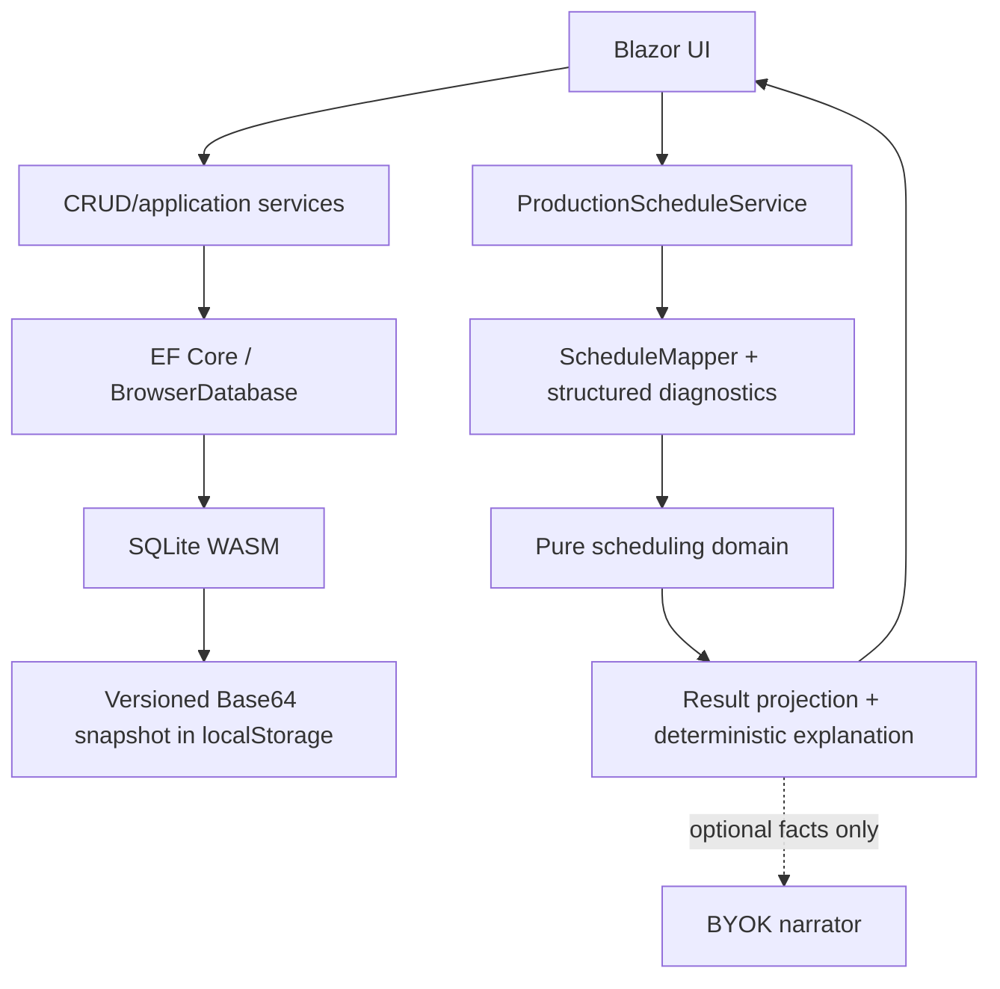

# Architecture

WorkPlan Studio is a static Blazor WebAssembly portfolio application. Its architecture is intentionally small: the browser owns UI, application services, EF Core, SQLite and persistence. There is no server-side API.

## Boundaries and invariants

- The scheduling project has no Blazor, EF Core, JavaScript or network dependency. An architecture test enforces this boundary.
- EF entities are persistence models. Mutating services normalize and validate them again; SQLite constraints and unique indexes are the final defense.
- `ScheduleMapper.ToSeconds` is the only decimal-minute to integer-second conversion. It uses checked arithmetic and midpoint-to-even rounding.
- A released order is mapped completely or rejected completely. `SchedulePreparationIssue` carries plan, optional operation and stable reason code; UI text is localized without parsing exceptions.
- Work-center parallel capacity is validated as 1–64 and passed to the finite-capacity engine.
- Availability calendars repeat over a declared period, so placement is total and the dispatcher has no failure path. Operations are not preemptable, so a step must fit inside one window - checked at context construction, never mid-search. See [ADR 0010](adr/0010-periodic-calendars-and-setup-families.md).
- Sequence-dependent change-over is keyed by operation family; the transition matrix is flattened into a lookup once per context because it is queried on every slot of every step of every candidate order.
- Scheduling budgets are deterministic count limits, not wall-clock cutoffs. Cancellation is cooperative and does not alter a completed result.

## Browser persistence lifecycle

1. Read the versioned payload from `localStorage`.
2. Reject invalid Base64, short/truncated data, wrong SQLite header or unsupported schema without overwriting storage.
3. Write compatible bytes to the WASM file-system path, run `PRAGMA quick_check`, then verify the expected schema through EF.
4. Before every snapshot, run `PRAGMA wal_checkpoint(TRUNCATE)` so committed WAL pages are merged into the main database file.
5. Save the main file as Base64. A storage/quota exception becomes a typed persistence failure, never a successful durable save.

This is explicit local demo storage, not a migration system. Schema mismatch presents export and confirmed reset actions. See [ADR 0006](adr/0006-explicit-browser-storage-recovery.md).

## Scheduling model

The scheduler consumes **production orders**, not work plans. A work plan is master data and may be edited at any time; an order captures the routing as an immutable snapshot when it is released, so a later edit cannot change work already on the shop floor. That also gives the engine a real customer due date, which is what makes `DueDateRule.Explicit` usable — it is now the default. See [ADR 0011](adr/0011-production-orders-own-routing-snapshots.md), which supersedes [ADR 0007](adr/0007-defer-production-order.md).

The scheduler is a deterministic heuristic:

1. assign target dates;
2. produce a dispatch-rule priority order;
3. run a bounded **insertion-neighbourhood** descent from the rule order and from each seeded multi-start permutation;
4. re-dispatch every candidate so precedence and capacity remain feasible by construction.

The neighbourhood is the part that matters. Adjacent swaps — the previous
implementation — move a job one position per improving step and stall almost
immediately on a tardiness objective; insertion moves it anywhere in one step.
Measured against brute-force enumeration of all `n!` orders over 20 random
8-job instances, the mean gap to the optimum went from 27.3 % to 0.2 %, and 19
of 20 instances are now solved to optimality. `OptimalityTests` asserts this, so
it is a tested property rather than a claim. See [ADR 0008](adr/0008-insertion-neighbourhood.md).

`ExactDispatchOrderOptimizer` enumerates all `n!` orders for instances up to nine
jobs. It is exact *within the dispatch-order model* — the best of every order the
dispatcher can be handed — and deliberately not described as a general job-shop
optimality proof, since the dispatcher never back-fills idle gaps.

The heuristic still does not *prove* global optimality — it is a descent, so it
finds a local optimum that happens to be global on instances of this size. For larger or
constraint-rich instances, CP-SAT/MILP or a background service is a roadmap
choice, not a hidden capability.

The dispatch rule and the target rule are not independent: under TWK targets EDD
is literally the same sort as SPT, and critical ratio is constant so it collapses
to FIFO. Six rules produce four schedules on the default targets. The page
reports the collapse rather than returning a silently identical schedule; see
[ADR 0009](adr/0009-report-rule-equivalences.md).

## Failure handling

Validation, conflict, not-found and persistence outcomes use small typed application results. Expected failures remain local to the page. Unexpected render failures are handled by a localized top-level `ErrorBoundary`; technical details go to `ILogger`, not to the user. Busy flags are released in `finally` blocks.

## Deliberately absent patterns

There is no repository wrapper over EF, MediatR, CQRS, AutoMapper or event bus. The application is small enough that these would add indirection without solving a measured problem. `IProductionScheduleService` exists because it provides a valuable component-test seam; the pure engine stays directly constructible.
