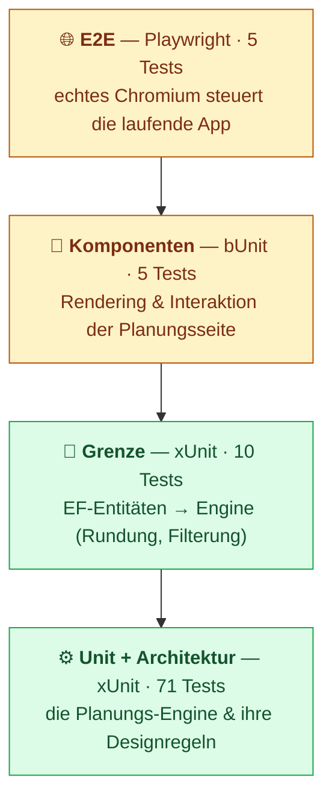

# Teststrategie

[English](TESTING.md) · **Deutsch**

Die anspruchsvolle Logik dieses Projekts ist die Planungs-Engine — dort liegt
daher der Schwerpunkt der Tests. Leitidee ist eine **Testpyramide**: viele
schnelle, deterministische Tests unten gegen reinen Code und wenige langsame Tests
mit hoher Aussagekraft oben gegen die echte App im echten Browser.

Dass die Engine eine reine Bibliothek ist (kein Blazor, kein EF, kein WebAssembly),
macht das erst möglich — der Großteil der Suite läuft in **wenigen Sekunden**, ohne
Browser und ohne die `wasm-tools`-Workload.



## Die Schichten

| Schicht | Projekt | Tests | Sichert | WASM nötig? | Laufzeit |
| --- | --- | --: | --- | :---: | --- |
| Unit + Architektur | `tests/WorkPlanStudio.Scheduling.Tests` | 71 | die Engine: Determinismus, Zulässigkeit, jede Regel, Bewertung, Suche — und dass die Engine abhängigkeitsfrei bleibt | nein | ~1 s |
| Grenze (Mapping) | `tests/WorkPlanStudio.Web.Tests` | 10 | das EF→Domain-Mapping: `decimal`→Sekunden-Rundung, Freigabe-Filter, Überspringen inaktiver Arbeitsplätze, Neuindizierung der Schritte | ja¹ | ~2 s |
| Komponenten | `tests/WorkPlanStudio.Web.Tests` | 5 | die Planungsseite: KPI-/Gantt-/Tabellen-Rendering, Leerzustand, Verspätungs-Styling, der Parameter→Generieren-Fluss | ja¹ | ~2 s |
| End-to-End | `tests/WorkPlanStudio.E2E` | 5 | das Ganze durch einen Browser: eine Parameter-Änderung verändert den Plan sichtbar, Determinismus, EN/DE | Browser² | ~30 s |

¹ Diese referenzieren das Blazor-App-Assembly, daher kompiliert ihr Build die App (also `wasm-tools`). Die Tests selbst laufen auf einem normalen Host.
² Braucht einen Chromium-Download (`playwright install`) und die laufende App; kein `wasm-tools`, wenn ein vorab veröffentlichter Build ausgeliefert wird.

## Was jede Schicht tut

### ⚙️ Unit + Architektur — die Engine

Der Kern: Zulässigkeit (Reihenfolge, Kapazität, Freigabezeiten), je ein fokussierter
Test pro **Prioritätsregel** und pro **Zieltermin-Regel**, die KPIs des Evaluators
und die Such-Garantien („nie schlechter als die Regel", „mehr Starts schaden nie",
„Lokalsuche verschlechtert nie"). Determinismus wird dreifach festgenagelt:

- ein **Golden-Value**-Test des PRNG (`DeterministicRandom`),
- *gleicher Seed → identischer Plan*,
- *identischer Plan unabhängig von der Eingabe-Reihenfolge* (schützt gegen
  versehentliches Verlassen auf Dictionary-/HashSet-Reihenfolge — eine echte
  Desktop-vs-WASM-Falle).

`ArchitectureTests` reflektieren über das Engine-Assembly und **lassen den Build
fehlschlagen**, falls jemand Blazor, EF Core, JS-Interop oder SQLite daraus
referenziert. Die Pure-Library-Grenze ist die Designentscheidung, auf der die ganze
Pyramide ruht — also wird sie per Test erzwungen, nicht der Disziplin überlassen.

### 🔌 Grenze — das Mapping

`ScheduleMapper` ist die einzige Stelle, an der `decimal`-Minuten zu ganzzahligen
Sekunden werden. Diese Tests nutzen handgebaute `WorkPlan`-/`Operation`-/`WorkCenter`-Entitäten
(keine Datenbank), um kaufmännische Rundung zu prüfen, dass Arbeitsgänge auf
inaktiven Arbeitsplätzen entfernt werden, dass Pläne ohne Schritte übersprungen
werden und dass Schrittnummern neu indiziert werden, sodass fehlerhafte Daten den
Vertrag der Engine nicht brechen können.

### 🧩 Komponenten — die Seite

[bUnit](https://bunit.dev) rendert `Schedule.razor` im Speicher gegen einen
**gefälschten** `IProductionScheduleService`, also ohne Datenbank und ohne
Engine-Lauf. Es prüft, dass ein Ergebnis in die richtigen KPI-Karten, Gantt-Zeilen
und Tabellenzeilen verwandelt wird; dass der Leerzustand ohne Daten erscheint; dass
verspätete Aufträge rote Pillen und Balken erhalten; und dass ein Klick auf
**Generieren** den Service mit den im Formular gewählten Parametern aufruft. Genau
deshalb hängt die Seite an der `IProductionScheduleService`-*Schnittstelle* — damit
ein Test eine Fälschung einsetzen kann.

### 🌐 End-to-End — die echte Sache

[Playwright](https://playwright.dev/dotnet/) steuert Chromium gegen die laufende App
über ein kleines Page-Object (`SchedulePage`). Die Kernprüfung ist die vom Auftrag
geforderte: **die Zieltermine anziehen, und der Plan wird sichtbar verspätet** — rot
umrandete Balken und rote Status-Pillen (`schedule-ontime.png` → `schedule-late.png`,
vom Lauf selbst erzeugt). Außerdem wird geprüft, dass eine andere Prioritätsregel
einen zulässigen Plan behält und ihn sichtbar verändert, dass derselbe Seed denselben
Makespan reproduziert und dass die Oberfläche auf Deutsch umschaltet.

## Tests ausführen

```bash
# Alles außer E2E (schnell, ohne Browser):
dotnet test tests/WorkPlanStudio.Scheduling.Tests/WorkPlanStudio.Scheduling.Tests.csproj
dotnet test tests/WorkPlanStudio.Web.Tests/WorkPlanStudio.Web.Tests.csproj

# E2E — App starten, Browser einmalig installieren, dann ausführen:
dotnet run --project src/WorkPlanStudio/WorkPlanStudio.csproj &           # liefert http://localhost:5235
pwsh tests/WorkPlanStudio.E2E/bin/Debug/net10.0/playwright.ps1 install chromium
dotnet test tests/WorkPlanStudio.E2E/WorkPlanStudio.E2E.csproj
```

Nützliche Umgebungsvariablen für E2E: `E2E_BASE_URL` (Standard `http://localhost:5235`),
`HEADED=1` um den Browser zu sehen, `E2E_ARTIFACTS=<Verzeichnis>` um Screenshots zu sammeln.

## Abdeckung

Der Engine-Job misst die Code-Abdeckung mit dem Collector der Microsoft Testing Platform; die Planungsbibliothek liegt bei etwa **98 % Zeilen / 90 % Zweige**. Lokal reproduzierbar mit:

```bash
dotnet test tests/WorkPlanStudio.Scheduling.Tests/WorkPlanStudio.Scheduling.Tests.csproj \
  --coverage --coverage-output-format cobertura
```

## In der CI

| Workflow | Läuft | Wann |
| --- | --- | --- |
| [`ci.yml`](../.github/workflows/ci.yml) | Engine-Tests (ohne WASM) + Mapper-/Komponententests (mit WASM) als zwei Jobs | bei jedem Pull Request |
| [`e2e.yml`](../.github/workflows/e2e.yml) | baut, liefert die App aus, installiert Chromium, führt Playwright aus, lädt Screenshots hoch | bei jedem Pull Request |
| [`deploy.yml`](../.github/workflows/deploy.yml) | Engine-Tests sichern das GitHub-Pages-Deploy ab | Push auf `main` |
