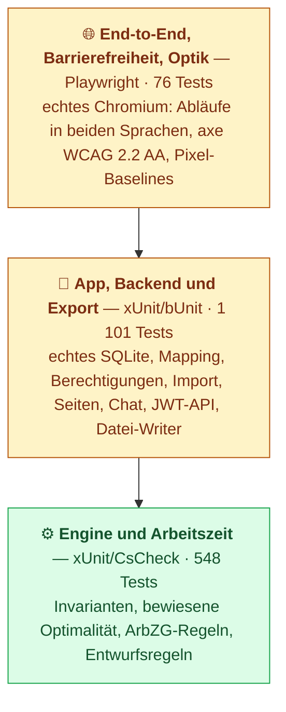

# Teststrategie

[English](TESTING.md) · **Deutsch**

Die schwierige Logik dieses Projekts liegt in Bibliotheken ohne Framework, und dort
liegen deshalb auch die meisten Tests. Der Leitgedanke ist eine **Testpyramide**:
unten viele schnelle, deterministische Tests gegen reinen Code, oben wenige
langsame Tests mit hoher Aussagekraft gegen die echte App in einem echten Browser.
Dass die Bibliotheken frei von Blazor, EF und WebAssembly sind, macht das möglich:
Der Großteil der Suite läuft in Sekunden, ohne Browser und ohne die
`wasm-tools`-Workload.


```mermaid
graph TD
    E2E["🌐 <b>End-to-End, Barrierefreiheit, Optik</b> — Playwright · 76 Tests<br/>echtes Chromium: Abläufe in beiden Sprachen, axe WCAG 2.2 AA, Pixel-Baselines"]
    APP["🧩 <b>App, Backend und Export</b> — xUnit/bUnit · 1 101 Tests<br/>echtes SQLite, Mapping, Berechtigungen, Import, Seiten, Chat, JWT-API, Datei-Writer"]
    UNIT["⚙️ <b>Engine und Arbeitszeit</b> — xUnit/CsCheck · 548 Tests<br/>Invarianten, bewiesene Optimalität, ArbZG-Regeln, Entwurfsregeln"]

    E2E --> APP --> UNIT

    classDef fast fill:#dcfce7,stroke:#16a34a,color:#14532d;
    classDef slow fill:#fef3c7,stroke:#b45309,color:#7c2d12;
    class UNIT fast;
    class APP,E2E slow;
```

## Die Schichten

Die Zahlen wurden auf diesem Stand durch Ausführen jeder Suite gemessen; siehe
*Tests ausführen* weiter unten.

| Schicht | Projekt | Tests | Sichert ab | WASM nötig? | Laufzeit |
| --- | --- | --: | --- | :---: | --- |
| Engine: Unit, Property, Optimalität, exakter Löser, Architektur, Budgets | `tests/WorkPlanStudio.Scheduling.Tests` | **294** | Determinismus, Zulässigkeit, Regeln, Kalender und Sperrzeiten, Eingabeprüfung, allokationsfreie Bewertung, die Optimalitätsstudie über zwanzig Instanzen, das LP-Modell, ein abhängigkeitsfreier Kern | nein | ~5 s |
| Arbeitszeit: Unit, Property, Architektur, Budgets | `tests/WorkPlanStudio.WorkingTime.Tests` | **254** | Feiertage aller 16 Länder über 1990–2200, Schichtmodelle, jede ArbZG-Vorschrift mit ihrem Parameter, die Ausgleichszeiträume, beide Zeitumstellungen, die Invarianten des Zeitleistenbauers | nein | ~1 s |
| Daten, Mapping, Berechtigungen, Import, Komponenten, Assistent, Fernzugriff | `tests/WorkPlanStudio.Web.Tests` | **865** | echte SQLite-Bedingungen und Schemaaufwertungen, das Alles-oder-nichts-Mapping, die Rollenrichtlinien als geschlossene Menge, das Versprechen des Imports (Vorschau = Übernahme), lokalisierte Komponentenzustände, der zerlegte Lauf, der Optimalitätsbeweis, der Chat gegen feindliche Antworten | ja¹ | ~5 s |
| Backend: HTTP-Integration gegen eine echte SQLite-Datei | `tests/WorkPlanStudio.Api.Tests` | **88** | Anmeldung, Kontosperre, Ratenbegrenzung, Rotation und Wiederverwendungserkennung der Refresh-Tokens, 401/403 je Route, Concurrency-Stempel — und dass der Server den Plan erzeugt, den auch der Browser erzeugt hätte | nein | ~3 s |
| Export-Writer: CSV, xlsx, PDF | `tests/WorkPlanStudio.Export.Tests` | **148** | die Bytes, zurückgelesen: Formel-Injektion, Maskierung, die Teile der Arbeitsmappe, die Objekttabelle des PDF, die Datumsregeln beider Sprachen | nein | <1 s |
| End-to-End, Barrierefreiheit, Bildvergleich | `tests/WorkPlanStudio.E2E` | **76** | echtes Chromium: Planänderungen, Determinismus, Sprache, Arbeitszeit im Gantt, Fertigungsaufträge von Anfang bis Ende, Speicherwiederherstellung, Rollen, Farbschema, Tastatur, Mobilgerät, der Chat in beiden Sprachen; axe WCAG 2.2 AA auf jeder Route in hell, dunkel und auf Deutsch; neun Bildschirm-Baselines | Browser² | ~75 s |

**1 649 Unit- und Integrationstests, dazu 76 Browsertests.** Zehn der Browsertests
sind die Pixelvergleiche, und sie werden außerhalb von Linux mit einer Begründung
*übersprungen*, die [ADR 0021](adr/0021-visual-baselines-linux-only.md) nennt, statt
gegen eine Baseline zu vergleichen, die niemand erzeugt hat.

¹ Diese Tests referenzieren die Blazor-App-Assembly, ihr Build übersetzt also die App (daher `wasm-tools`). Die Tests selbst laufen auf einem gewöhnlichen Wirt.
² Braucht einen heruntergeladenen Chromium (`playwright install`) und die laufende App; kein `wasm-tools`, wenn man einen bereits veröffentlichten Build ausliefert.

## Was jede Schicht tut

### ⚙️ Unit und Architektur — die Engine

Der Kern: Zulässigkeit (Reihenfolge, Kapazität, Freigabetermine, Kalenderfenster,
Sperrzeiten, unterbrochene Arbeitsgänge), je ein gezielter Test pro
**Prioritätsregel** und pro **Terminregel**, die Kennzahlen des Bewerters
(Auslastung der *offenen* Zeit) und die Zusicherungen der Suche. Determinismus ist
dreifach fixiert: ein **Golden-Value**-Test des PRNG, *gleicher Seed → identischer
Plan*, und *identischer Plan unabhängig von der Reihenfolge der Eingabesammlung*.

`InputValidationTests` ist die Hälfte, die es vorher nicht gab: doppelte Nummern,
ein Auftrag ohne Zieltermin, eine negative Freigabe, ein nicht endliches Gewicht,
ein Rüstzeiteintrag von einer Familie auf sich selbst und ein Schritt über der
Dauerschranke werden alle namentlich abgewiesen. Mehrere davon machten früher aus
Unsinn einen plausiblen Plan, und eine unbegrenzte Dauer lief in einen *negativen*
Strafwert über, den die Suche dann minimierte.

`AllocationBudgetTests` prüft, dass die Bewertung eines Kandidaten **nichts**
belegt, sodass die Zahl in [PERFORMANCE.de.md](PERFORMANCE.de.md) eine Eigenschaft
ist und keine Beobachtung.

`ArchitectureTests` spiegeln über jede Bibliotheks-Assembly und **lassen den Build
scheitern**, wenn jemand aus ihr Blazor, EF Core, JS-Interop oder SQLite
referenziert. Die Grenze der reinen Bibliotheken ist die Entwurfsentscheidung, auf
der die ganze Pyramide ruht, also wird sie von einem Test durchgesetzt und nicht der
Disziplin überlassen.

### 🎯 Optimalität — drei Umsetzungen und eine benannte Referenz

Das ist der Teil der Suite, der früher zirkulär war, und die Korrektur lohnt das
Lesen.

`OptimalityTests` maß die Engine bisher gegen `ExactDispatchOrderOptimizer`, der
jede der `n!` Auftragsreihenfolgen an **denselben Dispatcher und denselben
Bewerter** gibt, die auch die Engine benutzt. Beide Seiten der Behauptung liefen
durch denselben Belegungscode, ein Fehler in Belegung oder Bewertung hob sich also
exakt auf — und acht Dokumente zitierten „0,2 % mittlerer Abstand, 19 von 20 exakt
gelöst“ und schrieben es diesem Test zu, der keine der beiden Zahlen berechnet, auf
keinem solchen Satz.

Jetzt gibt es drei Umsetzungen, und die Tests benennen, welche welche ist:

- `DispatchScheduler` — die Belegung der Engine selbst;
- `ExactDispatchOrderOptimizer` — die Permutationsaufzählung, als Zweitmeinung zur
  **Suche** behalten;
- `ExactJobShopSolver` — ein disjunktives Branch-and-Bound, das mit keinem von
  beiden Code teilt und die Instanz für das **Optimum** ist.

`OptimalityStudyTests` lässt einen festen, eingecheckten Satz von zwanzig Instanzen
durch alle drei laufen und fixiert jede Zahl auf sechs Nachkommastellen: 18 von 20
exakt gegen die beste Auftragsreihenfolge (mittlerer Abstand 0,27 %), 7 von 20 exakt
gegen das wahre Optimum (Median 5,34 %). Er prüft außerdem, dass alle zwanzig als
optimal bewiesenen Pläne dieselbe unabhängige Zulässigkeitsprüfung bestehen wie die
Pläne des Dispatchers — ohne das ließe ein Löser, der eine Restriktion verletzt, die
Heuristik furchtbar aussehen — und dass der Instanzsatz den Funktionsumfang
weiterhin abdeckt, statt in zwanzig Kopien einer Ausprägung zusammenzufallen, was
das Audit den alten Generatoren nachgewiesen hat.

`ExactMilpWriterTests` prüft das ausgegebene LP-Modell auf zwei Wegen ohne Löser:
Das bewiesene Optimum muss jede Zeile bei genau dem gemeldeten Zielfunktionswert
erfüllen (das fängt ein zu enges Modell), und das Optimum des Modells selbst —
berechnet durch Aufzählen jeder Binärbelegung und Lösen des jeweils verbleibenden
Differenzrestriktionssystems — muss dem des Branch-and-Bound entsprechen (das fängt
ein zu weites). Siehe [ADR 0015](adr/0015-exact-solver.md).

### 🎲 Eigenschaftsbasiert — Invarianten

Beispieltests prüfen die Fälle, an die man gedacht hat; **Property-Tests prüfen die,
an die man nicht gedacht hat.** Mit [CsCheck](https://github.com/AnthonyLloyd/CsCheck)
erzeugt jeder Test hunderte zufällige, aber gültige Probleme und behauptet eine
*Invariante*, die für jeden Plan gelten muss, den die Engine erzeugen kann:
Reihenfolge, Kapazität, keine Arbeit in einer Sperrzeit, eine Unterbrechung nie
länger als die überbrückbare Lücke, Determinismus, eine Durchlaufzeit nie unter dem
längsten Einzelauftrag, und nie schlechter als die reine Regelreihenfolge. Bei einem
Fehlschlag *schrumpft* CsCheck auf ein minimales Gegenbeispiel und gibt einen Seed
(`CsCheck_Seed`) aus, mit dem er sich nachstellen lässt.

Die Arbeitszeit-Bibliothek hat ihre eigenen: Eine gebaute Zeitleiste überschreitet
die Tagesgrenze **je Besatzung und Kalendertag** nie (nicht je Schichtbezeichnung —
so bestand die alte Fassung, während die Begrenzung kaputt war), lässt die
Mindestruhezeit immer **auch über den Wochenumbruch**, öffnet nie an einem Sonntag
oder Feiertag, sofern die Vorschrift es nicht erlaubt, und ein Muster ohne
verbleibende Arbeitszeit liest sich als *geschlossen* statt als unbeschränkt. Die
Eigenschaft zu § 5 fand bei ihrem ersten Lauf zwei echte Fehler.

`Feasibility.AssertFeasible` — das unabhängige Orakel, auf das sich jede Eigenschaft
stützt — prüft zusätzlich, dass die einem Arbeitsgang berechnete Rüstzeit dem
entspricht, was der Kontext für diesen Übergang angibt, und dass jeder Parallelplatz
für sich seriell ist. Ohne das Erste bestand ein Dispatcher, der jedem Arbeitsgang
Rüstzeit berechnete, die gesamte Property-Suite.

### 🏛️ Vorschriften — deutsches Arbeitszeitrecht als Tests

Jede ArbZG-Vorschrift, die die App umsetzt, ist ein Parameter mit einem Test: die
Tagesgrenze von 8 bzw. 10 Stunden (§ 3), Ruhepausen von 30 bzw. 45 Minuten in
Abschnitten von mindestens 15 (§ 4), 11 Stunden Ruhezeit je Besatzung auch über den
Wochenumbruch (§ 5), die Nachtgrenze (§ 6), die Sonn- und Feiertagsruhe mit der
Verschiebung um bis zu ±6 Stunden (§ 9), die Zahl beschäftigungsfreier Sonntage
(§ 11 Abs. 1) und der Ersatzruhetag (§ 11 Abs. 2, 3).

Zwei Dinge gehen über eine Obergrenze hinaus. Die **Ausgleichszeiträume** nach § 3
Satz 2 und § 6 Abs. 2 werden berechnet, ein Betrieb, der den Zehn-Stunden-Tag täglich
nutzt, wird also gemeldet — mit Besatzung, Durchschnitt je Werktag, dem Datum der
ersten Überschreitung und den noch auszugleichenden Tagen. Und `Evaluate(TimeZoneInfo)`
misst diese in **tatsächlich verstrichenen Stunden**: 22:00–06:00 sind sieben Stunden
über die Umstellung auf Sommerzeit und neun über die auf Normalzeit, und mit ihrer
Pause überschreitet die Nacht im Herbst die Acht-Stunden-Grenze des § 6 Abs. 2, die
sie nach der Uhr einzuhalten scheint.

Feiertage werden für alle 16 Länder aus dem Osterdatum berechnet, und tabelliert
wird das *Recht*, nicht die Termine: Jeder Eintrag trägt die Jahre, in denen er galt,
der Reformationstag ist also nur 2017 bundesweit und der Buß- und Bettag bundesweit
bis 1994 und danach sächsisch. `GermanHolidayYearsTests` fixiert die Übergänge, die
Berliner Einzelfälle, Brandenburgs Oster- und Pfingstsonntag sowie Golden-Summen für
2027 und 2038 über alle sechzehn Länder.

### 🔌 Grenze — Mapping und Datenbank

Der `ScheduleMapper` ist die eine Stelle, an der Dezimalminuten zu ganzen Sekunden
und Betriebseinstellungen zu Maschinenkalendern werden. Diese Tests prüfen die
kaufmännische Rundung, den geprüften Überlauf, die Kapazität, die
Alles-oder-nichts-Regel und jeden der vier Gründe, aus denen ein Auftrag mit einem
Satz abgelehnt statt „nie“ eingeplant wird.

`BrowserDatabaseTests` und `SchemaUpgradeTests` arbeiten mit echtem, dateibasiertem
SQLite: Bedingungen, Konflikte, Sperren gegen Stilllegen und Löschen, Speichern und
Neuladen, ungültige oder abgeschnittene gespeicherte Daten, Kontingentfehler, Export
und Zurücksetzen — und die **Schemaaufwertung**, ausgehend von einer Datenbank auf
Stand 5 und einer auf Stand 6, die aus handgeschriebenem DDL entstehen und nicht aus
dem aktuellen Modell. Ein Test, der die alte Datenbank aus dem heutigen Modell baut,
besteht weiter, während die Aufwertung stillschweigend nicht mehr zu dem passt, was
ein echter Besucher hat.

Der CSV-Import hat das Versprechen, das zu prüfen sich lohnt: `PlanAsync` und
`CommitAsync` sind ein Codepfad, die Vorschau kann also nicht darüber lügen, was die
Übernahme tun wird, und die Übernahme verweigert — ohne zu schreiben —, wenn sich die
Datenbank dazwischen bewegt hat.

### 🔐 Berechtigungen — eine geschlossene Menge, keine Liste

`AuthorizationTests` lassen die echte Autorisierungspipeline von ASP.NET Core mit
einem gefälschten Rollenspeicher laufen: die Richtlinienmatrix je Rolle, Seiten, die
ohne ihre Aktionen zeichnen, und ein Rollenwechsel, der ohne Neuladen neu zeichnet.

`ServiceAuthorizationArchitectureTests` ist der Test, der nicht veralten kann. Er
**ermittelt** die schreibenden Methoden per Reflexion — nach dem Unterscheidungsmerkmal,
das der Code selbst verwendet: Eine Methode, die etwas ändern kann, liefert
`ApplicationResult<T>`, eine lesende nicht — und prüft, dass alle 14 gefundenen einen
Gast abweisen. Eine fünfzehnte, die morgen dazukommt, ist abgedeckt, sobald sie
geschrieben ist. Ein zweiter Test sichert das Unterscheidungsmerkmal selbst ab, damit
eine schreibende Methode, die `bool` liefert, nicht unbemerkt durchrutscht.

### 🧩 Komponenten — die Seiten

[bUnit](https://bunit.dev) zeichnet die Seiten im Speicher, gegen einen gefälschten
Dienst oder eine echte temporäre Datenbank. Jeder Komponententest leitet von
`AppBunitContext` ab, und jede Interaktion ist so gekapselt, dass Elementsuche und
Ereignisauslösung in einem Zeichendurchlauf stattfinden — in zweien führt das ein
Wettrennen um veraltete Handler wieder ein, dessen Suche dieses Projekt eine Stunde
gekostet hat.

Abgedeckt: Kennzahlenkarten und Gantt-Zeilen mit ihrer geschlossenen Zeit, die
Budgetgrenze des Parameterformulars (beide Felder markiert, „Erzeugen“ deaktiviert,
der Dienst nie gerufen), die ARIA-Auszeichnung des Fortschrittsbalkens und der
Abbruch, der den bisherigen Plan unverändert lässt, die Importseite ohne Maus, die
drei Ausgänge des Optimalitätsbeweises und der Tastaturweg durch das Exportmenü.

### 🤖 Assistent und Chat — feindliche Eingaben, ohne Netz

Der [Planungs-Assistent](AI-ASSISTANT.de.md) wird ohne Netz getestet. Der
Antwortgeber auf dem Gerät wird auf seine deutschen und englischen Absichten
geprüft, auf Antworten, die die Zahlen des Plans tragen, auf die
Was-wäre-wenn-Bewertungen, auf Determinismus — und darauf, dass er **zugibt, was er
nicht verstanden hat**: Eine Bezugnahme, die er erkennt, aber nicht auflösen kann,
endet mit „PO-9999 kann ich nicht finden“, statt auf eine andere Absicht mit einer
selbstbewusst falschen Zahl durchzufallen.

Die drei Anbieter-Clients laufen gegen einen **gestubbten `HttpMessageHandler`**, und
die Tabelle ist jetzt die eines Gegners: `{"choices":[null]}`, eine Nachricht ohne
Inhalt, eine leere Kandidatenliste, ein Rumpf, der nie fertig ankommt, ein Rumpf über
der Obergrenze und ein Modellname, der das Ziel der Anfrage umschreiben soll. Jeder
davon erreichte früher den Planer als rote Fehlerleiste oder als
`NullReferenceException`. `PromptHardeningTests` deckt die Einfassung und die Grenzen
des Gesendeten ab, `AssistantKeyHandlingTests` die Schlüsselablage je Anbieter, die
Bedeutung „leer heißt behalten“ und das Vergessen mit einem Klick; zwei
Quelltext-Scans prüfen, dass im Assistenten überhaupt nichts protokolliert wird.
Siehe [ADR 0025](adr/0025-hostile-input-on-the-model-path.md).

### 🌐 End-to-End — die echte Sache

[Playwright](https://playwright.dev/dotnet/) bedient Chromium gegen die laufende App
über ein Seitenobjekt, das Bedienelemente **über Rolle, zugänglichen Namen oder
Beschriftung** anspricht — die frühere Fassung klickte `.btn-primary`, was auf dieser
Seite auf drei Schaltflächen passt und nur funktionierte, weil die Absendetaste des
Chats zufällig deaktiviert war.

Die Kernprüfung ist die geforderte: **Termine straffen, und der Plan wird sichtbar
verspätet** (`schedule-ontime.png` → `schedule-late.png`). Die Suite belegt außerdem,
dass Regelwechsel einen zulässigen Plan lassen, dass derselbe Seed dieselbe
Durchlaufzeit erzeugt, dass geschlossene Zeit mit ihrem Grund schattiert ist und die
Achse echte Termine zeigt, dass ein anderes Bundesland andere Feiertage bringt, dass
Rollen ändern, was die Seiten erlauben, dass das Farbschema ein Neuladen übersteht,
dass Tastaturbenutzer zum Inhalt springen und in einem Dialog bleiben, dass die
mobile Navigationsschublade funktioniert, und dass der Chat eine vorgeschlagene Frage
und ein getipptes Was-wäre-wenn auf Deutsch wie auf Englisch beantwortet.

Zwei Klassen schließen die Lücken, die das Audit benannt hat. `ProductionOrderE2ETests`
belegt die Kernaussage von
[ADR 0011](adr/0011-production-orders-own-routing-snapshots.md) von Anfang bis Ende:
einen Entwurf anlegen, freigeben, seine Durchlaufzeit ablesen, dann die Stückzeit im
Quell-Arbeitsplan ändern, prüfen, dass sich der *Arbeitsplan* wirklich geändert hat,
und prüfen, dass der Plan des freigegebenen Auftrags sich nicht bewegt hat.
`StorageRecoveryE2ETests` zeichnet den Wiederherstellungsbildschirm aus
[ADR 0006](adr/0006-explicit-browser-storage-recovery.md), für den es überhaupt keine
Browser-Abdeckung gab: den Datenblock beschädigen, prüfen, dass er über den ersten
Klick auf „Zurücksetzen“ **erhalten** bleibt, das zweistufige Zurücksetzen
abschließen und prüfen, dass die wiederhergestellte Datenbank wirklich SQLite ist.

Die Klassen laufen parallel, jede mit eigenem Browser und jeder Test mit eigenem
Kontext; das brachte die Suite von 135 s auf ~75 s, während sie von 49 auf 76 Tests
wuchs. Es gibt genau einen Wiederholungsversuch in der ganzen Suite — ein einzelnes
Neuladen, wenn die App-Hülle nicht erscheint, also beim WebAssembly-Start — und er
meldet sich als Diagnosemeldung, damit ein Lauf, der ihn brauchte, nicht
stillschweigend wie ein sauberer aussieht. Keine Behauptung wird wiederholt.

### ♿ Barrierefreiheit — axe auf jeder Route, in beiden Sprachen

`AccessibilityE2ETests` und `GermanAccessibilityE2ETests` lassen
[axe-core](https://github.com/dequelabs/axe-core) mit den Kennzeichnungen für WCAG
2.0/2.1/2.2 A und AA **sowie Best Practices** auf jeder Route laufen, im hellen und
im dunklen Farbschema, auf Englisch und auf Deutsch, und in einem geöffneten Dialog.
Null Verstöße ist die Messlatte, und die Dialogprüfung nutzt denselben Satz an
Kennzeichnungen wie die Seitenprüfungen — früher ließ sie Best Practices aus und hielt
den Dialog damit an einen niedrigeren Maßstab als jede Seite.

Deutsch wurde nie zuvor geprüft, in einer zweisprachigen App. Die Prüfung stellt
zuerst `html[lang=de]` fest, damit ein stillschweigend gescheiterter Sprachwechsel
nicht bestehen kann.

Ein bekannter offener Mangel ist **über die Regel-ID fixiert** statt unterdrückt: Die
Prüfung läuft mit dem vollen Kennzeichnungssatz, und behauptet wird, dass die
Verstöße *genau* die fixierte Menge sind — ein neuer Verstoß lässt den Build
scheitern, **und ebenso das Beheben eines Verstoßes, ohne die Fixierung zu
entfernen**. Der Eintrag kann nicht zu einer stillen Unterdrückung verkommen — und
das hat er schon bewiesen: Die beiden auf dem gefüllten Arbeitsplan-Editor fixierten
Mängel wurden von einer anderen Änderung behoben, die Fixierung scheiterte daraufhin
mit „die Seite ist besser geworden“, und der Eintrag wurde entfernt. Eine Fixierung
bleibt, `heading-order` auf dem modalen Dialog, der sich mit einem `<h3>` unter einer
Seite überschreibt, deren einzige andere Überschrift die `<h1>` ist.

Automatisierte Regeln fangen etwa ein Drittel von WCAG. Tastatur- und Fokusverhalten
decken die Abläufe oben ab; bUnit prüft Dialogsemantik, Tabellenbezüge und zugängliche
Namen; und das Tastaturmodell des Gantt-Diagramms selbst — Pfeiltasten entlang einer
Spur, auf und ab zwischen den Spuren, Eingabetaste zum Vorlesen einer Marke, ein
wandernder Tabstopp, damit das Diagramm zwei Tabstopps hat statt 137 — hat eigene
Komponententests ([ADR 0023](adr/0023-accessible-gantt-and-responsive-tables.md)).

### 📸 Bildvergleich — Pixel-Baselines

`VisualRegressionTests` nehmen ganzseitige Bildschirmfotos von Übersicht, Planung und
Arbeitszeitseite in drei Profilen auf (Desktop hell, Desktop dunkel, Mobilgerät),
Animationen abgeschaltet, und vergleichen sie pixelweise mit eingecheckten Baselines.
Der Vergleich läuft auf zwei Canvas-Elementen im Browser, braucht also keine
Bildbibliothek. Eine Toleranz je Kanal fängt Kantenglättung ab; mehr als 0,2 %
abweichende Pixel lassen den Test scheitern, und Erwartung, Ist-Stand und Differenz
wandern alle in die Artefakte, damit ein Prüfer dreifach vergleichen kann, ohne die
Baseline aus Git zu holen.

Zwei Regeln machen daraus ein Gate statt einer Verzierung:

- **Eine fehlende Baseline lässt den Test scheitern.** Früher wurde sie geschrieben
  und der Test war grün, das Umbenennen einer Route entfernte ihre Absicherung also
  stillschweigend. Nur ein ausdrückliches `UPDATE_VISUAL_BASELINES=1` schreibt in den
  eingecheckten Ordner.
- **Die eingecheckten Dateinamen müssen genau die Bildschirmmatrix sein**, ein
  Umbenennen scheitert also doppelt, und eine verwaiste Baseline scheitert ebenfalls.

Baselines werden **nur für Linux** gepflegt — die CI läuft auf `ubuntu-latest`,
Schriften unterscheiden sich je Betriebssystem, und eine Baseline, die keine
Automatisierung je vergleicht, ist Pflege ohne Abnehmer. Auf Windows und macOS werden
diese Tests hörbar übersprungen, unter Nennung von
[ADR 0021](adr/0021-visual-baselines-linux-only.md), statt gegen etwas Ungeprüftes zu
vergleichen.

### ⏱️ Leistung — Budgets und Benchmarks

`PerformanceBudgetTests` in beiden Bibliotheksprojekten sind Stolperdrähte mit
Schranken rund eine Größenordnung über den gemessenen Zahlen. Sie laufen im
Performance-Workflow auf `main`, wöchentlich und auf Anforderung statt bei jedem Pull
Request — siehe [PERFORMANCE.de.md](PERFORMANCE.de.md), wo auch die Zahlen von
BenchmarkDotNet und Lighthouse stehen.

### Was hier *nicht* steht

**Mutationstests.** `dotnet-stryker` 5.0.0 kann gegen dieses Repository nicht laufen:
Jedes Testprojekt nutzt die Microsoft Testing Platform, die Stryker noch nicht
unterstützt ([stryker-net#3094](https://github.com/stryker-mutator/stryker-net/issues/3094)).
Die Entscheidung war zu warten, statt ein VSTest-überbrücktes Projekt allein für eine
Kennzahl anzulegen, die ohnehin nur berichtet und nicht abgesichert würde, und es wird
nirgends ein Mutationsscore behauptet. Die Aussagekraft der Behauptungen wird
stattdessen dort von Hand geprüft, wo es zählt: Mehrere Änderungen dieser Auslieferung
wurden belegt, indem die Korrektur zurückgenommen und geprüft wurde, dass genau die
gemeinten Tests scheitern.

## Tests ausführen

`dotnet test` nutzt die CLI der Microsoft Testing Platform von .NET 10. Die
Testprojekte sind zugleich selbsttragende ausführbare Dateien, und das ist der
schnellere Weg, eines davon laufen zu lassen:

```bash
dotnet build WorkPlanStudio.slnx -c Release

./tests/WorkPlanStudio.Scheduling.Tests/bin/Release/net10.0/WorkPlanStudio.Scheduling.Tests.exe
./tests/WorkPlanStudio.WorkingTime.Tests/bin/Release/net10.0/WorkPlanStudio.WorkingTime.Tests.exe
./tests/WorkPlanStudio.Web.Tests/bin/Release/net10.0/WorkPlanStudio.Web.Tests.exe
./tests/WorkPlanStudio.Api.Tests/bin/Release/net10.0/WorkPlanStudio.Api.Tests.exe
./tests/WorkPlanStudio.Export.Tests/bin/Release/net10.0/WorkPlanStudio.Export.Tests.exe
```

Jede gibt `Total: N, Errors: 0, Failed: 0` aus. Über das SDK:

```bash
dotnet test tests/WorkPlanStudio.Scheduling.Tests/WorkPlanStudio.Scheduling.Tests.csproj
dotnet test tests/WorkPlanStudio.Web.Tests/WorkPlanStudio.Web.Tests.csproj -- --filter-class "*Optimality*"
```

Die Browser-Suite braucht die laufende App und einmalig ein Chromium:

```bash
dotnet run --project src/WorkPlanStudio/WorkPlanStudio.csproj &           # liefert http://localhost:5235
pwsh tests/WorkPlanStudio.E2E/bin/Debug/net10.0/playwright.ps1 install chromium
dotnet test tests/WorkPlanStudio.E2E/WorkPlanStudio.E2E.csproj
```

Umgebungsvariablen der Browser-Suite: `E2E_BASE_URL` (Vorbelegung
`http://localhost:5235`), `HEADED=1`, um dem Browser zuzusehen,
`E2E_ARTIFACTS=<Ordner>` für Bildschirmfotos und Differenzbilder, und
`UPDATE_VISUAL_BASELINES=1` (alter Name `VISUAL_UPDATE=1`), um die Bild-Baselines neu
zu schreiben — **unter Linux**, denn nur dessen Baselines sind eingecheckt. Ein
gescheiterter Property-Test gibt `CsCheck_Seed=…` aus; setzt man den, wird genau der
Fall nachgestellt.

## Abdeckung

Die Abdeckung wird mit dem Collector der Microsoft Testing Platform gemessen und **je
Assembly in der CI abgesichert**
([`.github/scripts/coverage_gate.py`](../.github/scripts/coverage_gate.py)). Gemessen
am 11.09.2026 auf diesem Stand:

| Assembly | Gemessen von | Zeilen | Zweige | Schwelle |
| --- | --- | ---: | ---: | ---: |
| `WorkPlanStudio.Scheduling` | `Scheduling.Tests` | 96,57 % | 90,45 % | 90 % |
| `WorkPlanStudio.WorkingTime` | `WorkingTime.Tests` | 94,31 % | 90,29 % | 90 % |
| `WorkPlanStudio` (App: Dienste, Mapping, Import, Assistent, Seiten) | `Web.Tests` | 79,89 % | 71,28 % | 65 % |
| `WorkPlanStudio.Api` | `Api.Tests` | 70,19 % | 65,84 % | 60 % |
| `WorkPlanStudio.Export` | `Export.Tests` | 98,45 % | 90,34 % | 90 % |

Die Zahl der App-Assembly liegt aus Entwurfsgründen niedriger: Ihre Seiten deckt die
Browser-Suite ab, die der Collector nicht sieht.

Die Schwellenwerte stehen im `env`-Block von `ci.yml` und sonst nirgends, damit die
Prüfung im Pull Request und die Auslieferung zusammen wandern. Die Badges im README
entstehen bei jeder Auslieferung aus derselben Messung und werden neben der Seite
ausgeliefert. Um eine Zahl nachzustellen:

```bash
dotnet test tests/WorkPlanStudio.Scheduling.Tests/WorkPlanStudio.Scheduling.Tests.csproj \
  --coverage --coverage-output-format cobertura --coverage-output engine.cobertura.xml
python3 .github/scripts/coverage_gate.py TestResults/engine.cobertura.xml WorkPlanStudio.Scheduling=90
```

## In der CI

| Workflow | Führt aus | Wann |
| --- | --- | --- |
| [`ci.yml`](../.github/workflows/ci.yml) | die beiden Bibliotheksprojekte, das Web-Projekt und das Backend, jeweils mit Abdeckungsschwelle und einer Untergrenze über `--minimum-expected-tests` | bei jedem Pull Request und auf `main`; von der Auslieferung aufgerufen |
| [`e2e.yml`](../.github/workflows/e2e.yml) | baut die App, liefert sie aus, installiert Chromium, führt Abläufe, axe und den Bildvergleich aus; lädt eine trx-Datei, Bildschirmfotos, Differenzbilder und Baselines hoch | bei jedem Pull Request und auf `main`; von der Auslieferung aufgerufen |
| [`quality.yml`](../.github/workflows/quality.yml) | `dotnet format --severity warn --verify-no-changes`, dann die Unit-Tests der Prüfskripte selbst, dann jeden relativen Markdown-Link **samt Anker**, dann beide Ressourcendateien geparst und Schlüssel für Schlüssel verglichen | bei jedem Pull Request und auf `main` |
| [`codeql.yml`](../.github/workflows/codeql.yml) | CodeQL-Analyse (security-extended) des C#-Codes | bei jedem Pull Request aus diesem Repository, auf `main`, wöchentlich |
| [`performance.yml`](../.github/workflows/performance.yml) | BenchmarkDotNet im Kurzlauf; die Zeitbudget-Tests; Lighthouse CI auf der veröffentlichten Seite | auf `main`, wöchentlich, auf Anforderung |
| [`deploy.yml`](../.github/workflows/deploy.yml) | ruft `ci.yml` und `e2e.yml` auf und veröffentlicht danach mit den Abdeckungs-Badges nach GitHub Pages | Push auf `main` |

Jeder Job hat ein `timeout-minutes`, jede Action ist auf einen Commit-SHA mit ihrem
Tag als Kommentar dahinter fixiert, jeder Checkout setzt `persist-credentials: false`,
und der Job, der fremden Testcode ausführt, hält keine Auslieferungsrechte. Die
Pages-Auslieferung bricht einen laufenden Vorgang **nicht** ab.

Dependabot hält NuGet-Pakete und die GitHub Actions mit wöchentlichen, gruppierten
Pull Requests aktuell ([`.github/dependabot.yml`](../.github/dependabot.yml)).
