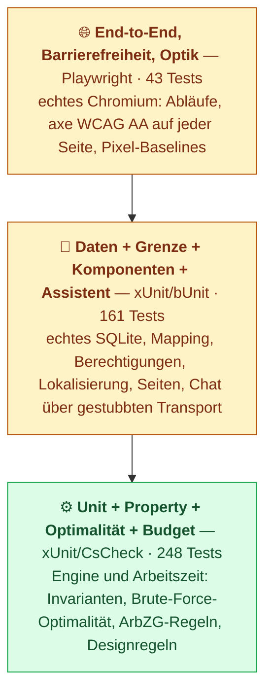

# Teststrategie

[English](TESTING.md) · **Deutsch**

Die anspruchsvolle Logik dieses Projekts steckt in zwei reinen Bibliotheken —
der Planungs-Engine und den Arbeitszeitregeln — und dort liegt der Schwerpunkt
der Tests. Leitidee ist eine **Testpyramide**: viele schnelle, deterministische
Tests unten gegen reinen Code und wenige langsame Tests mit hoher Aussagekraft
oben gegen die echte App im echten Browser. Dass die Bibliotheken kein Blazor,
kein EF und kein WebAssembly kennen, macht das erst möglich: der Großteil der
Suite läuft in Sekunden, ohne Browser und ohne die `wasm-tools`-Workload.


```mermaid
graph TD
    E2E["🌐 <b>End-to-End, Barrierefreiheit, Optik</b> — Playwright · 43 Tests<br/>echtes Chromium: Abläufe, axe WCAG AA auf jeder Seite, Pixel-Baselines"]
    WEB["🧩 <b>Daten + Grenze + Komponenten + Assistent</b> — xUnit/bUnit · 161 Tests<br/>echtes SQLite, Mapping, Berechtigungen, Lokalisierung, Seiten, Chat über gestubbten Transport"]
    UNIT["⚙️ <b>Unit + Property + Optimalität + Budget</b> — xUnit/CsCheck · 248 Tests<br/>Engine und Arbeitszeit: Invarianten, Brute-Force-Optimalität, ArbZG-Regeln, Designregeln"]

    E2E --> WEB --> UNIT

    classDef fast fill:#dcfce7,stroke:#16a34a,color:#14532d;
    classDef slow fill:#fef3c7,stroke:#b45309,color:#7c2d12;
    class UNIT fast;
    class WEB,E2E slow;
```

## Die Schichten

| Schicht | Projekt | Tests | Sichert | WASM nötig? | Laufzeit |
| --- | --- | --: | --- | :---: | --- |
| Engine: Unit, Property, Optimalität, Architektur, Budget | `tests/WorkPlanStudio.Scheduling.Tests` | 153 | Determinismus, Zulässigkeit, Regeln, Kalender und Sperrzeiten, begrenzte Suche, Overflow, Cancellation, Erklärungen, abhängigkeitsfreier Kern, Zeitbudgets | nein | ~3 s |
| Arbeitszeit: Unit, Property, Architektur, Budget | `tests/WorkPlanStudio.WorkingTime.Tests` | 95 | Feiertage aller 16 Länder, Schichtmodelle, jede ArbZG-Regel mit ihrem Parameter, Invarianten des Zeitleisten-Builders, Zeitbudgets | nein | ~2 s |
| Daten, Mapping, Berechtigungen, Komponenten, Assistent | `tests/WorkPlanStudio.Web.Tests` | 161 | echtes SQLite (Constraints/CRUD/Reload/Recovery), Alles-oder-nichts-Mapping, Arbeitszeit im Plan, Persona-Richtlinien an der Servicegrenze, lokalisierte UI-Zustände, Dialog-Semantik, der Chat mit drei Anbietern über gestubbten Transport | ja¹ | ~15 s |
| End-to-End, Barrierefreiheit, Optik | `tests/WorkPlanStudio.E2E` | 43 | echtes Chromium: Planänderungen, Determinismus, Sprache, Arbeitszeit im Gantt, Personas, Theme, Tastatur, Mobil, der Chat in beiden Sprachen; axe WCAG 2.2 AA auf jeder Seite in beiden Themes und im Dialog; Screenshot-Baselines für neun Schirme | Browser² | ~3 min |

¹ Diese referenzieren das Blazor-App-Assembly, daher kompiliert ihr Build die App (also `wasm-tools`). Die Tests selbst laufen auf einem normalen Host.
² Braucht einen Chromium-Download (`playwright install`) und die laufende App; kein `wasm-tools`, wenn ein vorab veröffentlichter Build ausgeliefert wird.

## Was jede Schicht tut

### ⚙️ Unit + Architektur — die Engine

Der Kern: Zulässigkeit (Reihenfolge, Kapazität, Freigabezeiten,
Kalenderfenster, Sperrzeiten, unterbrochene Arbeitsgänge), je ein gezielter
Test pro **Prioritätsregel** und pro **Terminregel**, die KPIs des Bewerters
(Auslastung der *offenen* Zeit) und die Garantien der Suche („nie schlechter
als die Regel", „mehr Starts schaden nie", „lokale Suche verschlechtert nie").
Determinismus ist dreifach festgenagelt: ein **Golden-Value**-Test des PRNG,
*gleicher Seed → identischer Plan*, *identischer Plan unabhängig von der
Reihenfolge der Eingabe*.

`ArchitectureTests` reflektieren über jedes Bibliotheks-Assembly und **lassen
den Build scheitern**, wenn jemand Blazor, EF Core, JS-Interop oder SQLite von
dort referenziert. Die reine Bibliotheksgrenze ist die Designentscheidung, auf
der die ganze Pyramide ruht — also wird sie von einem Test erzwungen statt der
Disziplin überlassen.

### 🎲 Eigenschaftsbasiert — Invarianten

Beispieltests prüfen die Fälle, an die man gedacht hat; **Property-Tests prüfen
die anderen.** Mit [CsCheck](https://github.com/AnthonyLloyd/CsCheck) erzeugt
jeder Test hunderte zufällige, aber gültige Probleme (Maschinen, Kapazitäten,
Kalender mit Phasen und Sperrzeiten, Aufträge, Schritte, Regeln, Budgets) und
behauptet eine *Invariante*, die für jeden Plan gelten muss, den die Engine je
erzeugen kann:

- **Reihenfolge** — ein Schritt beginnt nie, bevor der vorherige seines Auftrags fertig ist;
- **Kapazität** — kein Arbeitsplatz bearbeitet mehr Arbeitsgänge gleichzeitig, als er Plätze hat;
- **Kalender** — keine Arbeit in einer Sperrzeit, und eine Unterbrechung über eine Pause überschreitet nie die überbrückbare Lücke;
- **Determinismus** — dasselbe Problem liefert immer einen bitidentischen Plan;
- **Untere Schranke** — die Durchlaufzeit liegt nie unter dem längsten einzelnen Auftrag;
- **Nie schlechter als die Regel** — das Suchergebnis verliert nie gegen die reine Regelreihenfolge.

Die Arbeitszeit-Bibliothek hat eigene Eigenschaften: eine gebaute Zeitleiste
überschreitet nie die Tageshöchstgrenze, lässt immer die Mindestruhezeit,
öffnet nie an einem Sonn- oder Feiertag, es sei denn, die Regel erlaubt es, und
der erzeugte Kalender lässt sich verlustfrei in die Engine übergeben. Bei einem
Fehlschlag *schrumpft* CsCheck auf ein minimales Gegenbeispiel und druckt einen
Seed (`CsCheck_Seed`) zum Reproduzieren.

### 🏛️ Regeln — deutsches Arbeitszeitrecht als Tests

Jede ArbZG-Regel, die die App durchsetzt, ist ein Parameter mit einem Test:
die 8/10-Stunden-Tagesgrenze (§3), Pausen von 30/45 Minuten in Abschnitten von
mindestens 15 (§4), 11 Stunden Ruhezeit je Besetzung einschließlich des
Wochenumbruchs (§5), die Nachtgrenze (§6), Sonn- und Feiertagsruhe mit der
Verschiebung um 0–6 Stunden (§9) und die Zahl freier Sonntage (§11). Die
Feiertage werden für alle 16 Länder aus dem Osterdatum berechnet und gegen die
Tabellen für 2026 geprüft, Teilfeiertage eingeschlossen.

### 🔌 Grenze — das Mapping

`ScheduleMapper` ist die eine Stelle, an der `decimal`-Minuten zu ganzzahligen
Sekunden und Betriebseinstellungen zu Maschinenkalendern werden. Diese Tests
nutzen von Hand gebaute Entitäten und prüfen kaufmännisches Runden, geprüften
Overflow, Kapazität, die Alles-oder-nichts-Regel (ein inaktiver oder fehlender
Arbeitsplatz weist den ganzen Auftrag mit einer stabilen Diagnose ab) und dass
ein Arbeitsgang, der länger ist als jedes Schichtfenster, mit Begründung
abgelehnt statt nie eingeplant wird.

`BrowserDatabaseTests` nutzen echtes dateibasiertes SQLite: Constraints,
Aggregat-Update, Konflikte, Not-Found-Updates, Deaktivierungs-/Löschschutz,
Speichern→Neuladen, ungültige oder abgeschnittene gespeicherte Daten,
Schema-Abweichung, Export/Reset und simulierte Lese-/Schreib-/Quota-Fehler.

### 🔐 Berechtigungen — Personas an der Grenze

`AuthorizationTests` fahren die echte ASP.NET-Core-Autorisierungspipeline mit
einem gefälschten Persona-Speicher: die Richtlinienmatrix je Rolle, Services,
die einem Gast `Forbidden` zurückgeben, Seiten, die ohne ihre Aktionen
rendern, und ein Persona-Wechsel, der ohne Neuladen neu rendert. Dieselbe
Pipeline läuft im Browser.

### 🧩 Komponenten — die Seiten

[bUnit](https://bunit.dev) rendert die Seiten im Speicher. Die Planungsseite
läuft gegen einen **gefälschten** `IProductionScheduleService` (keine Engine,
keine Datenbank) und wird auf KPI-Karten, Gantt-Zeilen mit geschlossenen
Abschnitten, Tabellenzeilen, den Leerzustand, die Verspätungs-Optik und darauf
geprüft, dass **Erzeugen** die gewählten Parameter übergibt. Die
Arbeitszeitseite, die Übersicht und der Theme-Umschalter rendern gegen eine
echte temporäre Datenbank. Der Chat wird im Speicher von Ende zu Ende geprüft:
eine geklickte Vorschlagsfrage, die auf dem Gerät beantwortet wird, eine
getippte Frage, das Löschen und der Einstellungsdialog, der Endpunkt und
Modell mit dem Anbieter wechselt.

### 🤖 Assistent und Chat — ohne Netz

Der [Planungs-Assistent](AI-ASSISTANT.md) wird ohne Netz getestet. Der
Antwortgeber auf dem Gerät wird auf seine englischen und deutschen Absichten
geprüft, auf Antworten, die die Zahlen des Plans tragen, auf die
Was-wäre-wenn-Urteile und auf Determinismus. Die drei Anbieter-Clients laufen
gegen einen **gestubbten `HttpMessageHandler`** — Pfad, Header (auch
Anthropics Versions- und Direktzugriffs-Header), JSON-Form, Zusammenlegen der
Züge, und eine leere Antwort ist ein Fehler. Die Fassaden werden auf jeden
Pfad geprüft: nicht konfiguriert, gesund, fehlschlagend (Rückfall mit
Hinweis), Was-wäre-wenn mit erneutem Lauf des Planers, Zurücksetzen und
Abbruch.

### 🌐 End-to-End — die echte Sache

[Playwright](https://playwright.dev/dotnet/) steuert Chromium gegen die
laufende App über ein Seitenobjekt. Die Kernprüfung ist die aus dem
Auftrag: **Termine straffen, und der Plan wird sichtbar verspätet**
(`schedule-ontime.png` → `schedule-late.png`, vom Lauf selbst aufgenommen).
Die Suite beweist außerdem, dass Regelwechsel einen zulässigen Plan behalten,
derselbe Seed dieselbe Durchlaufzeit liefert, geschlossene Zeit mit Grund
schattiert wird und die Achse echte Daten zeigt, ein anderes Bundesland andere
Feiertage bringt, Personas ändern, was die Seiten erlauben, das Theme ein
Neuladen überlebt, Tastaturnutzer zum Inhalt springen und im Dialog bleiben,
der mobile Drawer funktioniert, der Chat eine Vorschlagsfrage und ein
getipptes Was-wäre-wenn auf Englisch und Deutsch beantwortet, und gespeicherte
Daten ein hartes Neuladen und einen bestätigten Reset überstehen.

### ♿ Barrierefreiheit — axe auf jeder Seite

`AccessibilityE2ETests` fahren [axe-core](https://github.com/dequelabs/axe-core)
(über `Deque.AxeCore.Playwright`) mit den Tags WCAG 2.0/2.1/2.2 A und AA plus
Best Practices auf jeder Route, im hellen und im dunklen Theme und in einem
offenen Dialog. Null Verstöße ist die Messlatte. Der erste Lauf fand fünf
echte Mängel — Kontrast von Pills und Balkenbeschriftungen, ein nicht
fokussierbarer Scrollbereich, eine übersprungene Überschriftenebene und eine
doppelte Landmarke — alle in derselben Änderung behoben. Automatische Regeln
finden etwa ein Drittel der WCAG; Tastatur und Fokus decken die Abläufe oben
ab, bUnit prüft Dialog-Semantik, Tabellen-Scopes und zugängliche Namen an
reinen Icon-Knöpfen.

### 📸 Optik — Pixel-Baselines

`VisualRegressionTests` nehmen ganzseitige Screenshots der Übersicht, der
Planung und der Arbeitszeitseite in drei Profilen (Desktop hell, Desktop
dunkel, Mobil) mit abgeschalteten Animationen und vergleichen sie pixelweise
mit Baselines in `tests/WorkPlanStudio.E2E/visual-baselines/<os>/`. Der
Vergleich läuft auf zwei Canvas-Elementen im Browser und braucht keine
Bildbibliothek. Eine Toleranz je Farbkanal schluckt Anti-Aliasing; mehr als
0,2 % abweichende Pixel schlagen fehl, und das Diff-Bild (rot = geändert)
landet bei den Artefakten. Baselines gelten je Betriebssystem, weil sich die
Schriften unterscheiden; ein Runner ohne Baselines schreibt sie und besteht,
der CI-Job lädt sie hoch, damit sie eingecheckt werden können, und
`VISUAL_UPDATE=1` erneuert sie nach einer gewollten Änderung.

### ⏱️ Leistung — Budgets und Benchmarks

`PerformanceBudgetTests` in beiden Bibliotheksprojekten sind Stolperdrähte mit
Grenzen eine Größenordnung über den gemessenen Werten; sie laufen bei jedem
Pull Request und schlagen bei einer quadratischen Regression fehl. Genaue
Zahlen liefern das BenchmarkDotNet-Projekt und Lighthouse CI — siehe
[PERFORMANCE.md](PERFORMANCE.md).

## Tests ausführen

```bash
# Alles außer der Browser-Suite (kein Browser nötig):
dotnet test tests/WorkPlanStudio.Scheduling.Tests/WorkPlanStudio.Scheduling.Tests.csproj
dotnet test tests/WorkPlanStudio.WorkingTime.Tests/WorkPlanStudio.WorkingTime.Tests.csproj
dotnet test tests/WorkPlanStudio.Web.Tests/WorkPlanStudio.Web.Tests.csproj

# Browser-Suite — App starten, einmal einen Browser installieren, dann laufen lassen:
dotnet run --project src/WorkPlanStudio/WorkPlanStudio.csproj &           # dient http://localhost:5235
pwsh tests/WorkPlanStudio.E2E/bin/Debug/net10.0/playwright.ps1 install chromium
dotnet test tests/WorkPlanStudio.E2E/WorkPlanStudio.E2E.csproj

# Eine Klasse oder ein Test:
dotnet test tests/WorkPlanStudio.E2E/WorkPlanStudio.E2E.csproj -- --filter-class "*Accessibility*"
dotnet test tests/WorkPlanStudio.E2E/WorkPlanStudio.E2E.csproj -- --filter-method "*chat*"
```

Umgebungsvariablen für die Browser-Suite: `E2E_BASE_URL` (Standard
`http://localhost:5235`), `HEADED=1`, um den Browser zu sehen,
`E2E_ARTIFACTS=<dir>` für Screenshots und Diffs, `VISUAL_UPDATE=1`, um die
Baselines neu zu schreiben. Ein fehlgeschlagener Property-Test druckt
`CsCheck_Seed=…`; gesetzt spielt er genau diesen Fall nach.

## Abdeckung

Die Abdeckung wird mit dem Collector der Microsoft Testing Platform gemessen
und in der CI **je Assembly gegated** (`.github/scripts/coverage_gate.py`):
der Build scheitert unter 90 % Zeilen für die Engine, 90 % für die
Arbeitszeit-Bibliothek und 65 % für das App-Assembly. Gemessen am 08.09.2026:

| Assembly | Zeilen | Zweige | Gate |
| --- | ---: | ---: | ---: |
| `WorkPlanStudio.Scheduling` | 96,0 % | 89,5 % | 90 % |
| `WorkPlanStudio.WorkingTime` | 94,0 % | 89,4 % | 90 % |
| `WorkPlanStudio` (App: Services, Mapping, Assistent, Seiten) | 69,3 % | 63,1 % | 65 % |

Die Zahl des App-Assemblys ist bewusst niedriger: seine Seiten deckt die
Browser-Suite ab, die der Collector nicht sieht. Die Badges im README werden
bei jedem Deployment von demselben Skript erzeugt und von der Site
ausgeliefert, zeigen also gemessene Zahlen. Zum Nachmessen:

```bash
dotnet test tests/WorkPlanStudio.Scheduling.Tests/WorkPlanStudio.Scheduling.Tests.csproj \
  --coverage --coverage-output-format cobertura --coverage-output engine.cobertura.xml
python3 .github/scripts/coverage_gate.py <Pfad zu engine.cobertura.xml> WorkPlanStudio.Scheduling=90
```

## In der CI

| Workflow | Läuft | Wann |
| --- | --- | --- |
| [`ci.yml`](../.github/workflows/ci.yml) | die zwei Bibliotheksprojekte und das Web-Projekt, jedes mit seinem Abdeckungs-Gate | jeder Pull Request und `main` |
| [`e2e.yml`](../.github/workflows/e2e.yml) | baut und dient die App, installiert Chromium, fährt Abläufe, axe und den Bildvergleich; lädt Screenshots, Diffs und Baselines hoch | jeder Pull Request und `main`; vom Deploy aufgerufen |
| [`quality.yml`](../.github/workflows/quality.yml) | `dotnet format`-Prüfung, jeder relative Markdown-Link, beide Ressourcendateien parsen | jeder Pull Request und `main` |
| [`codeql.yml`](../.github/workflows/codeql.yml) | CodeQL-Analyse (security-extended) des C# | jeder Pull Request, `main`, wöchentlich |
| [`performance.yml`](../.github/workflows/performance.yml) | BenchmarkDotNet-Kurzlauf; Lighthouse CI auf der veröffentlichten Site | `main`, wöchentlich, auf Abruf |
| [`deploy.yml`](../.github/workflows/deploy.yml) | alle drei Testprojekte mit Abdeckungs-Gates **und** die Browser-Suite gaten das GitHub-Pages-Deployment; die Abdeckungs-Badges werden mit der Site veröffentlicht | Push auf `main` |

Dependabot hält NuGet-Pakete und die GitHub Actions mit wöchentlichen,
gruppierten Pull Requests aktuell (`.github/dependabot.yml`).
