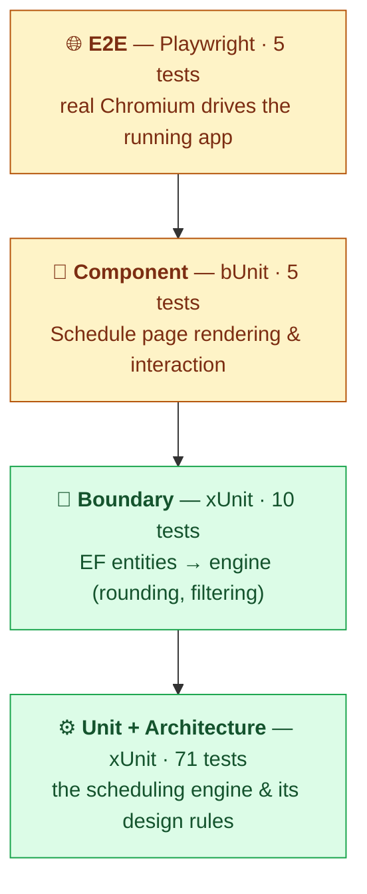

# Testing strategy

**English** · [Deutsch](TESTING.de.md)

The hard logic in this project is the scheduling engine, so that is where the
tests are concentrated. The guiding idea is a **test pyramid**: many fast,
deterministic tests at the bottom against pure code, and a few slow,
high-confidence tests at the top against the real app in a real browser.

Keeping the engine a pure library (no Blazor, no EF, no WebAssembly) is what makes
this possible — the bulk of the suite runs in **a couple of seconds** with no
browser and no `wasm-tools` workload.



## The layers

| Layer | Project | Tests | Guards | Needs WASM? | Runtime |
| --- | --- | --: | --- | :---: | --- |
| Unit + Architecture | `tests/WorkPlanStudio.Scheduling.Tests` | 71 | the engine: determinism, feasibility, every rule, scoring, search — and that the engine stays dependency-free | no | ~1 s |
| Boundary (mapping) | `tests/WorkPlanStudio.Web.Tests` | 10 | the EF→domain mapping: `decimal`→seconds rounding, Released filter, inactive-WC skip, step re-indexing | yes¹ | ~2 s |
| Component | `tests/WorkPlanStudio.Web.Tests` | 5 | the Schedule page: KPI/Gantt/table render, empty state, late styling, the parameter→Generate flow | yes¹ | ~2 s |
| End-to-end | `tests/WorkPlanStudio.E2E` | 5 | the whole thing through a browser: a parameter change visibly changes the schedule, determinism, EN/DE | browser² | ~30 s |

¹ These reference the Blazor app assembly, so building them compiles the app (hence `wasm-tools`). The tests themselves run on a normal host.
² Needs a Chromium download (`playwright install`) and the app running; no `wasm-tools` if you serve a pre-published build.

## What each layer does

### ⚙️ Unit + Architecture — the engine

The core: feasibility (precedence, capacity, release times), one focused test per
**dispatch rule** and per **due-date rule**, the evaluator's KPIs, and the search
guarantees ("never worse than the rule", "more starts never hurt", "local search
never regresses"). Determinism is pinned three ways:

- a **golden-value** test of the PRNG (`DeterministicRandom`),
- *same seed → identical schedule*,
- *identical schedule regardless of input collection order* (guards against
  accidental reliance on dictionary/hash-set ordering — a real desktop-vs-WASM
  hazard).

`ArchitectureTests` reflect over the engine assembly and **fail the build** if
anyone references Blazor, EF Core, JS interop or SQLite from it. The pure-library
boundary is the design decision that the whole pyramid rests on, so it is
enforced by a test rather than left to discipline.

### 🔌 Boundary — the mapping

`ScheduleMapper` is the one place `decimal` minutes become integer seconds. These
tests use hand-built `WorkPlan`/`Operation`/`WorkCenter` entities (no database) to
check banker's rounding, that operations on inactive work centers are dropped,
that plans left without steps are skipped, and that step numbers are re-indexed so
malformed data can't break the engine's contract.

### 🧩 Component — the page

[bUnit](https://bunit.dev) renders `Schedule.razor` in memory against a **fake**
`IProductionScheduleService`, so there is no database and no engine run. It checks
that a result is turned into the right KPI cards, Gantt rows and table rows; that
the empty state appears with no data; that late jobs get red pills and bars; and
that clicking **Generate** calls the service with the parameters chosen in the
form. This is why the page depends on the `IProductionScheduleService`
*interface* — so a test can substitute a fake.

### 🌐 End-to-end — the real thing

[Playwright](https://playwright.dev/dotnet/) drives Chromium against the running
app through a small page object (`SchedulePage`). The headline check is the one
the brief asked for: **tighten the targets and the schedule visibly turns late** —
red-ringed bars and red status pills (`schedule-ontime.png` → `schedule-late.png`,
captured by the run itself). It also checks that changing the dispatch rule keeps
a feasible schedule, that the same seed reproduces the same makespan, and that the
UI switches to German.

## Running the tests

```bash
# Everything except E2E (fast, no browser):
dotnet test tests/WorkPlanStudio.Scheduling.Tests/WorkPlanStudio.Scheduling.Tests.csproj
dotnet test tests/WorkPlanStudio.Web.Tests/WorkPlanStudio.Web.Tests.csproj

# E2E — start the app, install a browser once, then run:
dotnet run --project src/WorkPlanStudio/WorkPlanStudio.csproj &           # serves http://localhost:5235
pwsh tests/WorkPlanStudio.E2E/bin/Debug/net10.0/playwright.ps1 install chromium
dotnet test tests/WorkPlanStudio.E2E/WorkPlanStudio.E2E.csproj
```

Useful environment variables for E2E: `E2E_BASE_URL` (default `http://localhost:5235`),
`HEADED=1` to watch the browser, `E2E_ARTIFACTS=<dir>` to collect screenshots.

## Coverage

The engine job measures code coverage with the Microsoft Testing Platform collector; the scheduling library sits at roughly **98 % line / 90 % branch**. Reproduce it locally with:

```bash
dotnet test tests/WorkPlanStudio.Scheduling.Tests/WorkPlanStudio.Scheduling.Tests.csproj \
  --coverage --coverage-output-format cobertura
```

## In CI

| Workflow | Runs | When |
| --- | --- | --- |
| [`ci.yml`](../.github/workflows/ci.yml) | engine tests (no WASM) + mapper/component tests (WASM) as two jobs | every pull request |
| [`e2e.yml`](../.github/workflows/e2e.yml) | builds, serves the app, installs Chromium, runs Playwright, uploads screenshots | every pull request |
| [`deploy.yml`](../.github/workflows/deploy.yml) | engine tests gate the GitHub Pages deploy | push to `main` |
