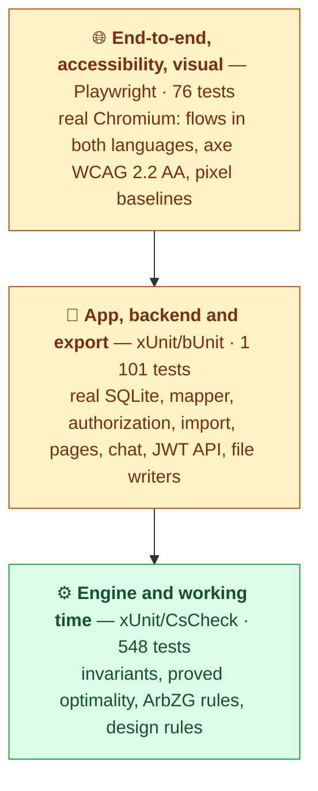

# Testing strategy

**English** · [Deutsch](TESTING.de.md)

The hard logic in this project lives in libraries that carry no framework, so
that is where most of the tests are. The guiding idea is a **test pyramid**: many
fast, deterministic tests at the bottom against pure code, and a few slow,
high-confidence tests at the top against the real app in a real browser. Keeping
the libraries free of Blazor, EF and WebAssembly is what makes this possible: the
bulk of the suite runs in seconds with no browser and no `wasm-tools` workload.


```mermaid
graph TD
    E2E["🌐 <b>End-to-end, accessibility, visual</b> — Playwright · 76 tests<br/>real Chromium: flows in both languages, axe WCAG 2.2 AA, pixel baselines"]
    APP["🧩 <b>App, backend and export</b> — xUnit/bUnit · 1 101 tests<br/>real SQLite, mapper, authorization, import, pages, chat, JWT API, file writers"]
    UNIT["⚙️ <b>Engine and working time</b> — xUnit/CsCheck · 548 tests<br/>invariants, proved optimality, ArbZG rules, design rules"]

    E2E --> APP --> UNIT

    classDef fast fill:#dcfce7,stroke:#16a34a,color:#14532d;
    classDef slow fill:#fef3c7,stroke:#b45309,color:#7c2d12;
    class UNIT fast;
    class APP,E2E slow;
```

## The layers

Counts measured on this tip by running each suite; see *Running the tests* below.

| Layer | Project | Tests | Guards | Needs WASM? | Runtime |
| --- | --- | --: | --- | :---: | --- |
| Engine: unit, property, optimality, exact solver, architecture, budget | `tests/WorkPlanStudio.Scheduling.Tests` | **294** | determinism, feasibility, rules, calendars and blackouts, input validation, zero-allocation scoring, the twenty-instance optimality study, the LP model, a dependency-free core | no | ~5 s |
| Working time: unit, property, architecture, budget | `tests/WorkPlanStudio.WorkingTime.Tests` | **254** | holidays for all 16 states across 1990–2200, shift patterns, every ArbZG rule with its parameter, the averaging windows, both daylight-saving transitions, the timeline builder's invariants | no | ~1 s |
| Data, mapper, authorization, import, components, assistant, remote | `tests/WorkPlanStudio.Web.Tests` | **865** | real SQLite constraints and schema upgrades, the all-or-nothing mapper, the persona policies as a closed set, the CSV import's preview-equals-commit promise, localized component states, the sliced run, the optimality proof, the chat against hostile responses | yes¹ | ~5 s |
| Backend: HTTP integration against a real SQLite file | `tests/WorkPlanStudio.Api.Tests` | **88** | login, lockout, rate limiting, refresh-token rotation and reuse detection, 401/403 per route, concurrency stamps, and that the server produces the schedule the browser would have | no | ~3 s |
| Export writers: CSV, xlsx, PDF | `tests/WorkPlanStudio.Export.Tests` | **148** | the bytes, read back: formula injection, quoting, the workbook's parts, the PDF's object table, both cultures' date rules | no | <1 s |
| End-to-end, accessibility, visual regression | `tests/WorkPlanStudio.E2E` | **76** | real Chromium: schedule changes, determinism, language, working time on the Gantt, production orders end to end, storage recovery, personas, theme, keyboard, mobile, the chat in both languages; axe WCAG 2.2 AA on every route in light, dark and German; nine screen baselines | browser² | ~75 s |

**1 649 unit and integration tests, plus 76 browser tests.** Ten of the browser
tests are the pixel comparisons, and they *skip* off Linux with a reason naming
[ADR 0021](adr/0021-visual-baselines-linux-only.md) rather than comparing against
a baseline nothing produced.

¹ These reference the Blazor app assembly, so building them compiles the app (hence `wasm-tools`). The tests themselves run on a normal host.
² Needs a Chromium download (`playwright install`) and the app running; no `wasm-tools` if you serve a pre-published build.

## What each layer does

### ⚙️ Unit + architecture — the engine

The core: feasibility (precedence, capacity, release times, calendar windows,
blackouts, paused operations), one focused test per **dispatch rule** and per
**due-date rule**, the evaluator's KPIs (utilisation of *open* time), and the
search guarantees. Determinism is pinned three ways: a **golden-value** test of
the PRNG, *same seed → identical schedule*, and *identical schedule regardless of
input collection order*.

`InputValidationTests` is the half that did not exist before: duplicate ids, a
job with no target date, a negative release, a non-finite weight, a same-family
change-over and a step longer than the engine's bound are all refused by name.
Several of them used to produce a plausible schedule from nonsense, and one — an
unbounded duration — overflowed into a *negative* penalty the search then
minimised towards.

`AllocationBudgetTests` asserts that scoring a candidate allocates **nothing**, so
the number [PERFORMANCE.md](PERFORMANCE.md) publishes is a property rather than an
observation.

`ArchitectureTests` reflect over each library assembly and **fail the build** if
anyone references Blazor, EF Core, JS interop or SQLite from it. The pure-library
boundary is the design decision the whole pyramid rests on, so it is enforced by a
test rather than left to discipline.

### 🎯 Optimality — three implementations, and a named reference

This is the part of the suite that used to be circular, and it is worth reading
the fix.

`OptimalityTests` previously measured the engine against `ExhaustiveDispatchOrderSearch`,
which hands every one of the `n!` job orders to **the same dispatcher and the same
evaluator** the engine uses. Both sides of the assertion ran the same placement
code, so any bug in placement or scoring cancelled exactly — and eight documents
quoted "0.2 % mean gap, 19 of 20 solved exactly" and attributed it to that test,
which computes neither number on no such set.

There are now three implementations and the tests name which is which:

- `DispatchScheduler` — the engine's own placement;
- `ExhaustiveDispatchOrderSearch` — the permutation enumerator, kept as a second
  opinion on the **search**;
- `ExactJobShopSolver` — a disjunctive branch-and-bound that shares no code with
  either and is the authority on the **optimum**.

`OptimalityStudyTests` runs a fixed, committed twenty-instance set through all
three and pins every figure to six decimal places: 18 of 20 exact against the best
dispatch order (mean gap 0.27 %), 7 of 20 exact against the true optimum (median
5.34 %). It also asserts that all twenty proved-optimal schedules pass the same
independent feasibility checker the dispatcher's schedules go through — without
that, a solver cheating on a constraint would make the heuristic look terrible —
and that the instance set still spans the feature space rather than collapsing
into twenty copies of one shape, which is what the audit found the old generators
had done.

`ExactMilpWriterTests` checks the emitted LP model two ways without a solver: the
proved optimum must satisfy every row at exactly the reported objective (catching
a model that is too tight), and the model's own optimum — computed by enumerating
every binary assignment and solving the difference-constraint system each one
leaves behind — must equal the branch-and-bound's (catching one that is too
loose). See [ADR 0015](adr/0015-exact-solver.md).

### 🎲 Property-based — invariants

Example tests check the cases you thought of; **property tests check the ones you
didn't.** Using [CsCheck](https://github.com/AnthonyLloyd/CsCheck), each test
generates hundreds of random-but-valid problems and asserts an *invariant* that
must hold for every schedule the engine can produce: precedence, capacity, no work
inside a blackout, a pause never longer than the bridgeable gap, determinism, a
makespan never below the longest single job, and never worse than the pure rule
order. On failure CsCheck *shrinks* to a minimal counter-example and prints a seed
(`CsCheck_Seed`) to reproduce it.

The working-time library has its own: a built timeline never exceeds the daily cap
**per crew calendar day** (not per shift label, which is how the old version
passed while the cap was broken), always leaves the minimum rest **including the
week wrap**, never opens on a Sunday or holiday unless the rule allows it, and a
pattern with no working time left reads as *closed* rather than as unconstrained.
The §5 property found two real bugs on its first run.

`Feasibility.AssertFeasible` — the independent oracle every property leans on —
also checks that the change-over charged to an operation equals what the context
says that transition costs, and that each parallel slot is serial in its own
right. Without the first, a dispatcher charging setup on every operation passed
the entire property suite.

### 🏛️ Rules — German working-time law as tests

Every ArbZG rule the app enforces is a parameter with a test: the 8/10-hour daily
cap (§ 3), breaks of 30/45 minutes in pieces of at least 15 (§ 4), 11 hours of
rest per crew including the week wrap (§ 5), the night cap (§ 6), Sunday and
holiday closure with the ±6-hour boundary shift (§ 9), the free-Sunday count
(§ 11) and the replacement rest day (§ 11 (2), (3)).

Two things go further than a cap. The **averaging periods** of § 3 sentence 2 and
§ 6 (2) are computed, so a plant using the ten-hour day every day is flagged with
the crew, the werktäglich average, the date it first exceeds and the compensation
days owed. And `Evaluate(TimeZoneInfo)` measures those in **real elapsed hours**:
22:00–06:00 is seven hours across the spring change and nine across the autumn
one, and with its break the autumn night breaches the § 6 (2) eight-hour cap it
appears on the clock to keep.

Public holidays are computed from Easter for all 16 states and the *law* is
tabled, not the dates: every entry carries the years it was in force, so
Reformationstag is nationwide in 2017 only and Buß- und Bettag is nationwide
through 1994 and Saxon after. `GermanHolidayYearsTests` pins the transitions, the
Berlin one-offs, Brandenburg's Ostersonntag and Pfingstsonntag, and golden totals
for 2027 and 2038 across all sixteen states.

### 🔌 Boundary — the mapping and the database

`ScheduleMapper` is the one place `decimal` minutes become integer seconds and
plant settings become machine calendars. These tests check banker's rounding,
checked overflow, capacity, the all-or-nothing rule and each of the four reasons
an order can be refused with a sentence rather than scheduled "never".

`BrowserDatabaseTests` and `SchemaUpgradeTests` use real file-backed SQLite:
constraints, conflicts, deactivation and delete guards, save→reload, invalid or
truncated stored data, quota failures, export/reset — and the **schema upgrade**,
driven from a schema-5 and a schema-6 database written by hand-written DDL rather
than generated from the current model. A test that builds the old database from
today's model keeps passing while the upgrade quietly stops matching anything a
real visitor has.

The CSV import has the promise worth testing: `PlanAsync` and `CommitAsync` are
one code path, so the preview cannot lie about what the commit will do, and the
commit refuses — without writing — when the database moved between the two.

### 🔐 Authorization — a closed set, not a list

`AuthorizationTests` run the real ASP.NET Core authorization pipeline with a fake
persona store: the policy matrix per role, pages rendering without their actions,
and a persona switch re-rendering without a reload.

`ServiceAuthorizationArchitectureTests` is the one that will not rot. It
**discovers** the mutating methods by reflection — the codebase's own
discriminator, that a method which can change something returns
`ApplicationResult<T>` and a read does not — and asserts that every one of the 14
it finds refuses a guest. A fifteenth added tomorrow is covered the moment it is
written. A second test guards the discriminator itself, so a mutation that
returned `bool` could not slip past unnoticed.

### 🧩 Component — the pages

[bUnit](https://bunit.dev) renders the pages in memory against a fake service or a
real temp database. Every component test derives from `AppBunitContext`, and every
interaction is wrapped so that finding an element and triggering an event happen
in one render pass — doing it in two reintroduces a stale-handler race that cost
this project an hour to find.

Covered: KPI cards and Gantt rows with their closed segments, the parameter form's
evaluation-budget cap (both inputs marked, Generate disabled, the service never
called), the progress bar's ARIA and the cancel that leaves the previous schedule
untouched, the import page without a mouse, the optimality proof's three outcomes,
and the export menu's keyboard route.

### 🤖 Assistant and chat — hostile input, no network

The [schedule assistant](AI-ASSISTANT.md) is tested without a network. The
on-device answerer is checked for its English and German intents, for answers that
carry the schedule's own numbers, for the what-if verdicts, for determinism — and
for **admitting what it did not understand**: a reference it recognises but cannot
resolve ends the search with "I cannot find PO-9999" instead of falling through to
a different intent with a confident wrong number.

The three provider clients run against a **stubbed `HttpMessageHandler`**, and the
table is now an adversary's: `{"choices":[null]}`, a message with no content, an
empty candidate list, a body that never finishes arriving, a body larger than the
ceiling, and a model name crafted to rewrite the request target. Every one of
those used to reach the planner as a red banner or a `NullReferenceException`.
`PromptHardeningTests` covers the fencing and the bounds on what is sent;
`AssistantKeyHandlingTests` covers the per-provider key storage, the blank-means-keep
semantics and the one-click forget; two source-grep tests assert that nothing in
the assistant logs anything at all. See
[ADR 0025](adr/0025-hostile-input-on-the-model-path.md).

### 🌐 End-to-end — the real thing

[Playwright](https://playwright.dev/dotnet/) drives Chromium against the running
app through a page object that addresses controls **by role, accessible name or
label text** — the previous version clicked `.btn-primary`, which matches three
buttons on that page and only worked because the chat's Send button happened to be
disabled.

The headline check is the one the brief asked for: **tighten the targets and the
schedule visibly turns late** (`schedule-ontime.png` → `schedule-late.png`). The
suite also proves that rule changes keep a feasible schedule, that the same seed
reproduces the same makespan, that closed time is shaded with its reason and the
axis shows real dates, that changing the federal state changes the holidays, that
personas change what the pages allow, that the theme survives a reload, that
keyboard users can skip to content and stay inside a dialog, that the mobile
drawer works, and that the chat answers a suggested question and a typed what-if
in English and in German.

Two classes close the gaps the audit named. `ProductionOrderE2ETests` proves
[ADR 0011](adr/0011-production-orders-own-routing-snapshots.md)'s headline claim
end to end: raise a draft, release it, read its makespan, then change the per-piece
time on the source routing, assert the *plan* really changed, and assert the
released order's schedule did not move. `StorageRecoveryE2ETests` renders
[ADR 0006](adr/0006-explicit-browser-storage-recovery.md)'s recovery screen, which
had no browser coverage at all: corrupt the payload, assert it is **preserved**
across the first reset click, complete the two-step reset, and assert the recovered
database is really SQLite.

The classes run in parallel, each with its own browser and every test with its own
context; that took the suite from 135 s to ~75 s while it grew from 49 tests to 76.
There is exactly one retry in the whole suite — a single reload when the app shell
does not appear, which is the WebAssembly boot — and it announces itself as a
diagnostic so a run that needed one is not silently equal to a clean run. No
assertion is retried.

### ♿ Accessibility — axe on every route, in both languages

`AccessibilityE2ETests` and `GermanAccessibilityE2ETests` run
[axe-core](https://github.com/dequelabs/axe-core) with the WCAG 2.0/2.1/2.2 A and
AA tags **plus best practices** on every route, in the light and the dark theme,
in English and in German, and inside an open dialog. Zero violations is the bar,
and the dialog scan uses the same tag set as the page scans — it used to omit
best practices, holding the dialog to a lower bar than every page.

German was never scanned before, in a bilingual app. The scan asserts
`html[lang=de]` first, so a culture switch that silently failed cannot pass.

A known open defect is **pinned by rule id** rather than suppressed: the scan runs
with the full tag set and the assertion is that the violations are *exactly* the
pinned set, so a new violation fails the build **and so does fixing one without
removing the pin**. The entry cannot rot into a silent suppression — and it has
already proved that: the two defects pinned on the populated work-plan editor were
fixed by another change, the pin then failed with "the page got better", and the
entry was removed. One pin remains, `heading-order` on the modal dialog, which
titles itself with an `<h3>` under a page whose only other heading is the `<h1>`.

Automated rules catch roughly a third of WCAG. Keyboard and focus behaviour is
covered by the flows above; bUnit checks dialog semantics, table scopes and
accessible names; and the Gantt's own keyboard model — arrow keys along a lane,
up and down between lanes, Enter to read a mark, a roving tabindex so the chart is
two tab stops rather than 137 — has its own component tests
([ADR 0023](adr/0023-accessible-gantt-and-responsive-tables.md)).

### 📸 Visual regression — pixel baselines

`VisualRegressionTests` take full-page screenshots of the dashboard, the schedule
and the working-time page in three profiles (desktop light, desktop dark, mobile),
animations disabled, and compare them pixel-wise against committed baselines. The
comparison runs on two canvases inside the browser, so it needs no image library. A
per-channel tolerance absorbs anti-aliasing; more than 0.2 % of differing pixels
fails, and expected, actual and diff all travel to the artifacts so a reviewer can
compare three ways without fetching the baseline out of git.

Two rules make it a gate rather than a decoration:

- **A missing baseline fails.** It used to be written and the test returned green,
  so renaming a route silently removed its guard. Only an explicit
  `UPDATE_VISUAL_BASELINES=1` writes into the committed folder.
- **The committed file names must be exactly the screen matrix**, so a rename
  fails twice and an orphaned baseline fails too.

Baselines are maintained for **Linux only** — CI runs `ubuntu-latest`, fonts differ
per operating system, and a baseline no automation ever compares is maintenance
without a consumer. On Windows and macOS these tests skip loudly, naming
[ADR 0021](adr/0021-visual-baselines-linux-only.md), rather than comparing against
something unverified.

### ⏱️ Performance — budgets and benchmarks

`PerformanceBudgetTests` in both library projects are tripwires with bounds an
order of magnitude above the measured numbers. They run in the Performance
workflow on `main`, weekly and on demand rather than on every pull request — see
[PERFORMANCE.md](PERFORMANCE.md), which also carries the BenchmarkDotNet and
Lighthouse numbers.

### What is *not* here

**Mutation testing.** `dotnet-stryker` 5.0.0 cannot run against this repository:
every test project uses the Microsoft Testing Platform, which Stryker does not yet
support ([stryker-net#3094](https://github.com/stryker-mutator/stryker-net/issues/3094)).
The choice was to wait rather than to add a VSTest-bridged project purely for a
score that would be reported and not gated, and no mutation score is claimed
anywhere. Assertion strength is instead checked by hand where it matters: several
changes in this release were verified by reverting the fix and confirming that
exactly the intended tests fail.

## Running the tests

`dotnet test` uses the .NET 10 Microsoft Testing Platform CLI. The test projects
are also self-hosting executables, which is the faster way to run one:

```bash
dotnet build WorkPlanStudio.slnx -c Release

./tests/WorkPlanStudio.Scheduling.Tests/bin/Release/net10.0/WorkPlanStudio.Scheduling.Tests.exe
./tests/WorkPlanStudio.WorkingTime.Tests/bin/Release/net10.0/WorkPlanStudio.WorkingTime.Tests.exe
./tests/WorkPlanStudio.Web.Tests/bin/Release/net10.0/WorkPlanStudio.Web.Tests.exe
./tests/WorkPlanStudio.Api.Tests/bin/Release/net10.0/WorkPlanStudio.Api.Tests.exe
./tests/WorkPlanStudio.Export.Tests/bin/Release/net10.0/WorkPlanStudio.Export.Tests.exe
```

Each prints `Total: N, Errors: 0, Failed: 0`. Through the SDK:

```bash
dotnet test tests/WorkPlanStudio.Scheduling.Tests/WorkPlanStudio.Scheduling.Tests.csproj
dotnet test tests/WorkPlanStudio.Web.Tests/WorkPlanStudio.Web.Tests.csproj -- --filter-class "*Optimality*"
```

The browser suite needs the app running and a Chromium once:

```bash
dotnet run --project src/WorkPlanStudio/WorkPlanStudio.csproj &           # serves http://localhost:5235
pwsh tests/WorkPlanStudio.E2E/bin/Debug/net10.0/playwright.ps1 install chromium
dotnet test tests/WorkPlanStudio.E2E/WorkPlanStudio.E2E.csproj
```

Environment variables for the browser suite: `E2E_BASE_URL` (default
`http://localhost:5235`), `HEADED=1` to watch the browser, `E2E_ARTIFACTS=<dir>` to
collect screenshots and visual diffs, and `UPDATE_VISUAL_BASELINES=1` (legacy
alias `VISUAL_UPDATE=1`) to rewrite the visual baselines — **on Linux**, because
that is the only operating system whose baselines are committed. A failing property
test prints `CsCheck_Seed=…`; set it to replay the exact case.

## Coverage

Coverage is measured with the Microsoft Testing Platform collector and **gated per
assembly** in CI ([`.github/scripts/coverage_gate.py`](../.github/scripts/coverage_gate.py)).
Measured on 2026-09-11 on this tip:

| Assembly | Measured by | Lines | Branches | Gate |
| --- | --- | ---: | ---: | ---: |
| `WorkPlanStudio.Scheduling` | `Scheduling.Tests` | 96.57 % | 90.45 % | 90 % |
| `WorkPlanStudio.WorkingTime` | `WorkingTime.Tests` | 94.31 % | 90.29 % | 90 % |
| `WorkPlanStudio` (app: services, mapper, import, assistant, pages) | `Web.Tests` | 79.89 % | 71.28 % | 65 % |
| `WorkPlanStudio.Api` | `Api.Tests` | 70.19 % | 65.84 % | 60 % |
| `WorkPlanStudio.Export` | `Export.Tests` | 98.45 % | 90.34 % | 90 % |

The app assembly's number is lower by design: its pages are covered by the browser
suite, which the collector does not see.

The thresholds live in `ci.yml`'s `env` block and nowhere else, so the
pull-request check and the production deploy move together. The README badges are
generated from the same script on every deployment and served from the site. To
reproduce a number:

```bash
dotnet test tests/WorkPlanStudio.Scheduling.Tests/WorkPlanStudio.Scheduling.Tests.csproj \
  --coverage --coverage-output-format cobertura --coverage-output engine.cobertura.xml
python3 .github/scripts/coverage_gate.py TestResults/engine.cobertura.xml WorkPlanStudio.Scheduling=90
```

## In CI

| Workflow | Runs | When |
| --- | --- | --- |
| [`ci.yml`](../.github/workflows/ci.yml) | the two library projects, the web project and the backend, each with its coverage gate and a `--minimum-expected-tests` floor | every pull request and `main`; called by the deploy |
| [`e2e.yml`](../.github/workflows/e2e.yml) | builds and serves the app, installs Chromium, runs the flows, axe and the visual comparison; uploads a trx, screenshots, diffs and baselines | every pull request and `main`; called by the deploy |
| [`quality.yml`](../.github/workflows/quality.yml) | `dotnet format --severity warn --verify-no-changes`, then the Python checks' own unit tests, then every relative Markdown link **and its anchor**, then both resource files parsed and compared key for key | every pull request and `main` |
| [`codeql.yml`](../.github/workflows/codeql.yml) | CodeQL security-extended analysis of the C# | every pull request from this repository, `main`, weekly |
| [`performance.yml`](../.github/workflows/performance.yml) | BenchmarkDotNet short job; the wall-clock budget tests; Lighthouse CI on the published site | `main`, weekly, on demand |
| [`deploy.yml`](../.github/workflows/deploy.yml) | calls `ci.yml` and `e2e.yml`, then publishes to GitHub Pages with the coverage badges | push to `main` |

Every job has a `timeout-minutes`, every action is pinned to a commit SHA with its
tag in a trailing comment, every checkout sets `persist-credentials: false`, and
the job that executes third-party test code holds no deployment credentials. The
Pages deployment does **not** cancel in progress.

Dependabot keeps NuGet packages and the GitHub Actions current with weekly, grouped
pull requests ([`.github/dependabot.yml`](../.github/dependabot.yml)).
