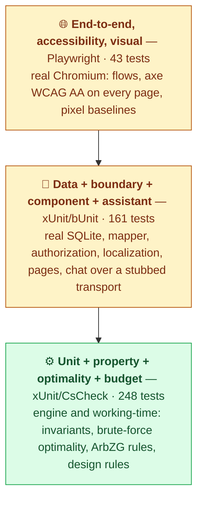

# Testing strategy

**English** · [Deutsch](TESTING.de.md)

The hard logic in this project lives in two pure libraries — the scheduling
engine and the working-time rules — so that is where most of the tests are.
The guiding idea is a **test pyramid**: many fast, deterministic tests at the
bottom against pure code, and a few slow, high-confidence tests at the top
against the real app in a real browser. Keeping the libraries free of Blazor,
EF and WebAssembly is what makes this possible: the bulk of the suite runs in
seconds with no browser and no `wasm-tools` workload.


```mermaid
graph TD
    E2E["🌐 <b>End-to-end, accessibility, visual</b> — Playwright · 43 tests<br/>real Chromium: flows, axe WCAG AA on every page, pixel baselines"]
    WEB["🧩 <b>Data + boundary + component + assistant</b> — xUnit/bUnit · 161 tests<br/>real SQLite, mapper, authorization, localization, pages, chat over a stubbed transport"]
    UNIT["⚙️ <b>Unit + property + optimality + budget</b> — xUnit/CsCheck · 248 tests<br/>engine and working-time: invariants, brute-force optimality, ArbZG rules, design rules"]

    E2E --> WEB --> UNIT

    classDef fast fill:#dcfce7,stroke:#16a34a,color:#14532d;
    classDef slow fill:#fef3c7,stroke:#b45309,color:#7c2d12;
    class UNIT fast;
    class WEB,E2E slow;
```

## The layers

| Layer | Project | Tests | Guards | Needs WASM? | Runtime |
| --- | --- | --: | --- | :---: | --- |
| Engine: unit, property, optimality, architecture, budget | `tests/WorkPlanStudio.Scheduling.Tests` | 153 | determinism, feasibility, rules, calendars and blackouts, bounded search, overflow, cancellation, explanations, a dependency-free core, and time budgets | no | ~3 s |
| Working time: unit, property, architecture, budget | `tests/WorkPlanStudio.WorkingTime.Tests` | 95 | holidays for all 16 states, shift patterns, every ArbZG rule with its parameter, the timeline builder's invariants, and time budgets | no | ~2 s |
| Data, mapper, authorization, components, assistant | `tests/WorkPlanStudio.Web.Tests` | 161 | real SQLite constraints/CRUD/reload/recovery, all-or-nothing mapper, working time inside a schedule, the persona policies at the service boundary, localized component states, dialog semantics, and the chat with its three providers over a stubbed transport | yes¹ | ~15 s |
| End-to-end, accessibility, visual regression | `tests/WorkPlanStudio.E2E` | 43 | real Chromium: schedule changes, determinism, language, working time on the Gantt, personas, theme, keyboard, mobile, the chat in both languages; axe WCAG 2.2 AA on every page in both themes and in a dialog; screenshot baselines for nine screens | browser² | ~3 min |

¹ These reference the Blazor app assembly, so building them compiles the app (hence `wasm-tools`). The tests themselves run on a normal host.
² Needs a Chromium download (`playwright install`) and the app running; no `wasm-tools` if you serve a pre-published build.

## What each layer does

### ⚙️ Unit + architecture — the engine

The core: feasibility (precedence, capacity, release times, calendar windows,
blackouts, paused operations), one focused test per **dispatch rule** and per
**due-date rule**, the evaluator's KPIs (utilisation of *open* time), and the
search guarantees ("never worse than the rule", "more starts never hurt",
"local search never regresses"). Determinism is pinned three ways: a
**golden-value** test of the PRNG, *same seed → identical schedule*, and
*identical schedule regardless of input collection order*.

`ArchitectureTests` reflect over each library assembly and **fail the build**
if anyone references Blazor, EF Core, JS interop or SQLite from it. The
pure-library boundary is the design decision the whole pyramid rests on, so it
is enforced by a test rather than left to discipline.

### 🎲 Property-based — invariants

Example tests check the cases you thought of; **property tests check the ones
you didn't.** Using [CsCheck](https://github.com/AnthonyLloyd/CsCheck), each
test generates hundreds of random-but-valid problems (machines, capacities,
calendars with phases and blackouts, jobs, steps, rules, budgets) and asserts
an *invariant* that must hold for every schedule the engine can produce:

- **precedence** — a step never starts before the previous step of its job finishes;
- **capacity** — no work center runs more operations at once than it has slots;
- **calendar** — no work inside a blackout, and a pause across a break never exceeds the bridgeable gap;
- **determinism** — the same problem always yields a bit-identical schedule;
- **lower bound** — the makespan is never below the longest single job;
- **never worse than the rule** — the search result never loses to the pure rule order.

The working-time library has its own properties: a built timeline never
exceeds the daily cap, always leaves the minimum rest, never opens on a Sunday
or holiday unless the rule allows it, and the calendar it produces round-trips
into the engine. On failure CsCheck *shrinks* to a minimal counter-example and
prints a seed (`CsCheck_Seed`) to reproduce it.

### 🏛️ Rules — German working-time law as tests

Every ArbZG rule the app enforces is a parameter with a test: the 8/10-hour
daily cap (§3), breaks of 30/45 minutes in pieces of at least 15 (§4), 11
hours of rest per crew including the week wrap (§5), the night cap (§6),
Sunday and holiday closure with the 0–6 hour boundary shift (§9), and the
free-Sunday count (§11). Public holidays are computed from Easter for all 16
states and checked against the 2026 tables, partial holidays included.

### 🔌 Boundary — the mapping

`ScheduleMapper` is the one place `decimal` minutes become integer seconds and
plant settings become machine calendars. These tests use hand-built entities
to check banker's rounding, checked overflow, capacity, the all-or-nothing rule
(an inactive or missing center rejects the complete order with a stable
diagnostic) and that an operation longer than any shift window is refused with
a reason rather than scheduled never.

`BrowserDatabaseTests` use real file-backed SQLite: constraints, aggregate
update, conflicts, not-found updates, deactivation/delete guards, save→reload,
invalid or truncated stored data, schema mismatch, export/reset and simulated
read/write/quota failures.

### 🔐 Authorization — personas at the boundary

`AuthorizationTests` run the real ASP.NET Core authorization pipeline with a
fake persona store: the policy matrix per role, services returning
`Forbidden` for a guest, pages rendering without their actions, and a persona
switch re-rendering without a reload. The same pipeline runs in the browser.

### 🧩 Component — the pages

[bUnit](https://bunit.dev) renders the pages in memory. The Scheduling page
runs against a **fake** `IProductionScheduleService` (no engine, no database)
and is checked for KPI cards, Gantt rows with closed segments, table rows, the
empty state, late styling, and that **Generate** passes the chosen parameters.
The Working-time page, the dashboard and the theme toggle render against a
real temp database. The chat panel is tested end to end in memory: a clicked
suggestion answered on-device, a typed question, clearing, and the settings
dialog switching endpoint and model with the provider.

### 🤖 Assistant and chat — never touching the network

The [schedule assistant](AI-ASSISTANT.md) is tested without a network. The
on-device answerer is checked for its English and German intents, for answers
that carry the schedule's own numbers, for the what-if verdicts and for
determinism. The three provider clients run against a **stubbed
`HttpMessageHandler`** — path, headers (including Anthropic's version and
direct-browser headers), JSON shape, turn folding, and an empty answer being
an error. The façades are tested for every path: not configured, healthy,
failing (fallback with a note), what-if re-running the scheduler, reset and
cancellation.

### 🌐 End-to-end — the real thing

[Playwright](https://playwright.dev/dotnet/) drives Chromium against the
running app through a page object. The headline check is the one the brief
asked for: **tighten the targets and the schedule visibly turns late**
(`schedule-ontime.png` → `schedule-late.png`, captured by the run). The suite
also proves rule changes keep a feasible schedule, the same seed reproduces
the same makespan, closed time is shaded with its reason and the axis shows
real dates, changing the state changes the holidays, personas change what the
pages allow, the theme survives a reload, keyboard users can skip to content
and stay inside a dialog, the mobile drawer works, the chat answers a
suggested question and a typed what-if in English and in German, and saved
data survives a hard reload and a confirmed reset.

### ♿ Accessibility — axe on every page

`AccessibilityE2ETests` run [axe-core](https://github.com/dequelabs/axe-core)
(via `Deque.AxeCore.Playwright`) with the WCAG 2.0/2.1/2.2 A and AA tags plus
best practices on every route, in the light and the dark theme, and inside an
open dialog. Zero violations is the bar. The first run found five real
defects — pill and bar-label contrast, an unfocusable scroll region, a
skipped heading level and a duplicate landmark — all fixed in the same
change. Automated rules catch roughly a third of WCAG; keyboard and focus
behaviour is covered by the flows above, and bUnit checks dialog semantics,
table scopes and accessible names on icon-only controls.

### 📸 Visual regression — pixel baselines

`VisualRegressionTests` take full-page screenshots of the dashboard, the
schedule and the working-time page in three profiles (desktop light, desktop
dark, mobile) with animations disabled and compare them pixel-wise against
baselines in `tests/WorkPlanStudio.E2E/visual-baselines/<os>/`. The
comparison runs on two canvases inside the browser, so it needs no image
library. A per-channel tolerance absorbs anti-aliasing; more than 0.2 % of
differing pixels fails, and the diff image (red = changed) is written next to
the artifacts. Baselines are per operating system because fonts differ; a
runner without baselines writes them and passes, the CI job uploads them so
they can be committed, and `VISUAL_UPDATE=1` refreshes them after an intended
change.

### ⏱️ Performance — budgets and benchmarks

`PerformanceBudgetTests` in both library projects are tripwires with bounds an
order of magnitude above the measured numbers; they run on every pull request
and fail on a quadratic regression. Precise numbers come from the
BenchmarkDotNet project and Lighthouse CI — see [PERFORMANCE.md](PERFORMANCE.md).

## Running the tests

```bash
# Everything except the browser suite (no browser needed):
dotnet test tests/WorkPlanStudio.Scheduling.Tests/WorkPlanStudio.Scheduling.Tests.csproj
dotnet test tests/WorkPlanStudio.WorkingTime.Tests/WorkPlanStudio.WorkingTime.Tests.csproj
dotnet test tests/WorkPlanStudio.Web.Tests/WorkPlanStudio.Web.Tests.csproj

# Browser suite — start the app, install a browser once, then run:
dotnet run --project src/WorkPlanStudio/WorkPlanStudio.csproj &           # serves http://localhost:5235
pwsh tests/WorkPlanStudio.E2E/bin/Debug/net10.0/playwright.ps1 install chromium
dotnet test tests/WorkPlanStudio.E2E/WorkPlanStudio.E2E.csproj

# One class or one test:
dotnet test tests/WorkPlanStudio.E2E/WorkPlanStudio.E2E.csproj -- --filter-class "*Accessibility*"
dotnet test tests/WorkPlanStudio.E2E/WorkPlanStudio.E2E.csproj -- --filter-method "*chat*"
```

Environment variables for the browser suite: `E2E_BASE_URL` (default
`http://localhost:5235`), `HEADED=1` to watch the browser, `E2E_ARTIFACTS=<dir>`
to collect screenshots and visual diffs, `VISUAL_UPDATE=1` to rewrite the
visual baselines. A failing property test prints `CsCheck_Seed=…`; set it to
replay the exact case.

## Coverage

Coverage is measured with the Microsoft Testing Platform collector and
**gated per assembly** in CI (`.github/scripts/coverage_gate.py`): the build
fails below 90 % lines for the engine, 90 % for the working-time library and
65 % for the app assembly. Measured on 2026-09-08:

| Assembly | Lines | Branches | Gate |
| --- | ---: | ---: | ---: |
| `WorkPlanStudio.Scheduling` | 96.0 % | 89.5 % | 90 % |
| `WorkPlanStudio.WorkingTime` | 94.0 % | 89.4 % | 90 % |
| `WorkPlanStudio` (app: services, mapper, assistant, pages) | 69.3 % | 63.1 % | 65 % |

The app assembly's number is lower by design: its pages are covered by the
browser suite, which the collector does not see. The README badges are
generated from the same script on every deployment and served from the site,
so they show measured numbers. To reproduce:

```bash
dotnet test tests/WorkPlanStudio.Scheduling.Tests/WorkPlanStudio.Scheduling.Tests.csproj \
  --coverage --coverage-output-format cobertura --coverage-output engine.cobertura.xml
python3 .github/scripts/coverage_gate.py <path to engine.cobertura.xml> WorkPlanStudio.Scheduling=90
```

## In CI

| Workflow | Runs | When |
| --- | --- | --- |
| [`ci.yml`](../.github/workflows/ci.yml) | the two library projects and the web project, each with its coverage gate | every pull request and `main` |
| [`e2e.yml`](../.github/workflows/e2e.yml) | builds and serves the app, installs Chromium, runs the flows, axe and the visual comparison; uploads screenshots, diffs and baselines | every pull request and `main`; called by the deploy |
| [`quality.yml`](../.github/workflows/quality.yml) | `dotnet format` verification, every relative Markdown link, both resource files parse | every pull request and `main` |
| [`codeql.yml`](../.github/workflows/codeql.yml) | CodeQL security-extended analysis of the C# | every pull request, `main`, weekly |
| [`performance.yml`](../.github/workflows/performance.yml) | BenchmarkDotNet short job; Lighthouse CI on the published site | `main`, weekly, on demand |
| [`deploy.yml`](../.github/workflows/deploy.yml) | all three test projects with coverage gates **and** the browser suite gate the GitHub Pages deploy; coverage badges are published with the site | push to `main` |

Dependabot keeps NuGet packages and the GitHub Actions current with weekly,
grouped pull requests (`.github/dependabot.yml`).
